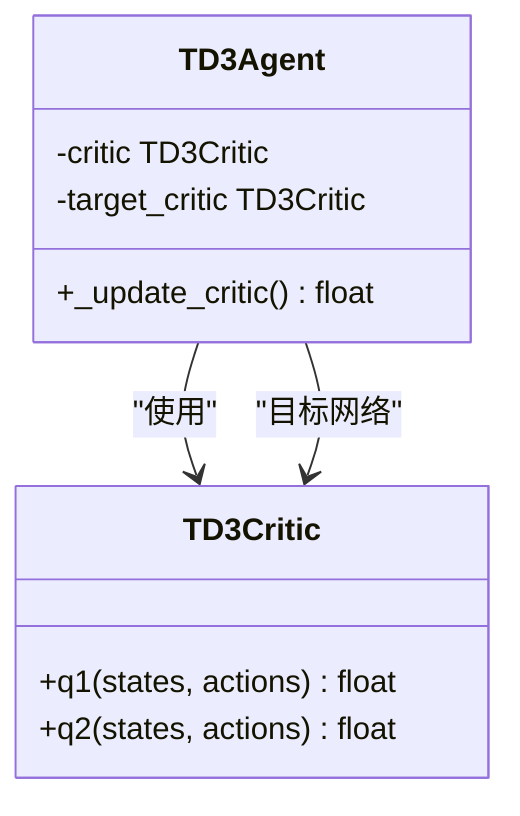
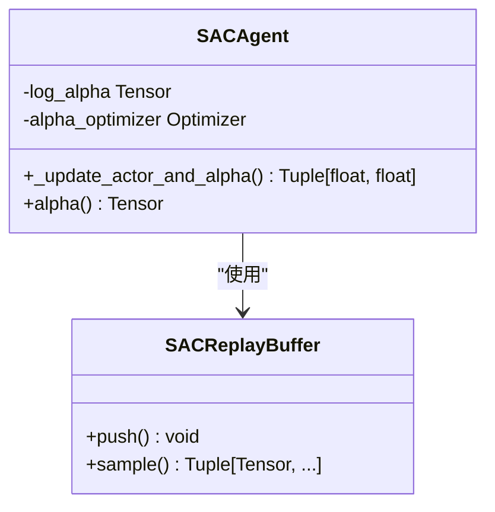
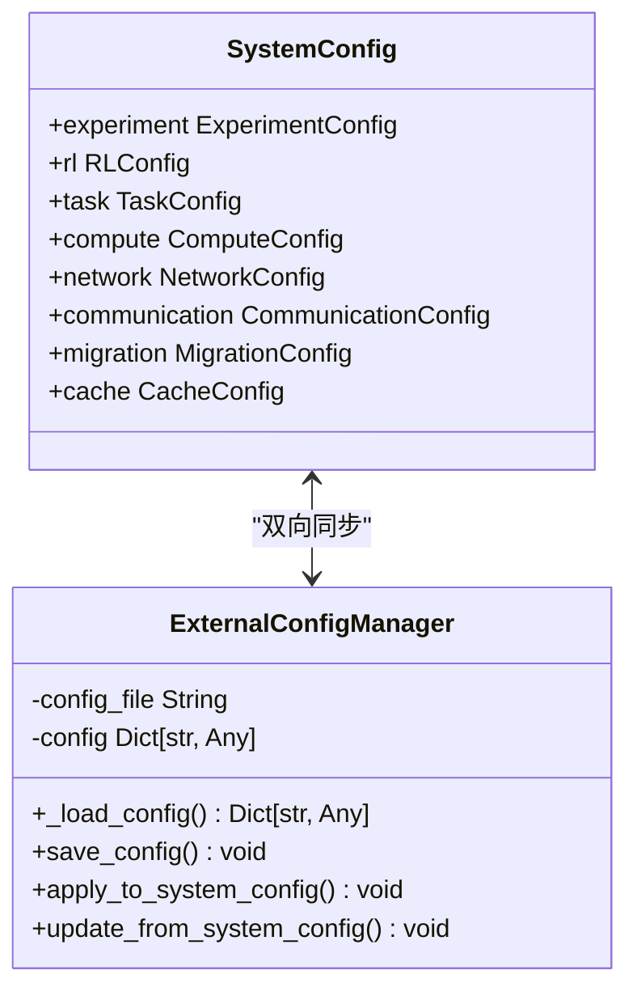

# 单智能体训练流程

<cite>
**本文档引用文件**   
- [ddpg.py](file://single_agent/ddpg.py)
- [ppo.py](file://single_agent/ppo.py)
- [sac.py](file://single_agent/sac.py)
- [td3.py](file://single_agent/td3.py)
- [train_single_agent.py](file://train_single_agent.py)
- [system_config.py](file://config/system_config.py)
- [external_config.py](file://config/external_config.py)
- [algorithm_config.py](file://config/algorithm_config.py)
- [vec_system_config.json](file://vec_system_config.json)
- [performance_optimization.py](file://tools/performance_optimization.py)
</cite>

## 目录
1. [引言](#引言)
2. [环境封装与状态预处理](#环境封装与状态预处理)
3. [核心算法训练流程](#核心算法训练流程)
4. [TD3算法实现细节](#td3算法实现细节)
5. [SAC算法实现细节](#sac算法实现细节)
6. [超参数配置与系统联动](#超参数配置与系统联动)
7. [网络更新与经验回放](#网络更新与经验回放)
8. [训练监控与日志解析](#训练监控与日志解析)
9. [调参经验与优化策略](#调参经验与优化策略)
10. [模型持久化与部署准备](#模型持久化与部署准备)

## 引言

本文档全面阐述了DDPG、PPO、TD3及其优化版本、SAC等单智能体强化学习算法的训练流程。文档详细描述了从环境封装、状态预处理到模型持久化的完整训练过程，重点分析了TD3算法中双Q网络、目标策略平滑和延迟更新策略的具体实现方式，以及SAC中熵正则化项的引入机制。同时，文档说明了训练脚本如何通过配置文件加载超参数，并与系统配置模块联动，为单智能体强化学习系统的开发和优化提供全面指导。

## 环境封装与状态预处理

单智能体训练环境通过`SingleAgentTrainingEnvironment`类实现，该类负责与仿真系统交互并提供标准化的强化学习接口。环境封装过程包括车辆、RSU（路侧单元）和UAV（无人机）的状态收集与归一化处理。

在状态预处理阶段，系统对原始状态数据进行归一化操作，确保输入特征在合理范围内。车辆状态包括位置、速度、任务数量和能耗；RSU状态包括位置、缓存利用率、队列长度和能耗；UAV状态则额外包含高度信息。所有数值均通过除以预定义的最大值进行归一化，如位置除以1000米，速度除以50米/秒，能耗除以1000焦耳。

动作解码过程根据算法类型分为连续动作和离散动作两种处理方式。对于DDPG、TD3和SAC等连续动作算法，动作字典被编码为连续动作向量；对于DQN等离散动作算法，多个智能体的动作被组合成一个全局动作索引。这种统一的接口设计使得训练框架能够支持多种算法。

**Section sources**
- [train_single_agent.py](file://train_single_agent.py#L98-L263)

## 核心算法训练流程

### DDPG训练流程

DDPG（深度确定性策略梯度）算法采用Actor-Critic架构，通过确定性策略函数直接输出动作。训练流程从经验回放缓冲区采样批次数据，首先更新Critic网络，然后更新Actor网络。Critic网络使用均方误差损失函数，目标Q值由目标网络计算得到。Actor网络的更新目标是最大化Critic网络评估的Q值。两个网络的参数通过软更新方式同步到对应的目标网络，更新系数由`tau`参数控制。

### PPO训练流程

PPO（近端策略优化）算法采用on-policy训练方式，每个训练轮次结束后进行多次策略更新。训练流程首先运行一个完整的episode，将所有经验存储在PPO专用缓冲区中。然后计算优势函数和回报值，对优势函数进行标准化处理。在PPO更新循环中，使用裁剪机制限制策略更新的幅度，防止策略突变。同时，算法引入熵正则化项以鼓励探索，并通过KL散度监控策略变化，实现自适应早停。

### TD3训练流程

TD3（双延迟深度确定性策略梯度）算法在DDPG基础上引入了三项关键改进：双Q网络、目标策略平滑和延迟策略更新。训练流程中，Critic网络有两个独立的Q网络，取二者最小值作为目标Q值，缓解了Q值过高估计问题。目标策略平滑通过在目标动作上添加噪声并裁剪，增加了训练稳定性。策略更新频率低于Critic更新频率，实现了延迟更新策略。

### SAC训练流程

SAC（软Actor-Critic）算法引入了最大熵强化学习框架，在优化累积奖励的同时最大化策略熵。训练流程中，Actor网络不仅优化Q值，还优化熵正则化项。温度参数`alpha`自动调节熵的重要性，确保探索与利用的平衡。Critic网络同样采用双Q网络结构，目标Q值减去熵项后用于计算目标。目标网络的更新频率由`target_update_freq`参数控制。

**Section sources**
- [ddpg.py](file://single_agent/ddpg.py#L175-L344)
- [ppo.py](file://single_agent/ppo.py#L235-L407)
- [td3.py](file://single_agent/td3.py#L216-L426)
- [sac.py](file://single_agent/sac.py#L219-L412)

## TD3算法实现细节

### 双Q网络机制

TD3算法通过双Q网络机制解决Q值过高估计问题。在计算目标Q值时，算法使用两个独立的Critic网络评估同一状态-动作对，取二者输出的最小值作为最终目标。这种设计有效抑制了由于函数逼近误差导致的Q值过高估计，提高了策略学习的稳定性。



**Diagram sources **
- [td3.py](file://single_agent/td3.py#L336-L370)

### 目标策略平滑

目标策略平滑是TD3算法的另一项关键创新。在计算目标Q值时，算法在目标Actor网络输出的动作上添加随机噪声，并对结果进行裁剪。具体实现中，噪声从正态分布中采样，标准差由`target_noise`参数控制，裁剪范围由`noise_clip`参数定义。这种平滑处理使得目标Q值对动作微小变化不敏感，增强了训练过程的鲁棒性。

### 延迟更新策略

TD3算法采用延迟更新策略，即Actor网络的更新频率低于Critic网络。通过`policy_delay`参数控制更新间隔，例如设置为2表示每更新2次Critic网络才更新1次Actor网络。这种设计确保Critic网络有足够的时间学习更准确的价值函数，避免Actor网络基于不准确的价值估计进行更新，从而提高整体训练稳定性。

**Section sources**
- [td3.py](file://single_agent/td3.py#L336-L370)

## SAC算法实现细节

### 熵正则化机制

SAC算法的核心是熵正则化机制，其目标函数不仅包含累积奖励，还包含策略熵。策略熵衡量了动作分布的随机性，最大化熵鼓励智能体探索未知状态。在实现中，Actor网络输出动作的均值和标准差，通过重参数化技巧采样动作。熵正则化项与Q值共同构成Actor网络的损失函数，推动策略在获得高奖励的同时保持足够的探索性。

### 温度参数自动调节

SAC算法引入可学习的温度参数`alpha`来自动平衡奖励最大化和熵最大化之间的权衡。当`auto_entropy_tuning`启用时，算法维护一个对数温度参数`log_alpha`，并通过额外的优化器进行更新。温度参数的更新目标是使实际策略熵接近目标熵，目标熵由`target_entropy_ratio`和动作维度决定。这种自适应机制确保了探索程度随训练进程动态调整。



**Diagram sources **
- [sac.py](file://single_agent/sac.py#L346-L374)

### 双Q网络与目标网络

与TD3类似，SAC也采用双Q网络结构来缓解过高估计问题。两个Critic网络独立学习，目标Q值取二者最小值。目标网络通过软更新方式从主网络同步参数，更新频率由`target_update_freq`参数控制。这种设计确保了价值函数估计的稳定性，为策略更新提供了可靠的基础。

**Section sources**
- [sac.py](file://single_agent/sac.py#L325-L374)

## 超参数配置与系统联动

### 配置文件加载

训练脚本通过`config`全局实例加载系统配置，该实例由`SystemConfig`类创建。配置系统采用分层设计，包含实验、强化学习、任务、计算、网络等多个子配置模块。训练脚本可以直接访问`config.experiment.num_episodes`等路径获取超参数，实现了配置的集中管理和便捷访问。

### 外部配置联动

系统支持通过`vec_system_config.json`文件进行外部配置，实现了运行时参数调整。`ExternalConfigManager`类负责加载和保存JSON配置文件，并与系统配置对象双向同步。当外部配置更新时，相关参数会自动应用到系统配置中；反之，系统配置的更改也可以保存到外部文件。这种机制提高了系统的灵活性和可调性。



**Diagram sources **
- [system_config.py](file://config/system_config.py#L0-L318)
- [external_config.py](file://config/external_config.py#L0-L255)

### 算法特定配置

每种算法都有其专用的配置类，如`TD3Config`、`SACConfig`等，这些类定义了算法特有的超参数。配置参数包括网络结构、学习率、折扣因子、软更新系数、探索噪声等。通过配置类的默认值和可调参数，实现了算法超参数的标准化管理和便捷修改。

**Section sources**
- [system_config.py](file://config/system_config.py#L0-L318)
- [external_config.py](file://config/external_config.py#L0-L255)
- [algorithm_config.py](file://config/algorithm_config.py#L0-L73)
- [vec_system_config.json](file://vec_system_config.json#L0-L68)

## 网络更新与经验回放

### Actor与Critic更新逻辑

在训练过程中，Actor和Critic网络的更新遵循特定的逻辑流程。首先从经验回放缓冲区采样一个批次的数据，然后计算Critic网络的损失并进行反向传播更新。对于TD3和SAC算法，Critic网络的更新使用双Q网络的最小值作为目标。随后，在满足条件时更新Actor网络，其目标是最大化Critic网络评估的Q值。所有网络更新都应用梯度裁剪，防止梯度爆炸。

### 软更新系数作用

软更新系数`tau`控制目标网络参数更新的速度。在每次网络更新时，目标网络参数按公式`target_param = (1-tau) * target_param + tau * source_param`进行更新。较小的`tau`值（如0.005）意味着目标网络变化缓慢，提供了稳定的学习目标；较大的`tau`值则使目标网络更快地跟踪主网络的变化。这种软更新机制比硬更新更平滑，有助于提高训练稳定性。

### 经验回放采样策略

不同算法采用不同的经验回放策略。DDPG和PPO使用均匀采样，每个经验被采样的概率相等。TD3采用优先级经验回放（PER），根据TD误差的绝对值确定采样优先级，误差越大的经验被采样的概率越高。SAC使用标准的经验回放缓冲区，通过随机采样获取训练数据。所有算法都实现了高效的数据预分配和循环缓冲区管理，确保了采样操作的高效性。

```mermaid
classDiagram
    class TD3ReplayBuffer {
        -priorities float[]
        +push() void
        +sample() Tuple[Tensor, ...]
        +update_priorities() void
    }
    
    class SACReplayBuffer {
        +push() void
        +sample() Tuple[Tensor,