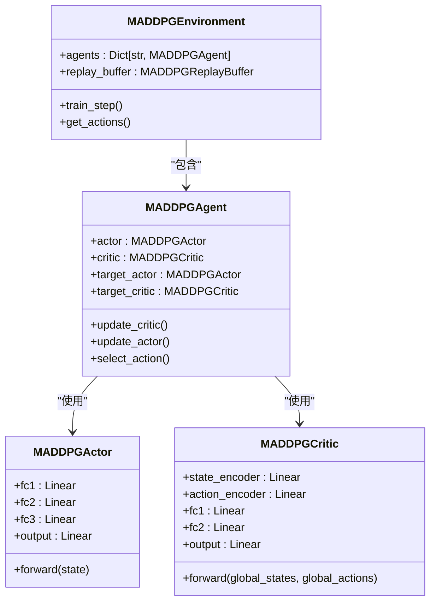
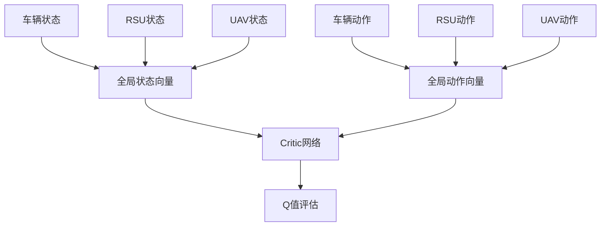
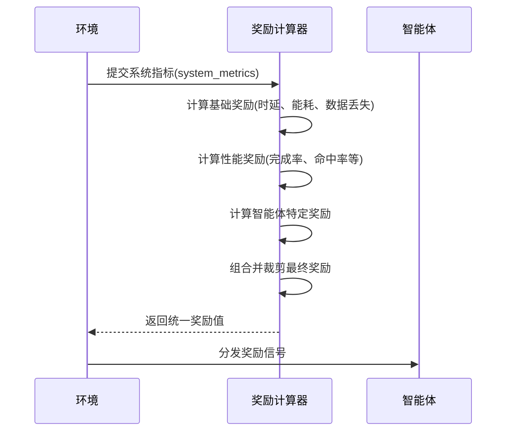

# MADDPG训练流程

<cite>
**本文档引用的文件**  
- [maddpg.py](file://algorithms/maddpg.py)
- [models.py](file://communication/models.py)
- [reward_calculator.py](file://utils/reward_calculator.py)
- [algorithm_config.py](file://config/algorithm_config.py)
- [data_structures.py](file://models/data_structures.py)
</cite>

## 目录
1. [MADDPG算法核心思想](#maddpg算法核心思想)  
2. [多智能体网络架构与交互机制](#多智能体网络架构与交互机制)  
3. [状态-动作联合观测向量构造](#状态-动作联合观测向量构造)  
4. [部分可观测性处理与联合奖励机制](#部分可观测性处理与联合奖励机制)  
5. [关键算法参数配置解析](#关键算法参数配置解析)  
6. [任务卸载与迁移决策收敛特性](#任务卸载与迁移决策收敛特性)  
7. [MADDPG与MATD3对比分析](#maddpg与matd3对比分析)  
8. [典型训练场景与模型持久化](#典型训练场景与模型持久化)

## MADDPG算法核心思想

MADDPG（Multi-Agent Deep Deterministic Policy Gradient）在本项目中实现了集中式训练、去中心化执行（CTDE）的核心范式。该算法通过为每个智能体维护独立的Actor网络，确保在执行阶段各智能体仅依赖本地观测进行决策，从而满足高动态车联网环境下的实时性与去中心化需求。同时，Critic网络在训练过程中可访问全局状态与动作信息，利用全局知识指导各智能体的策略优化，有效解决了多智能体环境中的信用分配问题。

该设计特别适用于车辆（vehicle_agent）、路侧单元（rsu_agent）和无人机（uav_agent）协同工作的VEC系统，能够在保持分布式执行灵活性的同时，通过全局信息提升协同决策质量。

**本节来源**  
- [maddpg.py](file://algorithms/maddpg.py#L1-L20)

## 多智能体网络架构与交互机制

MADDPG在`maddpg.py`中实现了多智能体Actor-Critic架构。每个智能体拥有独立的Actor网络（`MADDPGActor`）和Critic网络（`MADDPGCritic`）。Actor网络采用三层全连接结构，输入为本地状态，输出为连续动作空间中的策略，通过tanh激活函数将动作限制在[-1, 1]范围内。Critic网络作为共享的价值网络，接收所有智能体的状态和动作拼接而成的全局向量，评估当前联合策略的Q值。

在训练过程中，`MADDPGAgent`的`update_critic`方法通过`_get_global_states`和`_get_global_actions`方法将各智能体的经验拼接为全局观测，用于计算目标Q值。`update_actor`方法则通过策略梯度更新Actor网络，其中Critic网络的梯度通过`_get_global_actions_with_new_action`方法将当前智能体的新动作与其他智能体的旧动作结合，实现对策略的精确评估。



**图示来源**  
- [maddpg.py](file://algorithms/maddpg.py#L55-L138)
- [maddpg.py](file://algorithms/maddpg.py#L197-L459)
- [maddpg.py](file://algorithms/maddpg.py#L462-L645)

**本节来源**  
- [maddpg.py](file://algorithms/maddpg.py#L55-L138)
- [maddpg.py](file://algorithms/maddpg.py#L197-L459)

## 状态-动作联合观测向量构造

状态-动作联合观测向量的构造是MADDPG实现集中式训练的关键。在`maddpg.py`中，`_get_global_states`和`_get_global_actions`方法负责将各智能体的本地状态和动作按智能体ID排序后进行拼接，形成维度为`global_state_dim`和`global_action_dim`的全局向量。

该机制在`models.py`中得到了通信与计算模型的支持。`IntegratedCommunicationComputeModel`类整合了无线通信模型（`WirelessCommunicationModel`）和计算能耗模型（`ComputeEnergyModel`），为状态向量的构建提供了物理层和网络层的详细信息。例如，`calculate_transmission_delay`方法计算的通信时延和`calculate_vehicle_compute_energy`方法计算的能耗，均可作为状态向量的重要组成部分，确保智能体能够感知到系统级的性能指标。



**图示来源**  
- [maddpg.py](file://algorithms/maddpg.py#L330-L370)
- [models.py](file://communication/models.py#L495-L612)

**本节来源**  
- [maddpg.py](file://algorithms/maddpg.py#L330-L370)
- [models.py](file://communication/models.py#L25-L492)

## 部分可观测性处理与联合奖励机制

在高动态车联网环境下，单个智能体无法获得完整的环境信息，面临部分可观测性问题。MADDPG通过Critic网络访问全局信息来缓解这一问题，使得每个智能体的策略更新能够基于更全面的环境认知。

联合奖励信号由`reward_calculator.py`中的`UnifiedRewardCalculator`类生成。该奖励函数严格遵循论文式(24)的目标函数，旨在最小化加权成本：`min(ω_T * delay + ω_E * energy + ω_D * data_loss)`，对应的奖励为成本的负值。`calculate_base_reward`方法计算基础奖励，结合了平均任务时延、总能耗和数据丢失率。`calculate_performance_bonus`方法添加了任务完成率、缓存命中率和迁移成功率等性能奖励，以鼓励更优的系统表现。`_calculate_agent_specific_bonus`方法还为不同类型的智能体（车辆、RSU、UAV）提供了特定奖励，实现了更精细的激励机制。



**图示来源**  
- [reward_calculator.py](file://utils/reward_calculator.py#L13-L226)

**本节来源**  
- [reward_calculator.py](file://utils/reward_calculator.py#L13-L226)

## 关键算法参数配置解析

`algorithm_config.py`中的`AlgorithmConfig`类集中管理了MADDPG的关键参数。这些参数在`maddpg.py`的`MADDPGConfig`数据类中被具体化和使用。

- **噪声注入**：`noise_std`（0.1）和`noise_decay`（0.9999）控制探索噪声的初始大小和衰减速率，确保智能体在训练初期充分探索，后期稳定收敛。
- **学习率配置**：`actor_lr`（1e-4）和`critic_lr`（2e-4）分别控制Actor和Critic网络的更新步长，通常Critic网络使用稍高的学习率以更快地学习价值函数。
- **批量归一化**：虽然代码中未显式使用批量归一化层，但`MADDPGActor`和`MADDPGCritic`网络通过Xavier初始化和较小的输出层初始化（`-3e-3`到`3e-3`）来保证训练稳定性，起到了类似的作用。
- **其他参数**：`tau`（0.01）控制目标网络的软更新速度，`gamma`（0.99）是折扣因子，`batch_size`（128）和`memory_size`（100000）定义了经验回放的规模。

**本节来源**  
- [algorithm_config.py](file://config/algorithm_config.py#L7-L73)
- [maddpg.py](file://algorithms/maddpg.py#L10-L45)

## 任务卸载与迁移决策收敛特性

MADDPG算法在任务卸载与迁移决策中表现出良好的收敛特性。其集中式Critic网络能够有效评估不同卸载和迁移策略的长期收益，引导Actor网络学习到最优的协同策略。训练过程中，`actor_loss_history`和`critic_loss_history`记录了损失函数的变化，通常会随着训练步数的增加而逐渐下降并趋于稳定。

由于MADDPG直接优化确定性策略，其收敛速度通常快于随机策略方法。然而，其探索依赖于外加噪声，可能在复杂环境中陷入局部最优。通过`decay_noise`方法逐步减小噪声，算法能够在探索和利用之间取得平衡，最终收敛到一个稳定的策略。

**本节来源**  
- [maddpg.py](file://algorithms/maddpg.py#L400-L415)
- [maddpg.py](file://algorithms/maddpg.py#L600-L610)

## MADDPG与MATD3对比分析

与MATD3相比，MADDPG在稳定性和探索效率上各有优劣。

- **稳定性**：MATD3通过双Critic网络和延迟策略更新（`policy_delay=2`）显著提高了训练稳定性，减少了Q值的高估问题。而MADDPG仅使用单个Critic网络，且无延迟更新，因此在复杂或高噪声环境中可能不如MATD3稳定。
- **探索效率**：MADDPG使用简单的高斯噪声进行探索，实现简单且计算开销小。MATD3虽然也使用噪声，但其更复杂的架构可能需要更长的预热期。在本项目中，MADDPG的`tau`（0.01）比MATD3的`tau`（0.005）更大，意味着其目标网络更新更快，可能带来更快的初期学习速度，但也可能牺牲一些稳定性。

选择MADDPG还是MATD3取决于具体场景对稳定性和训练速度的权衡。

**本节来源**  
- [algorithm_config.py](file://config/algorithm_config.py#L7-L73)
- [maddpg.py](file://algorithms/maddpg.py#L10-L45)

## 典型训练场景与模型持久化

一个典型的MADDPG训练场景配置如下：
```python
config = AlgorithmConfig()
maddpg_params = config.get_algorithm_config('MADDPG')
env = MADDPGEnvironment()
# 训练循环...
```

模型持久化与恢复机制由`MADDPGAgent`的`save_model`和`load_model`方法实现。`save_model`方法将Actor、Critic及其目标网络的权重、优化器状态和噪声尺度保存到`.pth`文件中。`load_models`方法从指定路径加载所有智能体的模型，确保训练可以中断后继续或在新环境中部署已训练好的策略。

**本节来源**  
- [maddpg.py](file://algorithms/maddpg.py#L430-L450)
- [maddpg.py](file://algorithms/maddpg.py#L589-L600)