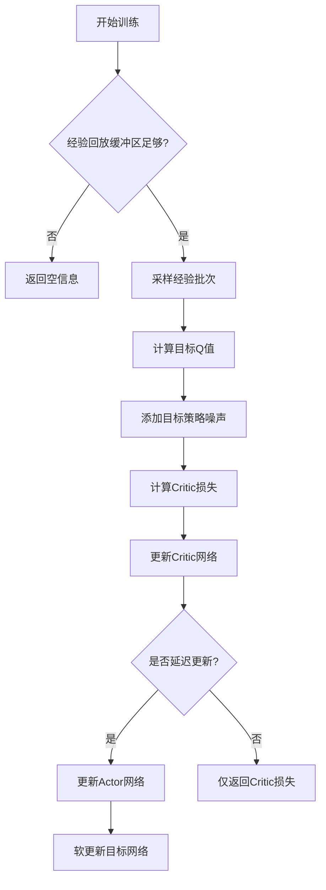
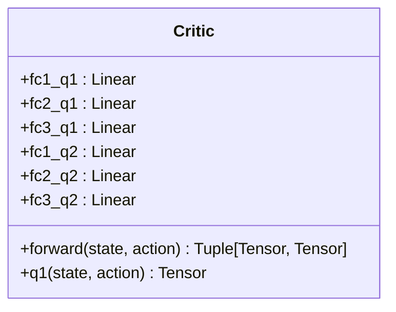
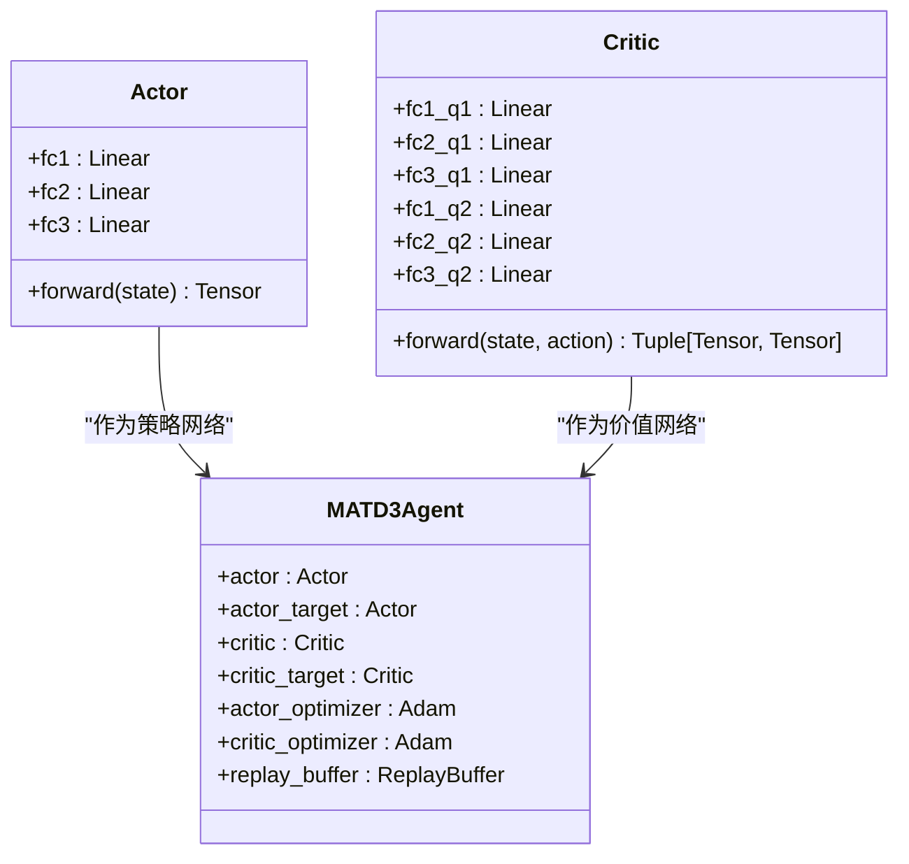
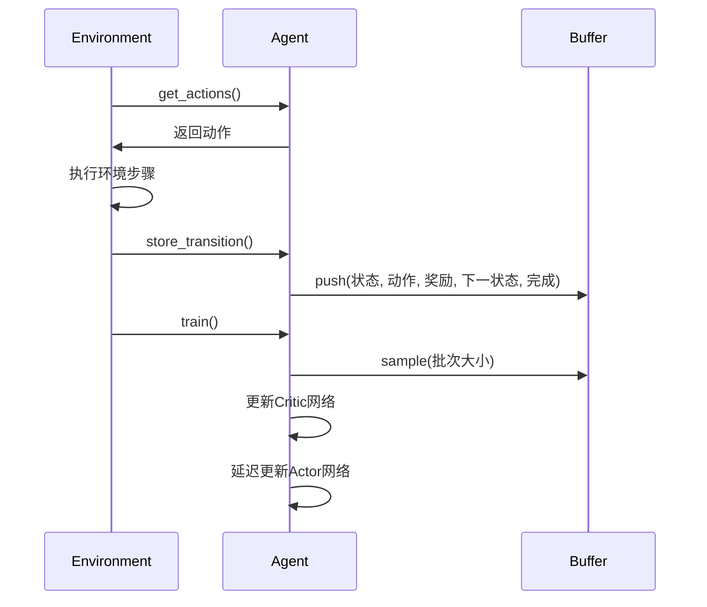
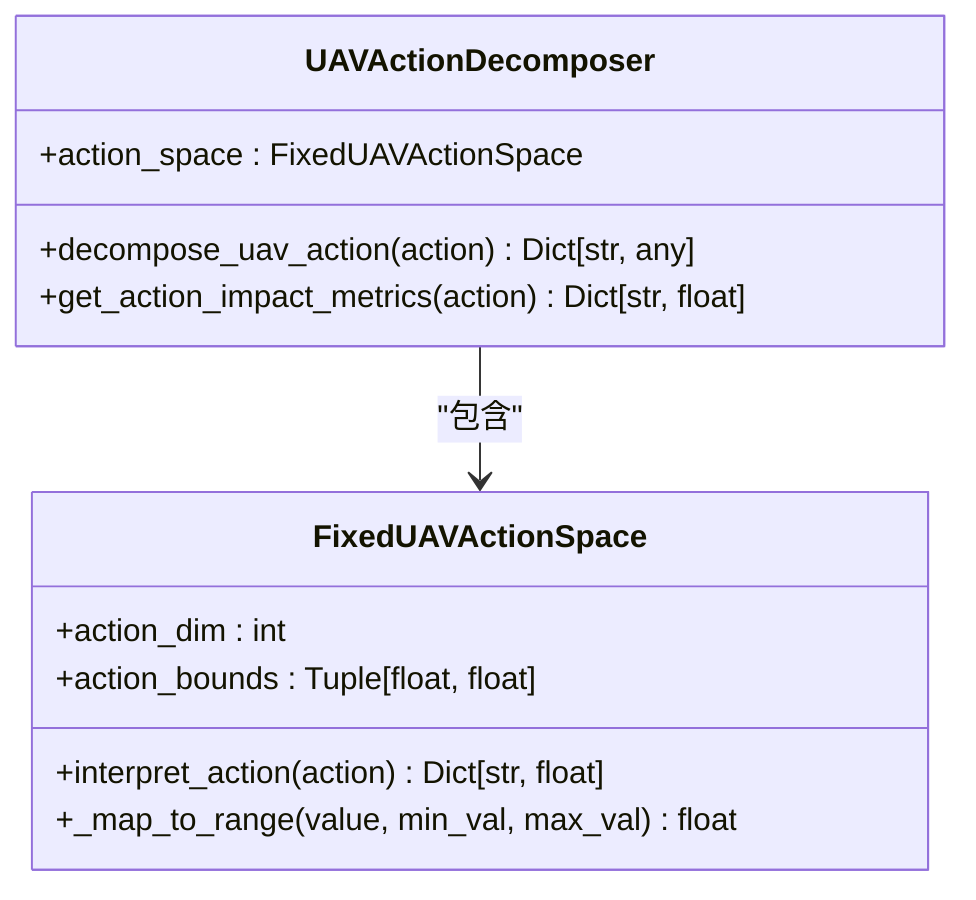
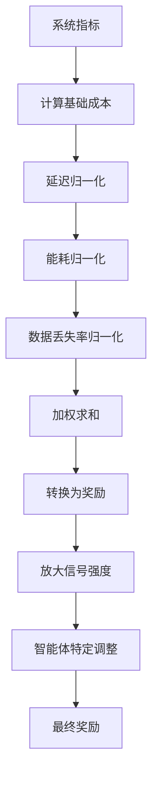
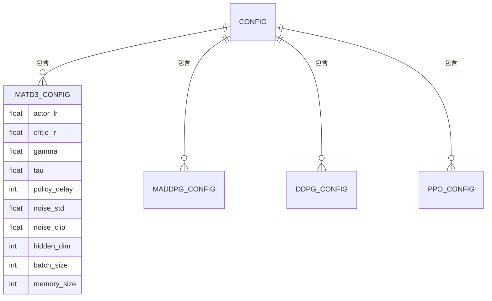
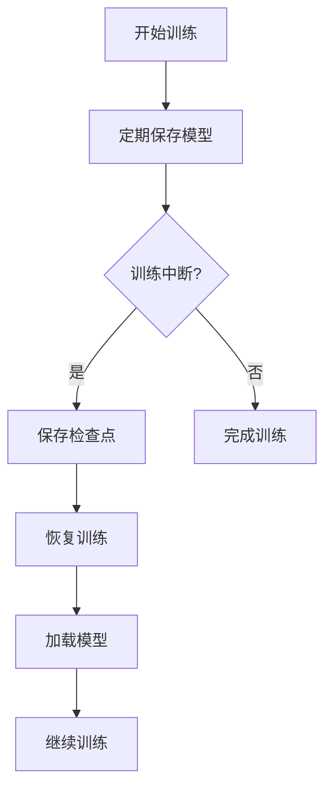

# MATD3训练流程

<cite>
**本文档引用的文件**   
- [matd3.py](file://algorithms/matd3.py)
- [uav_action_space.py](file://algorithms/uav_action_space.py)
- [reward_calculator.py](file://utils/reward_calculator.py)
- [standardized_reward.py](file://utils/standardized_reward.py)
- [algorithm_config.py](file://config/algorithm_config.py)
- [train_multi_agent.py](file://train_multi_agent.py)
</cite>

## 目录
1. [MATD3算法实现与训练流程](#matd3算法实现与训练流程)
2. [双延迟策略更新与目标策略平滑](#双延迟策略更新与目标策略平滑)
3. [集中式批评者网络设计](#集中式批评者网络设计)
4. [Actor-Critic架构构建](#actor-critic架构构建)
5. [经验回放缓存与训练执行](#经验回放缓存与训练执行)
6. [动作空间约束映射](#动作空间约束映射)
7. [多目标奖励函数](#多目标奖励函数)
8. [MATD3参数配置](#matd3参数配置)
9. [梯度传播与参数同步](#梯度传播与参数同步)
10. [训练命令与模型管理](#训练命令与模型管理)

## MATD3算法实现与训练流程

MATD3（Multi-Agent Twin Delayed Deep Deterministic Policy Gradient）算法在VEC_mig_caching系统中的实现基于`algorithms/matd3.py`文件中的`MATD3Environment`和`MATD3Agent`类。该系统通过多智能体协同决策优化车联网环境下的任务迁移与缓存策略。训练流程从`train_multi_agent.py`脚本启动，支持多种算法的训练与比较。系统初始化时创建车辆智能体、RSU智能体和UAV智能体，每个智能体拥有独立的状态观察空间和动作决策能力，通过集中式训练和分布式执行的方式实现协同优化。

**Section sources**
- [matd3.py](file://algorithms/matd3.py#L252-L549)
- [train_multi_agent.py](file://train_multi_agent.py#L0-L799)

## 双延迟策略更新与目标策略平滑

MATD3算法采用双延迟策略更新机制，通过`policy_delay`参数控制Actor网络的更新频率。在`MATD3Agent`类的`train`方法中，Critic网络每步更新，而Actor网络仅在`total_it % policy_delay == 0`时更新，有效减少策略过早收敛的风险。目标策略平滑通过添加噪声实现，在计算目标Q值时，对目标动作添加`policy_noise`噪声并限制在`noise_clip`范围内，增强策略的鲁棒性。该机制在`MATD3Agent.train`方法的`with torch.no_grad()`块中实现，确保目标策略的稳定性。

**Diagram sources **
- [matd3.py](file://algorithms/matd3.py#L163-L223)

**Section sources**
- [matd3.py](file://algorithms/matd3.py#L163-L223)

## 集中式批评者网络设计

MATD3采用集中式批评者网络设计，Critic网络接收全局状态信息进行价值评估。在`Critic`类中，通过`forward`方法接收状态和动作的拼接输入，计算两个Q值（Q1和Q2）并取最小值作为最终目标Q值，缓解Q值过高估计问题。该设计允许Critic网络访问所有智能体的联合状态和动作，而Actor网络仅基于局部观测进行决策，实现集中式训练与分布式执行的平衡。Critic网络的双Q网络结构通过`fc1_q1`、`fc2_q1`、`fc3_q1`和`fc1_q2`、`fc2_q2`、`fc3_q2`两组独立的全连接层实现。

**Diagram sources **
- [matd3.py](file://algorithms/matd3.py#L43-L79)

**Section sources**
- [matd3.py](file://algorithms/matd3.py#L43-L79)

## Actor-Critic架构构建

MATD3的Actor-Critic架构通过`Actor`和`Critic`类构建。`Actor`类包含三个全连接层（`fc1`、`fc2`、`fc3`），输出通过`tanh`激活函数限制在[-1,1]范围内，对应动作空间的标准化输出。`Critic`类包含两套独立的全连接层，实现双Q网络结构。在`MATD3Agent.__init__`方法中，初始化Actor网络、目标Actor网络、Critic网络和目标Critic网络，并通过`load_state_dict`方法复制初始权重。优化器使用Adam算法，分别配置`actor_lr`和`critic_lr`学习率。

**Diagram sources **
- [matd3.py](file://algorithms/matd3.py#L22-L40)
- [matd3.py](file://algorithms/matd3.py#L43-L79)
- [matd3.py](file://algorithms/matd3.py#L105-L146)

**Section sources**
- [matd3.py](file://algorithms/matd3.py#L22-L40)
- [matd3.py](file://algorithms/matd3.py#L43-L79)
- [matd3.py](file://algorithms/matd3.py#L105-L146)

## 经验回放缓存与训练执行

系统通过共享经验回放缓存实现集中式训练与分布式执行。`ReplayBuffer`类使用`deque`作为底层数据结构，最大容量由`config.rl.buffer_size`配置。`push`方法存储状态转移元组，`sample`方法随机采样批次数据。在`MATD3Environment.train_step`方法中，各智能体将经验存入各自的回放缓存，然后并行训练。训练执行通过`train_multi_agent.py`中的`MultiAgentTrainingEnvironment`类管理，该类封装了环境重置、步骤执行、奖励计算和模型评估等流程。

**Diagram sources **
- [matd3.py](file://algorithms/matd3.py#L82-L97)
- [matd3.py](file://algorithms/matd3.py#L477-L498)

**Section sources**
- [matd3.py](file://algorithms/matd3.py#L82-L97)
- [matd3.py](file://algorithms/matd3.py#L477-L498)

## 动作空间约束映射

UAV动作空间约束在`algorithms/uav_action_space.py`中定义。`FixedUAVActionSpace`类实现8维连续动作空间，每个维度对应特定的UAV控制参数，如电池功率管理、服务优先级调整等。`interpret_action`方法将[-1,1]范围的动作值映射到具体参数范围，例如功率级别映射到30%-100%。`UAVActionDecomposer`类将动作向量分解为具体执行参数，如`battery_management`、`service_strategy`等，实现动作空间到执行策略的映射。

**Diagram sources **
- [uav_action_space.py](file://algorithms/uav_action_space.py#L22-L109)
- [uav_action_space.py](file://algorithms/uav_action_space.py#L111-L176)

**Section sources**
- [uav_action_space.py](file://algorithms/uav_action_space.py#L22-L176)

## 多目标奖励函数

奖励函数在`utils/reward_calculator.py`和`utils/standardized_reward.py`中实现。`UnifiedRewardCalculator`类计算基础奖励，基于论文目标函数`min(ω_T * delay + ω_E * energy + ω_D * data_loss)`，奖励为成本的负值。`StandardizedRewardFunction`类进一步放大奖励信号强度8倍，解决信号过弱问题。奖励函数考虑协同任务完成率、能耗和延迟，通过`calculate_with_performance_bonus`方法添加智能体特定的成本调整，如车辆智能体关注本地处理效率，UAV智能体关注电池电量。

**Diagram sources **
- [reward_calculator.py](file://utils/reward_calculator.py#L13-L226)
- [standardized_reward.py](file://utils/standardized_reward.py#L11-L101)

**Section sources**
- [reward_calculator.py](file://utils/reward_calculator.py#L13-L226)
- [standardized_reward.py](file://utils/standardized_reward.py#L11-L101)

## MATD3参数配置

MATD3专属参数在`config/algorithm_config.py`中配置。`AlgorithmConfig`类定义`matd3_config`字典，包含`actor_lr`、`critic_lr`、`gamma`、`tau`、`policy_delay`、`noise_std`等参数。`policy_delay`设置为2，表示每2步更新一次Actor网络；`tau`为0.005，控制目标网络软更新率；`noise_std`为0.1，设置探索噪声标准差。这些参数可通过`get_algorithm_config`方法获取，并通过`update_algorithm_config`方法动态调整。

**Diagram sources **
- [algorithm_config.py](file://config/algorithm_config.py#L7-L73)

**Section sources**
- [algorithm_config.py](file://config/algorithm_config.py#L7-L73)

## 梯度传播与参数同步

训练过程中，梯度通过`backward`方法反向传播，`zero_grad`方法清零梯度，`step`方法更新网络参数。参数同步通过软更新实现，在`_soft_update`方法中，目标网络参数按`tau`比例从主网络复制：`target_param = target_param * (1-tau) + param * tau`。非平稳性通过目标策略噪声和双延迟更新缓解，确保训练稳定性。经验回放缓存的随机采样也减少数据相关性，提高样本独立性。

**Section sources**
- [matd3.py](file://algorithms/matd3.py#L225-L228)

## 训练命令与模型管理

完整训练命令示例：`python train_multi_agent.py --algorithm MATD3 --episodes 200`。模型保存路径为`results/models/matd3/`，检查点按`checkpoint_{episode}`命名。中断续训通过`load_models`方法实现，从指定目录加载各智能体模型。`save_models`和`load_models`方法遍历`agents`字典，对每个智能体执行保存/加载操作，确保所有模型状态一致。

**Section sources**
- [train_multi_agent.py](file://train_multi_agent.py#L0-L799)
- [matd3.py](file://algorithms/matd3.py#L511-L527)