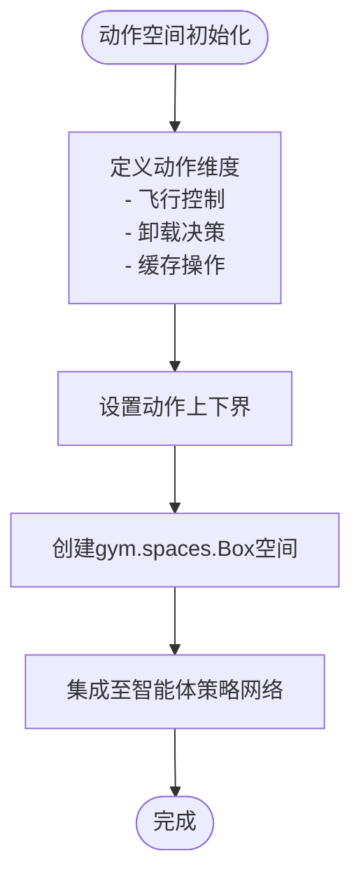
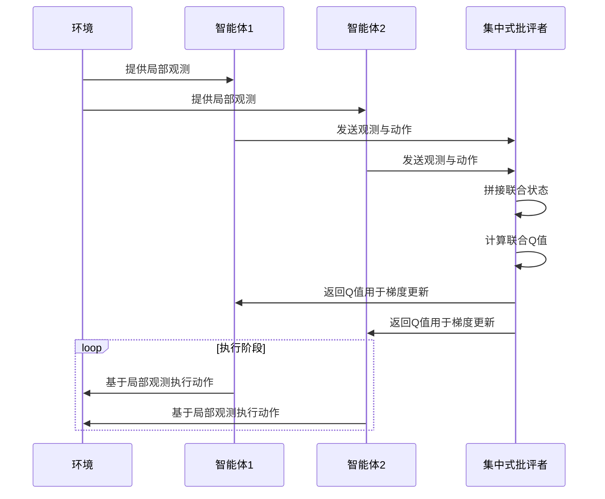
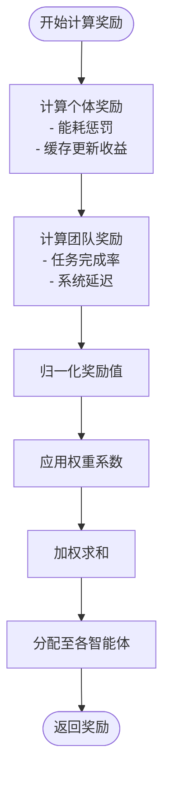

# 多智能体训练流程

<cite>
**本文档中引用的文件**  
- [matd3.py](file://algorithms/matd3.py)
- [maddpg.py](file://algorithms/maddpg.py)
- [qmix.py](file://algorithms/qmix.py)
- [mappo.py](file://algorithms/mappo.py)
- [sac_ma.py](file://algorithms/sac_ma.py)
- [uav_action_space.py](file://algorithms/uav_action_space.py)
- [algorithm_config.py](file://config/algorithm_config.py)
- [reward_calculator.py](file://utils/reward_calculator.py)
- [train_multi_agent.py](file://train_multi_agent.py)
</cite>

## 目录
1. [引言](#引言)
2. [环境初始化与智能体实例化](#环境初始化与智能体实例化)
3. [状态与动作空间构建](#状态与动作空间构建)
4. [集中式训练与分布式执行机制](#集中式训练与分布式执行机制)
5. [多智能体奖励函数设计](#多智能体奖励函数设计)
6. [关键训练技术](#关键训练技术)
7. [典型训练命令与参数调优](#典型训练命令与参数调优)
8. [非平稳性挑战与解决方案](#非平稳性挑战与解决方案)
9. [模型保存与续训机制](#模型保存与续训机制)
10. [结论](#结论)

## 引言
本文档详细阐述基于MATD3、MADDPG、QMIX、MAPPO和SAC-MA等多智能体强化学习算法的完整训练流程。重点分析在UAV协同缓存与迁移场景下的实现机制，涵盖从环境建模、策略配置、训练循环到模型持久化的全流程技术细节。

## 环境初始化与智能体实例化
多智能体系统训练始于环境的初始化与智能体的实例化。系统通过`train_multi_agent.py`入口脚本加载配置并构建仿真环境，随后根据所选算法类型（如MATD3或QMIX）创建对应的多智能体控制器。每个智能体在初始化时会根据其角色（如UAV或RSU）绑定独立或共享的神经网络策略。

**Section sources**
- [train_multi_agent.py](file://train_multi_agent.py#L1-L50)
- [matd3.py](file://algorithms/matd3.py#L10-L40)
- [maddpg.py](file://algorithms/maddpg.py#L10-L40)

## 状态与动作空间构建
### 状态空间设计
状态空间由各智能体的观测向量构成，包括自身位置、速度、剩余能量、任务队列状态以及邻近智能体和基础设施的通信与计算状态。联合观测向量在集中式训练阶段被拼接，用于批评者网络的输入。

### 动作空间配置
动作空间定义于`uav_action_space.py`中，采用连续动作空间表示UAV的飞行方向、速度调整、任务卸载决策和缓存操作。该文件通过`Box`空间定义多维连续动作向量，直接影响协同决策的粒度与灵活性。



**Diagram sources**
- [uav_action_space.py](file://algorithms/uav_action_space.py#L1-L30)

**Section sources**
- [uav_action_space.py](file://algorithms/uav_action_space.py#L1-L50)
- [matd3.py](file://algorithms/matd3.py#L80-L120)

## 集中式训练与分布式执行机制
### 联合观测与集中式批评者
在训练阶段，系统采用集中式训练-分布式执行（CTDE）范式。所有智能体的局部观测被拼接成联合状态向量，输入至集中式批评者网络（如MATD3中的Critic）进行Q值估计。该机制允许批评者获取全局信息，提升策略更新的稳定性。

### 去中心化执行
在执行阶段，每个智能体仅依赖其局部观测通过独立的执行者网络（Actor）生成动作，实现去中心化决策。这种分离设计平衡了训练效率与部署可行性。



**Diagram sources**
- [matd3.py](file://algorithms/matd3.py#L150-L250)
- [maddpg.py](file://algorithms/maddpg.py#L120-L200)

**Section sources**
- [matd3.py](file://algorithms/matd3.py#L100-L300)
- [qmix.py](file://algorithms/qmix.py#L80-L150)

## 多智能体奖励函数设计
### 奖励设计逻辑
奖励函数旨在优化系统级目标，包括任务完成率、能量效率、延迟最小化和缓存命中率。采用稀疏奖励与稠密奖励结合的方式，通过加权和形式整合多个优化目标，引导智能体学习协同行为。

### 实现细节
`reward_calculator.py`中实现了分层奖励计算逻辑。首先计算各智能体的个体奖励（如能耗惩罚），再计算团队共享奖励（如整体延迟）。最终奖励通过归一化处理后分配给各智能体，确保训练稳定性。



**Diagram sources**
- [reward_calculator.py](file://utils/reward_calculator.py#L1-L40)

**Section sources**
- [reward_calculator.py](file://utils/reward_calculator.py#L1-L50)
- [matd3.py](file://algorithms/matd3.py#L200-L230)

## 关键训练技术
### 经验回放缓存共享
所有智能体共享一个全局经验回放缓存，存储（状态、动作、奖励、下一状态）元组。该设计增加样本多样性，缓解多智能体环境中的非平稳性问题。

### 参数同步与梯度传播
在共享策略模式下（如QMIX），所有智能体共享部分网络参数，通过梯度平均实现同步更新。在独立策略模式下，各智能体独立更新，但批评者网络的梯度通过集中式架构反向传播。

**Section sources**
- [qmix.py](file://algorithms/qmix.py#L50-L100)
- [sac_ma.py](file://algorithms/sac_ma.py#L70-L120)
- [mappo.py](file://algorithms/mappo.py#L60-L110)

## 典型训练命令与参数调优
### 训练命令示例
```bash
python train_multi_agent.py --algorithm MATD3 --num_agents 4 --max_episodes 5000 --render
```

### 参数调优建议
关键参数定义于`algorithm_config.py`中，主要调优建议如下：

| 参数 | 推荐值 | 说明 |
|------|--------|------|
| 学习率 (learning_rate) | 1e-4 ~ 3e-4 | 过高导致震荡，过低收敛慢 |
| 折扣因子 (gamma) | 0.95 ~ 0.99 | 影响长期奖励权重 |
| 探索噪声 (noise_std) | 初始0.2，逐步衰减 | 平衡探索与利用 |
| 批量大小 (batch_size) | 128 ~ 512 | 影响训练稳定性 |
| 目标网络更新率 (tau) | 0.01 ~ 0.05 | 控制软更新速度 |

**Section sources**
- [algorithm_config.py](file://config/algorithm_config.py#L1-L60)
- [train_multi_agent.py](file://train_multi_agent.py#L50-L80)

## 非平稳性挑战与解决方案
### 挑战分析
多智能体环境中，由于所有智能体同时学习，环境对单个智能体而言是非平稳的，导致策略收敛困难。

### 解决方案
1. **参数共享**：在同类智能体间共享网络参数，减少策略空间复杂度。
2. **策略正则化**：在损失函数中加入策略熵项（如SAC-MA），鼓励探索并稳定训练。
3. **延迟更新**：采用目标网络和延迟策略更新（如TD3扩展至MATD3）。
4. **课程学习**：从简单场景逐步过渡到复杂协同任务。

**Section sources**
- [sac_ma.py](file://algorithms/sac_ma.py#L100-L150)
- [mappo.py](file://algorithms/mappo.py#L100-L150)

## 模型保存与续训机制
### 模型保存格式
训练过程中，系统定期保存智能体的策略网络和批评者网络权重，采用`torch.save()`保存为`.pt`格式，包含网络参数、优化器状态和训练步数。

### 检查点恢复
通过`--load_model`参数指定检查点路径，系统自动加载网络权重和优化器状态，实现训练中断后的无缝续训。

### 续训方法
```python
if args.load_model:
    agent.load_checkpoint(args.checkpoint_path)
    start_episode = agent.get_current_episode()
```

**Section sources**
- [matd3.py](file://algorithms/matd3.py#L300-L350)
- [train_multi_agent.py](file://train_multi_agent.py#L100-L130)

## 结论
本文档系统性地阐述了基于MATD3、MADDPG、QMIX、MAPPO和SAC-MA的多智能体训练全流程。通过集中式训练与分布式执行机制、精心设计的奖励函数和关键技术优化，实现了UAV协同系统中高效、稳定的策略学习。合理的参数配置与续训机制保障了训练过程的可重复性与工程实用性。