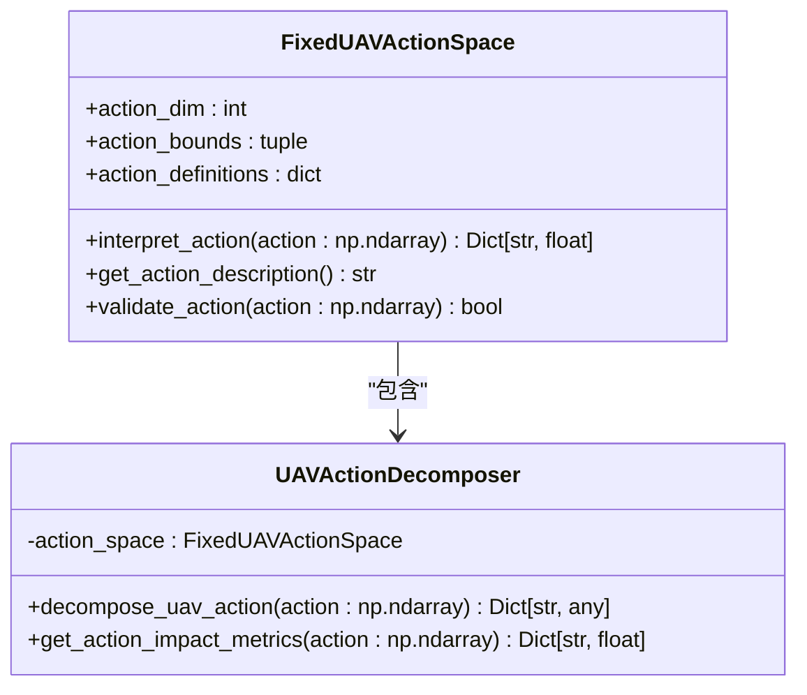

# 训练流程

<cite>
**本文档引用的文件**   
- [train_multi_agent.py](file://train_multi_agent.py)
- [train_single_agent.py](file://train_single_agent.py)
- [config/system_config.py](file://config/system_config.py)
- [config/external_config.py](file://config/external_config.py)
- [algorithms/uav_action_space.py](file://algorithms/uav_action_space.py)
- [algorithms/matd3.py](file://algorithms/matd3.py)
- [algorithms/maddpg.py](file://algorithms/maddpg.py)
- [algorithms/qmix.py](file://algorithms/qmix.py)
- [algorithms/mappo.py](file://algorithms/mappo.py)
- [algorithms/sac_ma.py](file://algorithms/sac_ma.py)
- [single_agent/ddpg.py](file://single_agent/ddpg.py)
- [single_agent/td3.py](file://single_agent/td3.py)
- [single_agent/dqn.py](file://single_agent/dqn.py)
- [single_agent/ppo.py](file://single_agent/ppo.py)
- [single_agent/sac.py](file://single_agent/sac.py)
- [evaluation/test_complete_system.py](file://evaluation/test_complete_system.py)
- [utils/logger.py](file://utils/logger.py)
- [utils/metrics.py](file://utils/metrics.py)
</cite>

## 目录
1. [多智能体训练流程](#多智能体训练流程)
2. [单智能体训练流程](#单智能体训练流程)
3. [命令行参数与配置文件](#命令行参数与配置文件)
4. [状态监控与日志记录](#状态监控与日志记录)
5. [检查点保存策略](#检查点保存策略)
6. [训练性能优化建议](#训练性能优化建议)
7. [UAV动作空间影响](#uav动作空间影响)

## 多智能体训练流程

多智能体训练流程通过 `train_multi_agent.py` 脚本实现，支持 MATD3、MADDPG、QMIX、MAPPO 和 SAC-MA 等多种算法。训练流程始于环境初始化，通过 `MultiAgentTrainingEnvironment` 类创建，该类初始化仿真器并根据指定算法创建相应的智能体环境。参数加载通过全局配置对象 `config` 完成，该对象整合了系统、实验和强化学习等模块的配置。模型训练在 `run_episode` 方法中执行，该方法循环执行环境步骤，收集状态、执行动作、计算奖励并更新智能体。评估在训练过程中定期进行，通过 `evaluate_model` 函数在独立的评估轮次中测试模型性能。训练完成后，使用 `save_training_results` 函数将训练结果、模型权重和性能曲线保存到指定目录，确保训练成果的持久化。

**Section sources**
- [train_multi_agent.py](file://train_multi_agent.py#L0-L1170)
- [config/system_config.py](file://config/system_config.py#L0-L318)

## 单智能体训练流程

单智能体训练流程通过 `train_single_agent.py` 脚本实现，支持 DDPG、TD3、DQN、PPO 和 SAC 等算法。与多智能体流程类似，它始于 `SingleAgentTrainingEnvironment` 的初始化，该类同样初始化仿真器并创建指定算法的智能体环境。参数加载同样依赖于 `config` 对象。模型训练在 `run_episode` 方法中进行，该方法处理动作选择、环境交互和智能体更新。对于 PPO 等算法，训练在轮次结束后通过 `update` 方法批量执行。评估由 `evaluate_single_model` 函数完成，该函数运行多个评估轮次以获得稳定的性能指标。最终，`save_single_training_results` 函数负责将训练结果、模型和曲线保存到磁盘，完成整个训练周期。

**Section sources**
- [train_single_agent.py](file://train_single_agent.py#L0-L967)
- [config/system_config.py](file://config/system_config.py#L0-L318)

## 命令行参数与配置文件

训练脚本通过命令行参数和配置文件协同工作。`train_multi_agent.py` 和 `train_single_agent.py` 均使用 `argparse` 解析命令行参数，如 `--algorithm` 指定算法，`--episodes` 设置训练轮次数。这些参数允许用户在不修改代码的情况下快速配置训练任务。配置文件则通过 `config` 模块提供更详细的设置。`system_config.py` 定义了系统级参数，如 `num_episodes`、`eval_interval` 和 `save_interval`，这些参数作为命令行参数的默认值。此外，`external_config.py` 允许通过 `vec_system_config.json` 文件在运行时动态调整网络拓扑、任务生成等外部参数，实现了高度的灵活性和可配置性。

**Section sources**
- [train_multi_agent.py](file://train_multi_agent.py#L0-L1170)
- [train_single_agent.py](file://train_single_agent.py#L0-L967)
- [config/system_config.py](file://config/system_config.py#L0-L318)
- [config/external_config.py](file://config/external_config.py#L0-L255)

## 状态监控与日志记录

训练过程中的状态监控通过 `MovingAverage` 类实现，该类在 `MultiAgentTrainingEnvironment` 和 `SingleAgentTrainingEnvironment` 中用于跟踪最近的奖励、时延、能耗和任务完成率等关键指标。这些移动平均值在训练循环中定期更新，并在每10个轮次后输出到控制台，为用户提供实时的训练进度反馈。日志记录由 `utils/logger.py` 中的 `Logger` 类处理，它提供 `info`、`warning`、`error` 等级别的日志记录功能。训练脚本使用此日志器输出关键事件，如环境初始化、模型保存和训练完成，确保所有重要操作都有迹可循。

**Section sources**
- [train_multi_agent.py](file://train_multi_agent.py#L0-L1170)
- [train_single_agent.py](file://train_single_agent.py#L0-L967)
- [utils/metrics.py](file://utils/metrics.py#L0-L147)
- [utils/logger.py](file://utils/logger.py#L0-L67)

## 检查点保存策略

检查点保存策略由 `save_interval` 参数控制。在训练循环中，每当轮次数是 `save_interval` 的倍数时，就会触发检查点保存。`train_algorithm` 和 `train_single_algorithm` 函数调用智能体环境的 `save_models` 方法，将当前模型权重保存到 `results/models/{algorithm}/checkpoint_{episode}` 路径下。这种定期保存的策略允许在训练中断后从最近的检查点恢复。此外，系统会持续跟踪最佳模型，当评估性能超过历史最佳时，会将模型保存为 `best_model`。最终，完整的训练结果（包括奖励曲线和系统指标）会以带时间戳的 JSON 文件形式保存，确保每次运行的可追溯性。

**Section sources**
- [train_multi_agent.py](file://train_multi_agent.py#L0-L1170)
- [train_single_agent.py](file://train_single_agent.py#L0-L967)

## 训练性能优化建议

为优化训练性能，建议调整批量大小和学习率调度。批量大小在 `algorithm_config.py` 和各算法的配置类中定义，例如 MATD3 的 `batch_size` 为 128。根据硬件能力，可以适当增加批次大小以提高 GPU 利用率。学习率调度方面，TD3 算法实现了指数衰减调度器，通过 `ExponentialLR` 优化器在训练过程中逐步降低学习率，有助于后期收敛。此外，`tools.performance_optimization` 模块提供了 `OPTIMIZED_BATCH_SIZES` 字典，可根据算法自动选择优化的批次大小，是提升训练效率的有效手段。

**Section sources**
- [algorithms/matd3.py](file://algorithms/matd3.py#L0-L549)
- [algorithms/td3.py](file://algorithms/td3.py#L0-L546)
- [single_agent/td3.py](file://single_agent/td3.py#L0-L546)
- [tools/performance_optimization.py](file://tools/performance_optimization.py)

## UAV动作空间影响

UAV 动作空间由 `algorithms/uav_action_space.py` 中的 `FixedUAVActionSpace` 类定义，它是一个8维的连续动作空间，每个维度对应一个专门的决策，如电池功率管理、服务优先级和覆盖区域优化。这种专门化的设计将复杂的UAV控制分解为多个直观的子任务，使智能体能够学习更精细的控制策略。动作空间直接影响训练过程，智能体输出的动作向量被 `UAVActionDecomposer` 解释为具体的执行参数，如 `power_level` 和 `coverage_radius_multiplier`。这种设计鼓励智能体在节能、服务质量、覆盖效率等维度上进行权衡，从而在复杂的VEC环境中实现更优的综合性能。

**Diagram sources **
- [algorithms/uav_action_space.py](file://algorithms/uav_action_space.py#L0-L206)

**Section sources**
- [algorithms/uav_action_space.py](file://algorithms/uav_action_space.py#L0-L206)
- [train_multi_agent.py](file://train_multi_agent.py#L0-L1170)