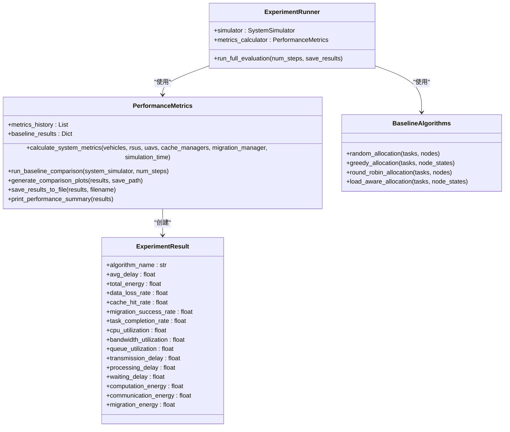
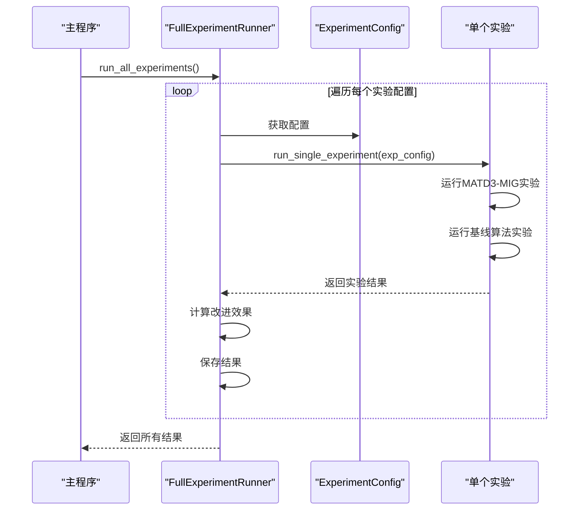
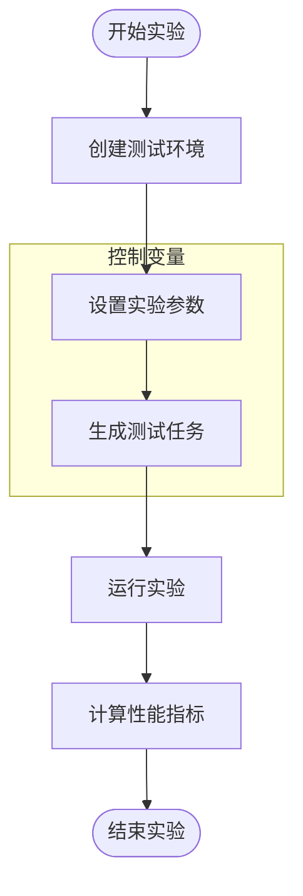
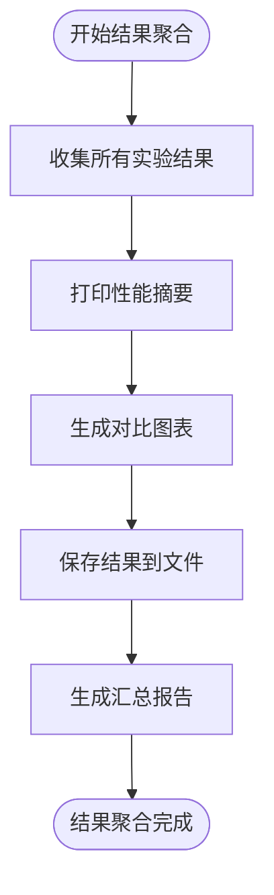
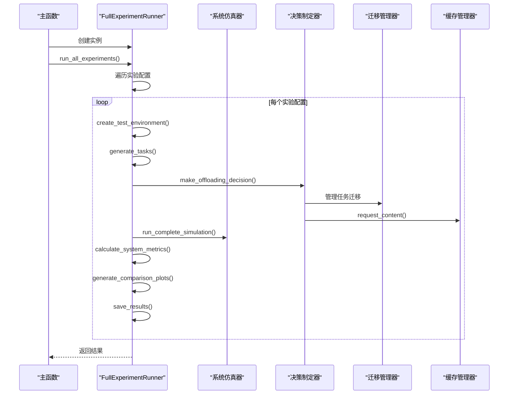
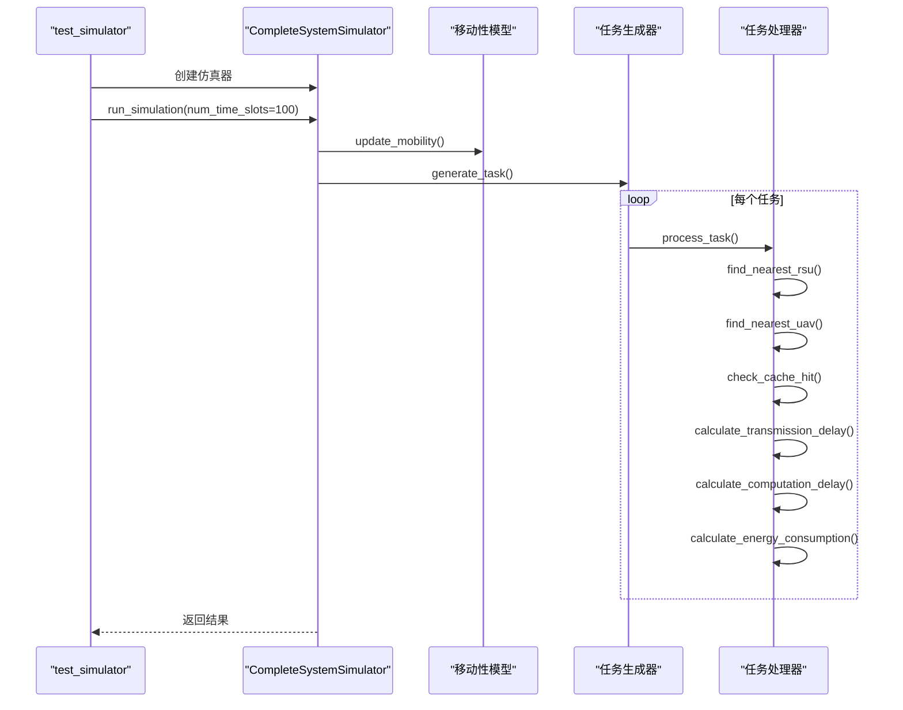
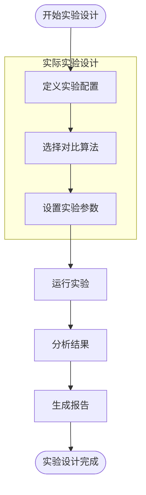
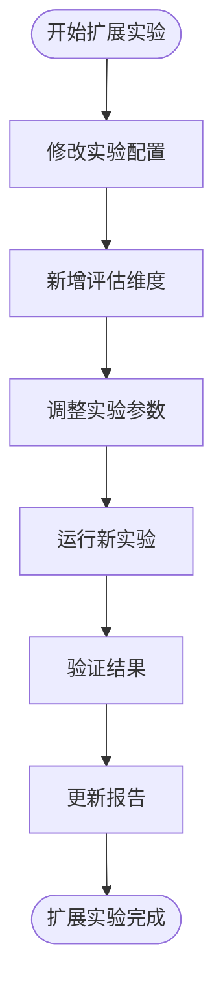
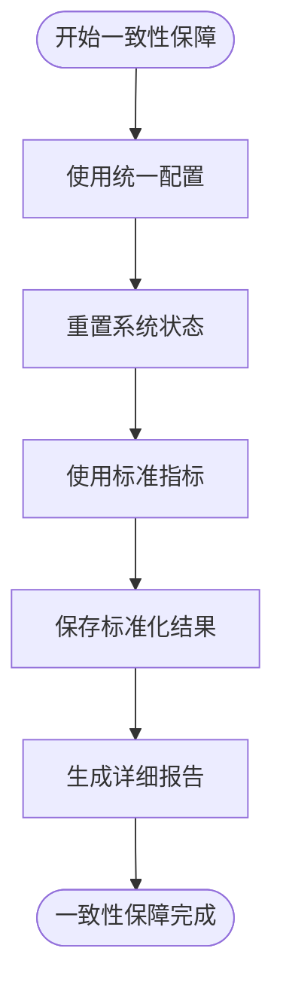

# 实验框架

<cite>
**本文档引用的文件**
- [evaluation.py](file://experiments/evaluation.py)
- [run_full_experiment.py](file://run_full_experiment.py)
- [test_complete_system.py](file://evaluation/test_complete_system.py)
- [experiment_summary.md](file://results/experiment_summary.md)
</cite>

## 目录
1. [引言](#引言)
2. [实验框架设计](#实验框架设计)
3. [多轮对比实验组织](#多轮对比实验组织)
4. [控制变量设置](#控制变量设置)
5. [结果聚合机制](#结果聚合机制)
6. [完整实验协调流程](#完整实验协调流程)
7. [端到端系统验证](#端到端系统验证)
8. [实际实验设计示例](#实际实验设计示例)
9. [扩展实验指导](#扩展实验指导)
10. [实验一致性保障](#实验一致性保障)

## 引言

本实验框架旨在对车联网边缘计算系统中的多智能体深度强化学习算法（如MATD3-MIG）进行全面评估。通过系统化的实验设计，框架支持多轮对比实验，能够精确控制变量，并对实验结果进行有效聚合。核心组件包括`experiments/evaluation.py`中的实验评估模块、`run_full_experiment.py`中的完整实验协调器以及`evaluation/test_complete_system.py`中的端到端系统验证器。`experiment_summary.md`文件记录了实际的实验配置和结果，为性能对比提供了数据支持。

## 实验框架设计

实验框架采用模块化设计，核心组件包括实验运行器、性能指标计算器和基线算法实现。`ExperimentRunner`类负责协调整个评估流程，调用`PerformanceMetrics`进行指标计算，并与系统仿真器交互。`PerformanceMetrics`类提供了计算系统综合性能指标的方法，包括任务时延、能耗、数据丢失率等。基线算法通过`BaselineAlgorithms`类实现，包括随机分配、贪心分配、轮询分配和负载感知分配等算法。

**图表来源**
- [experiments/evaluation.py](file://experiments/evaluation.py#L16-L531)

**本节来源**
- [experiments/evaluation.py](file://experiments/evaluation.py#L16-L531)

## 多轮对比实验组织

实验框架通过`run_full_experiment.py`中的`FullExperimentRunner`类组织多轮对比实验。该类定义了多个实验配置，包括标准配置、高负载场景和大规模场景。每个实验配置包含不同的参数，如车辆数量、RSU数量、UAV数量和任务到达率。`run_all_experiments`方法遍历所有实验配置，依次运行每个配置下的实验。

**图表来源**
- [run_full_experiment.py](file://run_full_experiment.py#L151-L583)

**本节来源**
- [run_full_experiment.py](file://run_full_experiment.py#L151-L583)

## 控制变量设置

实验框架通过`ExperimentConfig`类精确控制实验变量。每个实验配置都明确定义了车辆数量、RSU数量、UAV数量、任务到达率等参数。在运行实验时，这些参数被传递给`create_test_environment`和`generate_tasks`方法，确保每次实验都在相同的条件下进行。此外，`FullExperimentRunner`类还控制了实验的轮数和每轮的长度，确保实验的可重复性。

**图表来源**
- [run_full_experiment.py](file://run_full_experiment.py#L29-L54)

**本节来源**
- [run_full_experiment.py](file://run_full_experiment.py#L29-L54)

## 结果聚合机制

实验框架通过`PerformanceMetrics`类的`print_performance_summary`和`save_results_to_file`方法对实验结果进行聚合。`print_performance_summary`方法将所有算法的性能指标汇总成一个表格，并计算MATD3-MIG相对于最佳基线的改进。`save_results_to_file`方法将结果保存为CSV和JSON格式，便于后续分析。`FullExperimentRunner`类的`generate_summary_report`方法生成详细的Markdown报告，包含性能对比表和改进效果。

**图表来源**
- [experiments/evaluation.py](file://experiments/evaluation.py#L269-L531)
- [run_full_experiment.py](file://run_full_experiment.py#L484-L583)

**本节来源**
- [experiments/evaluation.py](file://experiments/evaluation.py#L269-L531)
- [run_full_experiment.py](file://run_full_experiment.py#L484-L583)

## 完整实验协调流程

`run_full_experiment.py`中的`main`函数协调了整个实验流程。它首先创建`FullExperimentRunner`实例，然后调用`run_all_experiments`方法。该方法依次运行每个实验配置，包括创建测试环境、生成任务、运行MATD3-MIG算法和基线算法、计算性能指标、生成图表和保存结果。整个流程确保了实验的完整性和一致性。

**图表来源**
- [run_full_experiment.py](file://run_full_experiment.py#L546-L583)

**本节来源**
- [run_full_experiment.py](file://run_full_experiment.py#L546-L583)

## 端到端系统验证

`evaluation/test_complete_system.py`中的`CompleteSystemSimulator`类提供了端到端系统功能的验证逻辑。该类模拟了车辆、RSU和UAV的移动性，生成计算任务，并处理任务的卸载和执行。`run_simulation`方法运行完整的仿真，`simulate_time_slot`方法模拟每个时隙的事件，`process_task`方法处理单个任务。通过`test_simulator`函数，可以快速验证仿真器的正确性。

**图表来源**
- [evaluation/test_complete_system.py](file://evaluation/test_complete_system.py#L13-L533)

**本节来源**
- [evaluation/test_complete_system.py](file://evaluation/test_complete_system.py#L13-L533)

## 实际实验设计示例

`experiment_summary.md`文件展示了实际的实验设计。实验配置包括标准配置、高负载场景和大规模场景。在每个配置下，MATD3-MIG算法与随机、贪心、轮询和负载感知等基线算法进行了性能对比。结果显示，MATD3-MIG在平均时延、总能耗、任务完成率和缓存命中率等方面均优于基线算法。例如，在标准配置下，MATD3-MIG的平均时延比随机算法降低了41.1%，总能耗降低了6.7%，任务完成率提高了30.7%，缓存命中率提高了400.0%。

**图表来源**
- [experiment_summary.md](file://results/experiment_summary.md#L1-L122)

**本节来源**
- [experiment_summary.md](file://results/experiment_summary.md#L1-L122)

## 扩展实验指导

要扩展实验，可以修改`run_full_experiment.py`中的`experiment_configs`列表，添加新的实验配置。例如，可以增加一个低负载场景或一个不同任务类型的场景。要新增评估维度，可以在`PerformanceMetrics`类中添加新的指标计算方法，并在`ExperimentResult`类中添加相应的字段。要修改实验参数，可以直接修改`ExperimentConfig`类的实例化参数。确保在修改后重新运行实验，并检查结果的合理性。

**本节来源**
- [run_full_experiment.py](file://run_full_experiment.py#L151-L583)
- [experiments/evaluation.py](file://experiments/evaluation.py#L16-L531)

## 实验一致性保障

实验框架通过多种机制保障实验的一致性。首先，所有实验都使用相同的`ExperimentConfig`类来定义参数，确保变量控制的一致性。其次，`FullExperimentRunner`类在每次运行实验前都会重置系统状态，避免前一次实验的影响。此外，`PerformanceMetrics`类使用相同的指标计算方法，确保结果的可比性。最后，所有结果都保存为标准化的CSV和JSON格式，并生成详细的Markdown报告，便于复现和验证。

**本节来源**
- [run_full_experiment.py](file://run_full_experiment.py#L151-L583)
- [experiments/evaluation.py](file://experiments/evaluation.py#L16-L531)