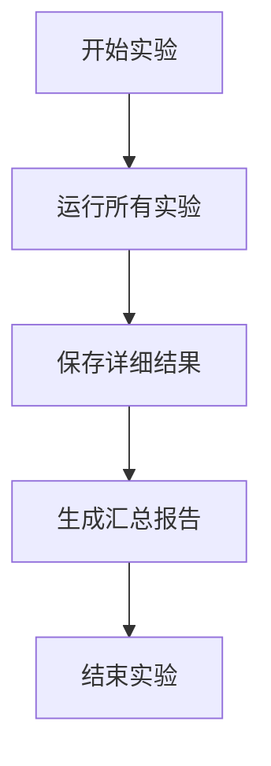
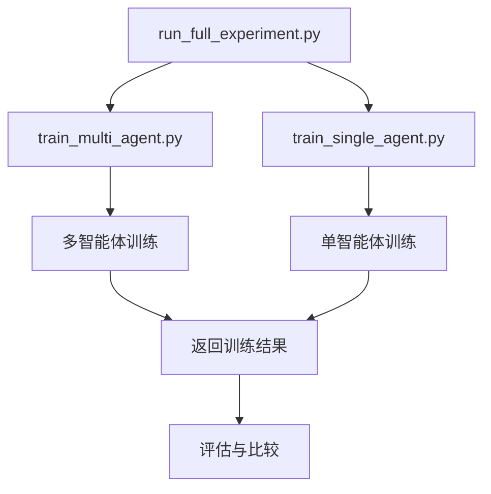
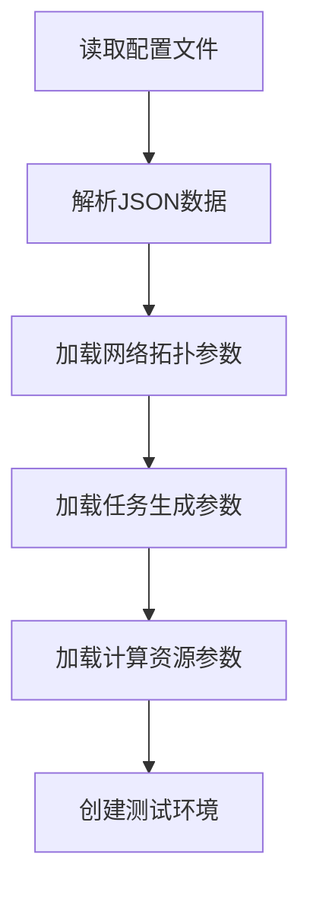
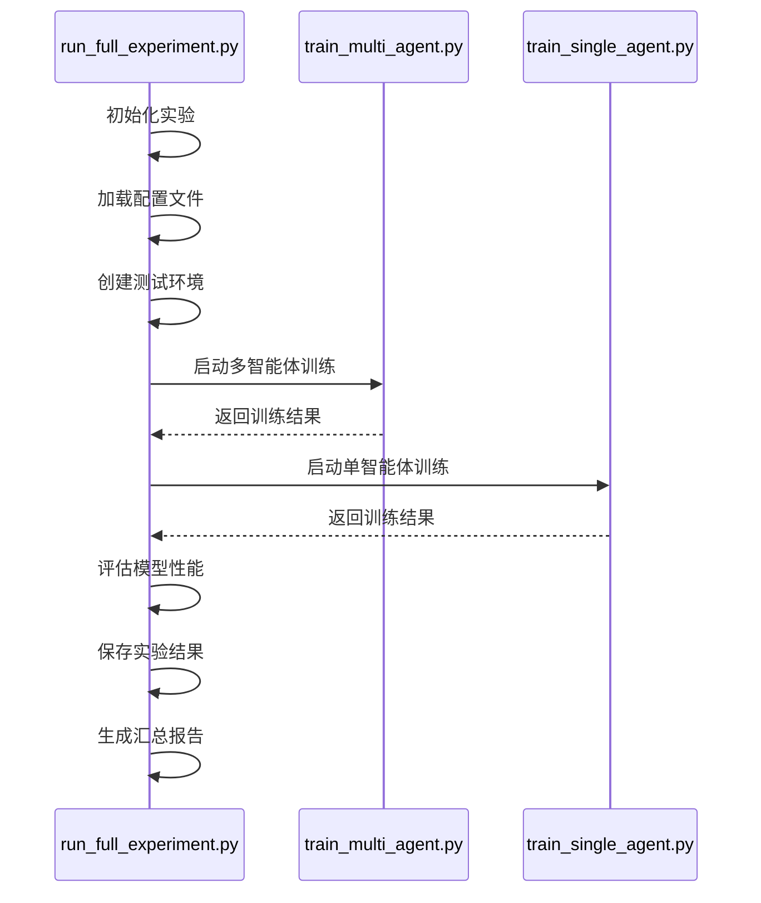

# 执行流程

<cite>
**本文档中引用的文件**  
- [run_full_experiment.py](file://run_full_experiment.py)
- [train_multi_agent.py](file://train_multi_agent.py)
- [train_single_agent.py](file://train_single_agent.py)
- [vec_system_config.json](file://vec_system_config.json)
</cite>

## 目录
1. [引言](#引言)
2. [实验生命周期协调机制](#实验生命周期协调机制)
3. [模型训练启动与评估调度](#模型训练启动与评估调度)
4. [结果数据持久化策略](#结果数据持久化策略)
5. [与训练脚本的调用关系](#与训练脚本的调用关系)
6. [配置文件动态加载机制](#配置文件动态加载机制)
7. [实验状态管理与异常处理](#实验状态管理与异常处理)
8. [完整执行路径分析](#完整执行路径分析)
9. [性能瓶颈识别与优化建议](#性能瓶颈识别与优化建议)

## 引言
`run_full_experiment.py` 是车联网边缘缓存系统（VEC-MIG）的核心协调脚本，负责管理从实验初始化到结果输出的完整生命周期。该脚本通过集成多智能体和单智能体强化学习算法，执行全面的性能评估与对比分析。其主要功能包括：协调模型训练启动、调度评估任务、持久化实验结果、管理实验状态以及处理异常中断。本文档将详细阐述该脚本如何通过调用 `train_multi_agent.py` 和 `train_single_agent.py` 来执行实验，并分析其如何根据 `vec_system_config.json` 动态加载实验参数，确保流程的连续性和鲁棒性。

## 实验生命周期协调机制
`run_full_experiment.py` 通过 `FullExperimentRunner` 类实现对整个实验生命周期的协调。该类定义了多个实验配置（如标准、高负载、大规模场景），并按顺序执行每个配置的完整实验流程。实验流程包括创建测试环境、生成任务、运行算法、计算性能指标和保存结果。脚本通过 `run_all_experiments` 方法启动所有实验，确保实验的连续性和完整性。在实验过程中，脚本会动态管理实验状态，记录关键指标，并在发生异常时进行错误处理，保障流程的连续性。

**Section sources**
- [run_full_experiment.py](file://run_full_experiment.py#L151-L583)

## 模型训练启动与评估调度
`run_full_experiment.py` 本身不直接进行模型训练，而是通过调用 `train_multi_agent.py` 和 `train_single_agent.py` 来启动训练任务。脚本通过 `subprocess` 或 `os.system` 调用这些训练脚本，传递必要的参数（如算法类型、训练轮次等）。在训练完成后，脚本会自动调度评估任务，使用 `evaluate_model` 函数对训练好的模型进行性能评估。评估过程包括在不同场景下测试模型的平均奖励、时延和完成率等指标，并将评估结果与基线算法进行对比。

**Section sources**
- [train_multi_agent.py](file://train_multi_agent.py#L715-L815)
- [train_single_agent.py](file://train_single_agent.py#L545-L645)

## 结果数据持久化策略
实验结果的持久化是 `run_full_experiment.py` 的关键功能之一。脚本通过 `save_results` 方法将详细的实验结果保存为 JSON 文件，并生成汇总报告。具体策略包括：
- **详细结果保存**：将所有实验配置的结果保存到 `results/full_experiment_results.json` 文件中。
- **汇总报告生成**：生成 `results/experiment_summary.md` 报告，包含性能对比表和改进效果分析。
- **结果目录管理**：确保 `results` 目录存在，并按算法类型组织结果文件。

**Diagram sources**
- [run_full_experiment.py](file://run_full_experiment.py#L484-L494)
- [run_full_experiment.py](file://run_full_experiment.py#L496-L544)

## 与训练脚本的调用关系
`run_full_experiment.py` 与 `train_multi_agent.py` 和 `train_single_agent.py` 之间存在明确的调用关系。`run_full_experiment.py` 作为主协调脚本，负责启动和管理实验流程，而训练脚本则负责具体的模型训练任务。调用关系如下：
- `run_full_experiment.py` 调用 `train_multi_agent.py` 来训练多智能体算法（如 MATD3、MADDPG）。
- `run_full_experiment.py` 调用 `train_single_agent.py` 来训练单智能体算法（如 DDPG、PPO）。
- 训练脚本返回训练结果，`run_full_experiment.py` 将这些结果用于后续的评估和比较。

**Diagram sources**
- [run_full_experiment.py](file://run_full_experiment.py#L546-L583)
- [train_multi_agent.py](file://train_multi_agent.py#L1141-L1165)
- [train_single_agent.py](file://train_single_agent.py#L990-L1014)

## 配置文件动态加载机制
`run_full_experiment.py` 通过 `vec_system_config.json` 文件动态加载实验参数。该配置文件定义了网络拓扑、任务生成、计算资源等关键参数。脚本在初始化时读取这些参数，并根据配置文件中的值创建测试环境和生成任务。例如，`num_vehicles`、`num_rsus` 和 `num_uavs` 参数用于确定测试环境中的节点数量，`task_arrival_rate` 参数用于控制任务生成的频率。这种动态加载机制使得实验配置更加灵活，便于进行不同场景的对比分析。

**Diagram sources**
- [vec_system_config.json](file://vec_system_config.json#L0-L68)
- [run_full_experiment.py](file://run_full_experiment.py#L190-L220)

## 实验状态管理与异常处理
`run_full_experiment.py` 通过 `try-except` 块实现异常处理，确保在实验过程中发生错误时能够捕获异常并进行适当处理。脚本会记录错误信息，并在必要时回滚到上一个稳定状态。此外，脚本通过 `os.makedirs` 确保结果目录存在，防止因目录缺失导致的写入失败。在实验过程中，脚本会定期输出进度信息，便于监控实验状态。如果实验失败，脚本会返回非零退出码，通知调用者实验未成功完成。

**Section sources**
- [run_full_experiment.py](file://run_full_experiment.py#L546-L583)

## 完整执行路径分析
从实验初始化到结果输出的完整执行路径如下：
1. **初始化**：创建 `FullExperimentRunner` 实例，加载实验配置。
2. **环境创建**：根据配置文件创建车辆、RSU 和 UAV 节点。
3. **任务生成**：根据任务到达率生成测试任务。
4. **算法运行**：依次运行 MATD3-MIG 和基线算法，收集性能数据。
5. **结果计算**：计算平均时延、总能耗、完成率等指标。
6. **结果保存**：将详细结果保存为 JSON 文件，生成汇总报告。
7. **结束**：输出实验完成信息，返回退出码。

**Diagram sources**
- [run_full_experiment.py](file://run_full_experiment.py#L546-L583)
- [train_multi_agent.py](file://train_multi_agent.py#L715-L815)
- [train_single_agent.py](file://train_single_agent.py#L545-L645)

## 性能瓶颈识别与优化建议
通过分析 `run_full_experiment.py` 的执行流程，可以识别出以下潜在性能瓶颈：
- **I/O 操作**：频繁的文件读写操作可能导致性能下降。建议使用批量写入和异步 I/O 来优化。
- **内存使用**：在大规模场景下，内存使用可能成为瓶颈。建议优化数据结构，减少内存占用。
- **计算密集型任务**：任务生成和性能计算可能消耗大量 CPU 资源。建议使用多线程或并行计算来加速。

优化建议包括：
- **并行化**：将独立的实验配置并行执行，以缩短总实验时间。
- **缓存机制**：缓存常用的计算结果，避免重复计算。
- **资源监控**：实时监控系统资源使用情况，及时发现和解决性能问题。

**Section sources**
- [run_full_experiment.py](file://run_full_experiment.py#L546-L583)
- [train_multi_agent.py](file://train_multi_agent.py#L715-L815)
- [train_single_agent.py](file://train_single_agent.py#L545-L645)