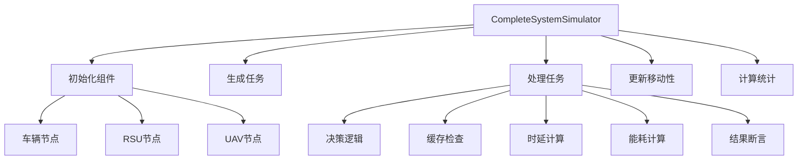
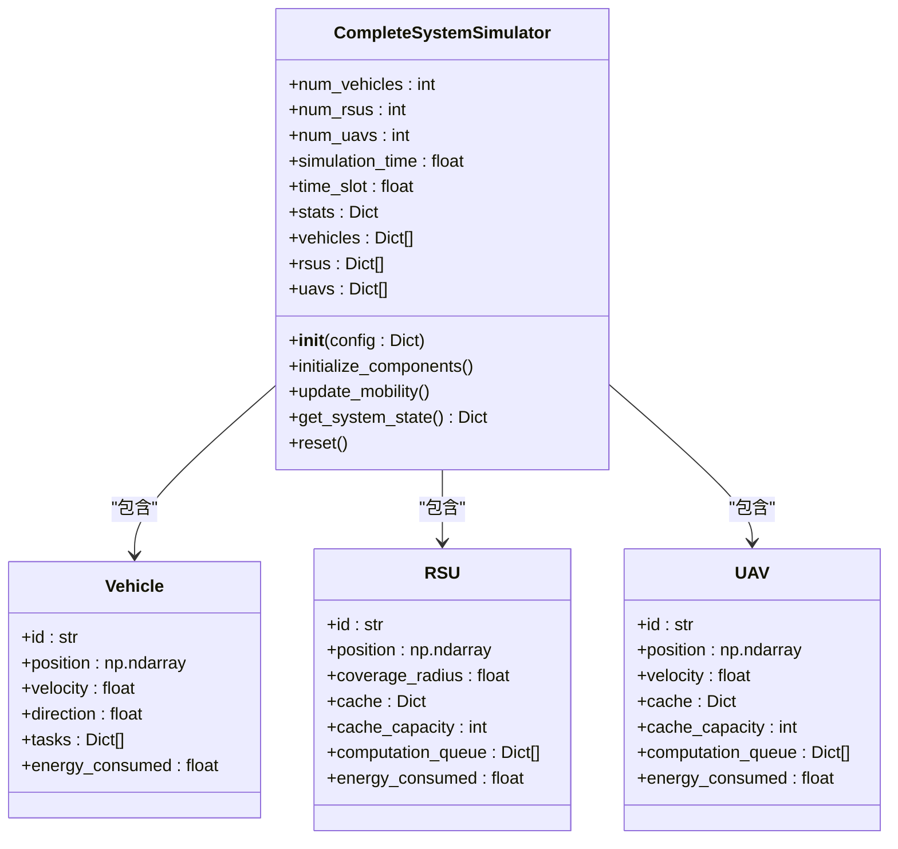
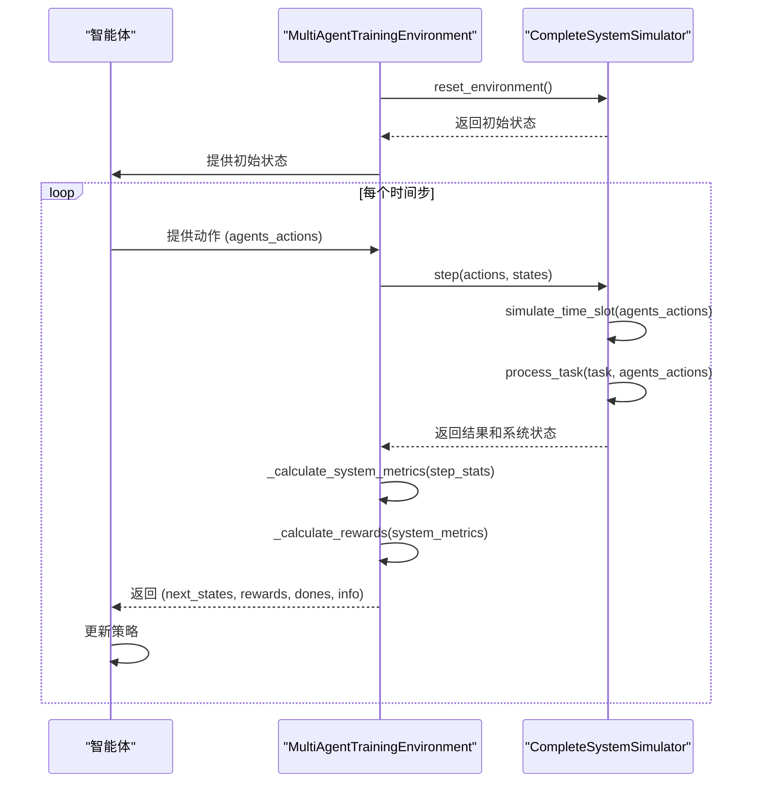

# 系统测试

<cite>
**本文档中引用的文件**  
- [test_complete_system.py](file://evaluation/test_complete_system.py)
- [performance_evaluator.py](file://evaluation/performance_evaluator.py)
- [train_multi_agent.py](file://train_multi_agent.py)
- [data_structures.py](file://models/data_structures.py)
- [system_config.py](file://config/system_config.py)
- [external_config.py](file://config/external_config.py)
- [data_validator.py](file://utils/data_validator.py)
- [energy_validator.py](file://utils/energy_validator.py)
- [standardized_reward.py](file://utils/standardized_reward.py)
</cite>

## 目录
1. [引言](#引言)
2. [测试用例构建机制](#测试用例构建机制)
3. [系统状态注入与动态模拟](#系统状态注入与动态模拟)
4. [预期行为验证与结果断言](#预期行为验证与结果断言)
5. [多智能体协作决策验证](#多智能体协作决策验证)
6. [单元测试与集成测试覆盖范围](#单元测试与集成测试覆盖范围)
7. [新测试用例编写指导](#新测试用例编写指导)
8. [测试自动化与持续集成](#测试自动化与持续集成)
9. [结论](#结论)

## 引言

`evaluation/test_complete_system.py` 模块是车联网边缘缓存系统的核心端到端测试组件，负责验证整个系统在复杂动态环境下的功能正确性、性能表现和多智能体协作决策的有效性。该模块通过 `CompleteSystemSimulator` 类实现了一个完整的仿真环境，能够模拟车辆、路侧单元（RSU）和无人机（UAV）构成的车联网场景。它不仅用于算法性能评估，还作为 `train_multi_agent.py` 等训练脚本的环境基础，为强化学习智能体提供交互接口。

本测试框架的设计目标是全面覆盖系统的关键功能，包括任务生成、卸载决策、缓存管理、能耗计算和移动性管理。通过精确的物理模型（如基于Shannon公式的传输时延计算）和合理的系统参数，该测试能够真实地反映现实世界中的挑战。其输出的详细统计信息（如完成率、平均时延、能耗和缓存命中率）是评估和比较不同算法（如MATD3、MADDPG）性能的核心依据。



**图示来源**
- [test_complete_system.py](file://evaluation/test_complete_system.py#L13-L536)

## 测试用例构建机制

`CompleteSystemSimulator` 类通过其 `generate_task` 方法构建测试用例，模拟车联网中动态生成的计算任务。每个任务被建模为一个包含多个关键属性的字典，这些属性直接映射到论文中定义的系统模型。

任务的核心属性包括：
- **`data_size`**: 任务输入数据大小，单位为MB，使用指数分布 `np.random.exponential(1.0)` 生成，以模拟真实世界中任务大小的随机性。
- **`computation_requirement`**: 任务所需的计算量，单位为MIPS，同样使用指数分布 `np.random.exponential(100)` 生成，代表不同的计算复杂度。
- **`deadline`**: 任务的截止时间，通过 `arrival_time + np.random.exponential(1.0)` 计算得出，确保任务具有不同的时延敏感性。
- **`content_id`**: 任务请求的内容ID，用于缓存命中率的计算，通过 `f'content_{np.random.randint(0, 100)}'` 随机生成，模拟有限的内容库。
- **`priority`**: 任务的优先级，使用 `np.random.uniform(0.1, 1.0)` 生成，为后续的优先级调度策略提供基础。

任务的生成策略在 `simulate_time_slot` 方法中实现，它结合了泊松过程和确定性策略。基础生成概率由 `task_arrival_rate` 配置项控制，但为了确保训练数据流的稳定性，代码中引入了 `adjusted_rate = max(base_rate, 0.1)` 的修正机制，保证每个时隙至少有10%的概率生成任务。此外，还有一个关键的“保底”逻辑：如果所有车辆在某个时隙都没有生成任务，则强制为一个随机车辆生成一个任务。这一设计确保了仿真过程始终有数据流动，避免了因随机性导致的长时间空闲，这对于强化学习训练的稳定性和收敛性至关重要。

**测试用例构建来源**
- [test_complete_system.py](file://evaluation/test_complete_system.py#L170-L197)
- [test_complete_system.py](file://evaluation/test_complete_system.py#L363-L397)

## 系统状态注入与动态模拟

`CompleteSystemSimulator` 通过初始化和动态更新机制，精确地注入并维护系统状态，以模拟真实车联网环境的动态性。

### 组件初始化
系统状态的初始注入在 `initialize_components` 方法中完成。该方法根据配置参数（如 `num_vehicles`, `num_rsus`, `num_uavs`）创建相应数量的车辆、RSU和UAV节点。每个节点都被赋予一个包含其物理和逻辑属性的字典：
- **车辆节点**：包含ID、随机生成的2D位置（`position`）、随机速度（`velocity`）、移动方向（`direction`）和初始能耗（`energy_consumed`）。
- **RSU节点**：包含ID、随机2D位置、固定的覆盖半径（`coverage_radius`）、一个空的缓存字典（`cache`）、缓存容量（`cache_capacity`）和计算队列（`computation_queue`）。
- **UAV节点**：与车辆类似，但其位置是3D的（包含高度`z`坐标），并以固定的巡航模式飞行。

### 移动性模拟
系统状态的动态变化主要体现在移动性上，由 `update_mobility` 方法处理。车辆采用简单的直线移动模型，根据其速度和方向更新位置。当车辆移动到仿真区域边界时，其方向会根据反射定律（`np.pi - direction` 或 `-direction`）进行调整，确保车辆不会离开仿真区域。UAV则采用简化的巡航模式，围绕区域中心（500, 500）做圆周运动，高度固定在100米。这种设计模拟了UAV在特定区域上空盘旋提供服务的场景。

### 状态注入接口
`get_system_state` 方法提供了一个接口，用于获取当前系统的高层状态摘要，包括节点数量、当前仿真时间和性能统计。这为外部监控和调试提供了便利。`reset` 方法则允许将整个系统状态重置到初始状态，这对于运行多个独立的仿真实验至关重要。



**图示来源**
- [test_complete_system.py](file://evaluation/test_complete_system.py#L48-L169)
- [test_complete_system.py](file://evaluation/test_complete_system.py#L275-L310)
- [test_complete_system.py](file://evaluation/test_complete_system.py#L470-L484)

## 预期行为验证与结果断言

`CompleteSystemSimulator` 通过一系列物理模型和业务逻辑来验证任务处理的预期行为，并通过结果断言来判断任务的成功与否。

### 核心验证逻辑
任务处理的核心逻辑在 `process_task` 方法中实现。该方法首先根据智能体的决策（`agents_actions`）或默认的就近卸载策略，确定任务的处理节点（车辆自身、RSU或UAV）。然后，它执行以下关键验证步骤：

1.  **缓存命中检查** (`check_cache_hit`): 检查任务请求的内容ID是否存在于处理节点的缓存中。如果命中，任务只需传输结果，时延较低；如果未命中，则需要完整的计算过程。
2.  **时延计算**:
    -   **传输时延** (`calculate_transmission_delay`): 使用香农公式 `capacity_mbps = bandwidth_mhz * log2(1 + SNR)` 计算信道容量，其中信噪比（SNR）考虑了距离导致的路径损耗。传输时延即为 `data_size / capacity_mbps`。
    -   **计算时延** (`calculate_computation_delay`): 计算执行时间 `computation_requirement / computation_capacity`，并加上一个简化的队列等待时间 `queue_length * 0.01`。
    -   **总时延**: 缓存命中时为传输时延；未命中时为传输时延与计算时延之和。
3.  **能耗计算** (`calculate_energy_consumption`): 分别计算传输能耗（`transmission_power * transmission_time`）和计算能耗（`computation_power * computation_time`），并求和得到总能耗。

### 结果断言
最终的断言逻辑基于任务的**截止时间**。系统计算任务的完成时间 `completion_time = arrival_time + total_delay`。如果 `completion_time <= deadline`，则任务被标记为 `'completed'`，其延迟、能耗等指标被计入统计。否则，任务被标记为 `'dropped'`（丢弃），并计入丢弃任务计数。这种基于截止时间的硬性约束是验证系统实时性能的关键。

此外，系统还包含数值修正逻辑，以防止因模型计算（如信号过弱导致SNR为负）产生无穷大或异常大的值。例如，`total_delay` 被限制在1.0秒以内，`total_energy` 被限制在2000.0焦耳以内，确保了仿真的数值稳定性。

**预期行为验证来源**
- [test_complete_system.py](file://evaluation/test_complete_system.py#L312-L359)
- [test_complete_system.py](file://evaluation/test_complete_system.py#L363-L397)
- [test_complete_system.py](file://evaluation/test_complete_system.py#L401-L469)

## 多智能体协作决策验证

`CompleteSystemSimulator` 不仅是一个独立的测试工具，更是验证多智能体协作决策正确性的核心平台。它通过与 `train_multi_agent.py` 的紧密集成，为智能体提供了一个真实的交互环境。

### 决策接口
`process_task` 方法的 `agents_actions` 参数是智能体决策的入口。当该参数不为 `None` 时，系统会使用智能体提供的决策来选择任务的处理节点。这使得仿真器能够评估不同多智能体算法（如MATD3、MADDPG）在复杂环境下的决策质量。

### 状态与奖励反馈
`train_multi_agent.py` 中的 `MultiAgentTrainingEnvironment` 类封装了 `CompleteSystemSimulator`，并负责构建智能体所需的状态向量和奖励信号。
- **状态向量** (`reset_environment`, `step`): 从仿真器的 `vehicles`, `rsus`, `uavs` 列表中提取关键信息（如归一化的位置、速度、任务数、能耗、缓存利用率等），并将其转换为智能体可以理解的数值向量。
- **奖励信号** (`_calculate_rewards`): 调用 `utils/standardized_reward.py` 中的 `calculate_standardized_reward` 函数。该函数根据系统指标（如平均时延、总能耗、任务完成率、数据丢失率）计算一个标准化的奖励值，其核心是论文中定义的加权成本函数 `reward = -(ω_T * normalized_delay + ω_E * normalized_energy + ω_D * data_loss_rate)`。这个奖励函数是驱动智能体学习协作优化策略的关键。

### 验证流程
整个验证流程如下：智能体根据当前状态选择动作（卸载决策） -> 动作被传递给 `CompleteSystemSimulator` -> 仿真器执行 `process_task` 并返回结果 -> `train_multi_agent.py` 收集结果并计算系统指标 -> 基于系统指标计算奖励 -> 将状态、动作、奖励、新状态反馈给智能体进行学习。通过观察训练过程中奖励的提升、平均时延的降低和任务完成率的提高，可以间接验证多智能体协作决策的有效性。



**图示来源**
- [train_multi_agent.py](file://train_multi_agent.py#L225-L258)
- [train_multi_agent.py](file://train_multi_agent.py#L300-L350)
- [standardized_reward.py](file://utils/standardized_reward.py#L45-L80)

## 单元测试与集成测试覆盖范围

尽管 `tests/` 目录当前为空，但系统通过模块化的测试函数和集成的验证工具，实现了有效的单元和集成测试覆盖。

### 单元测试
每个核心模块都包含一个 `test_` 前缀的测试函数，用于验证其基本功能。
- **`test_simulator()`** (`test_complete_system.py`): 这是一个集成测试，但它验证了 `CompleteSystemSimulator` 的基本功能。它创建一个仿真器实例，运行100个时隙的短期仿真，并打印关键性能指标（如完成率、平均时延、能耗），以确认仿真器能够正常启动和运行。
- **`test_evaluator()`** (`performance_evaluator.py`): 这是一个典型的单元测试。它创建一个 `PerformanceEvaluator` 实例，传入模拟的算法结果（`mock_results`），然后验证评估器能否正确计算综合分数、生成性能报告和绘制对比图。
- **`validate_reward_consistency()`** (`standardized_reward.py`): 这个函数通过一个具体的测试用例，验证了标准化奖励函数的计算逻辑是否正确，确保了奖励计算的稳定性和一致性。

### 集成测试
真正的集成测试发生在 `train_multi_agent.py` 的训练过程中。整个训练流程本身就是一次大规模的集成测试：
1.  **组件集成**: 它集成了 `CompleteSystemSimulator`（环境）、`MATD3Environment`/`MADDPGEnvironment`（智能体）和 `PerformanceEvaluator`（评估器）。
2.  **端到端流程**: 它完整地执行了“重置环境 -> 智能体决策 -> 执行仿真 -> 计算奖励 -> 更新智能体”的闭环。
3.  **性能评估**: 在训练过程中，会定期调用 `evaluate_model` 函数，使用 `CompleteSystemSimulator` 运行评估仿真，并通过 `PerformanceEvaluator` 生成详细的性能报告，从而验证整个系统在不同训练阶段的性能。

此外，`utils` 目录下的 `data_validator.py` 和 `energy_validator.py` 提供了强大的运行时验证能力。`data_validator` 可以检查系统指标（如完成率、丢失率之和是否超过1）的逻辑一致性，而 `energy_validator` 可以检测能耗计算的异常值。这些工具在训练和测试过程中被调用，起到了实时监控和保障数据质量的作用。

**测试覆盖范围来源**
- [test_complete_system.py](file://evaluation/test_complete_system.py#L498-L536)
- [performance_evaluator.py](file://evaluation/performance_evaluator.py#L250-L313)
- [standardized_reward.py](file://utils/standardized_reward.py#L120-L148)
- [data_validator.py](file://utils/data_validator.py#L100-L200)
- [energy_validator.py](file://utils/energy_validator.py#L50-L100)

## 新测试用例编写指导

为了扩展测试覆盖范围，特别是模拟异常场景，可以基于现有框架编写新的测试用例。以下是具体的指导方法。

### 模拟通信延迟
可以通过修改 `calculate_transmission_delay` 方法来模拟高延迟场景。例如，可以引入一个 `delay_factor` 配置项，放大计算出的时延。
```python
# 在 config/system_config.py 中添加
self.communication_delay_factor = 2.0  # 2倍延迟

# 在 test_complete_system.py 的 calculate_transmission_delay 方法中
delay = data_size / capacity_mbps
delay *= self.config.get('communication_delay_factor', 1.0)  # 应用延迟因子
```

### 模拟节点失效
可以在 `simulate_time_slot` 方法中，根据配置的概率随机使某个节点失效。
```python
# 在 simulate_time_slot 开始时添加
if np.random.random() < self.config.get('node_failure_rate', 0.0):
    # 随机选择一个节点并使其失效
    node_type = np.random.choice(['vehicles', 'rsus', 'uavs'])
    nodes = getattr(self, node_type)
    if nodes:
        failed_node = np.random.choice(nodes)
        failed_node['is_active'] = False  # 假设已添加此字段
        # 在 find_nearest_rsu/uav 中，跳过 is_active 为 False 的节点
```

### 编写新测试函数
可以创建一个新的测试函数 `test_failure_scenario()`，专门用于测试系统在节点失效情况下的鲁棒性。
```python
def test_failure_scenario():
    """测试节点失效场景"""
    print("🧪 测试节点失效场景...")
    simulator = CompleteSystemSimulator({
        'node_failure_rate': 0.05,  # 5%的时隙发生节点失效
        'simulation_time': 500
    })
    results = simulator.run_simulation(num_time_slots=500)
    # 分析结果，验证系统在部分节点失效时的性能下降程度
    print(f"在节点失效情况下，完成率: {results['statistics']['completion_rate']:.2%}")
```

## 测试自动化与持续集成

该系统的测试自动化与持续集成（CI）可以通过以下方案实现。

### 自动化测试脚本
可以创建一个 `run_tests.py` 脚本，自动执行所有测试函数。
```python
# run_tests.py
from evaluation.test_complete_system import test_simulator
from evaluation.performance_evaluator import test_evaluator
from utils.standardized_reward import validate_reward_consistency

def run_all_tests():
    print("开始运行所有测试...")
    test_simulator()
    test_evaluator()
    validate_reward_consistency()
    print("所有测试完成！")

if __name__ == "__main__":
    run_all_tests()
```

### 持续集成（CI）集成
可以使用 GitHub Actions 或 GitLab CI 等工具，在代码提交时自动运行测试。
```yaml
# .github/workflows/test.yml
name: Run Tests
on: [push, pull_request]
jobs:
  test:
    runs-on: ubuntu-latest
    steps:
    - uses: actions/checkout@v2
    - name: Set up Python
      uses: actions/setup-python@v2
      with:
        python-version: '3.8'
    - name: Install dependencies
      run: |
        pip install numpy matplotlib
    - name: Run tests
      run: |
        python run_tests.py
```

### 与训练流程集成
`train_multi_agent.py` 脚本本身就是一个强大的自动化测试工具。通过配置 `--compare` 参数，它可以自动训练和比较所有支持的算法，并生成最终的性能报告。这可以作为CI流程的一部分，确保每次代码变更后，新算法的性能不会下降。

**测试自动化来源**
- [test_complete_system.py](file://evaluation/test_complete_system.py#L498-L536)
- [train_multi_agent.py](file://train_multi_agent.py#L700-L750)

## 结论

`evaluation/test_complete_system.py` 模块是整个车联网边缘缓存系统测试和评估的基石。它通过 `CompleteSystemSimulator` 类提供了一个功能完备、物理模型精确的端到端仿真环境。该模块不仅能够独立运行以验证系统的基本功能，更重要的是，它作为强化学习训练的环境，为多智能体协作决策的验证提供了不可或缺的平台。

其测试机制涵盖了从测试用例构建、系统状态注入、预期行为验证到结果断言的完整链条。通过与 `train_multi_agent.py`、`performance_evaluator.py` 和 `utils` 下的验证工具的深度集成，系统实现了有效的单元测试和集成测试覆盖。尽管 `tests/` 目录为空，但模块内部的 `test_` 函数和训练流程本身构成了一个强大的测试体系。

为了进一步提升测试的全面性，建议补充针对异常场景（如通信延迟、节点失效）的专门测试用例，并建立一个完整的CI/CD流水线，将 `run_tests.py` 和 `train_multi_agent.py --compare` 纳入自动化流程。这将确保代码质量和系统性能的持续稳定。