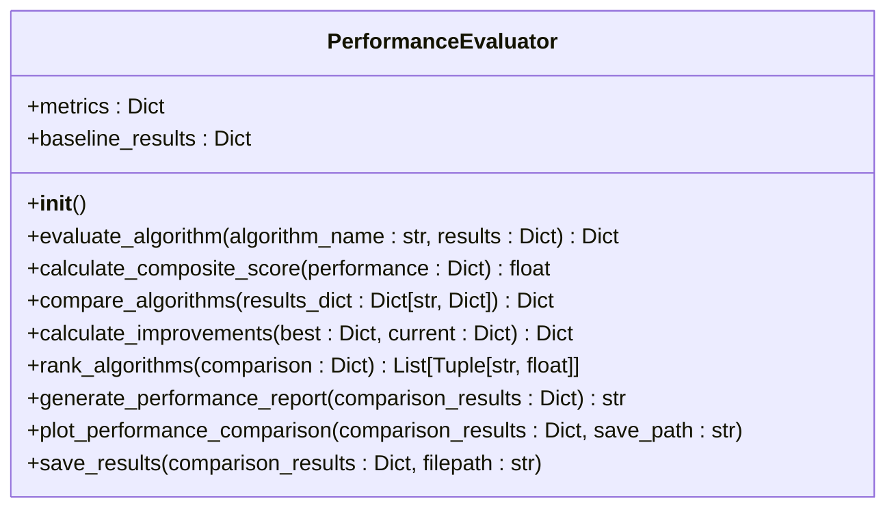
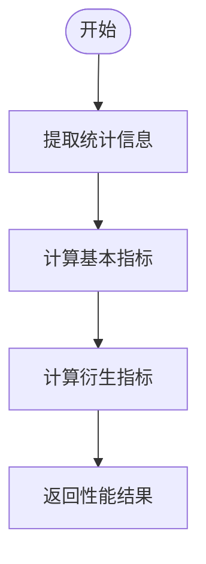
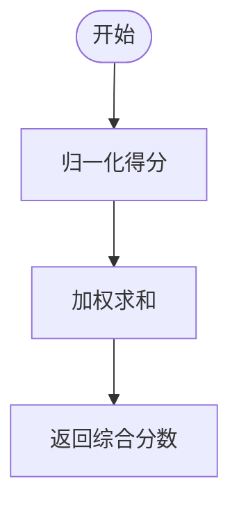
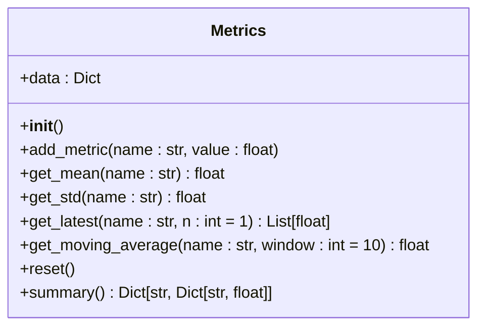
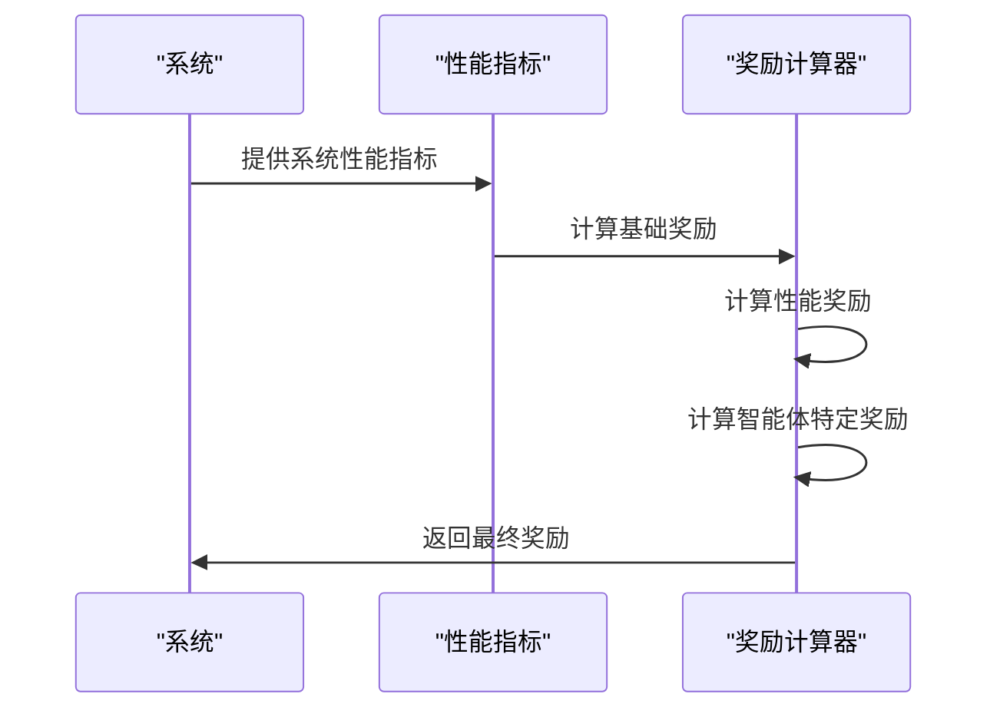

# 性能评估

<cite>
**本文档引用的文件**  
- [performance_evaluator.py](file://evaluation/performance_evaluator.py)
- [metrics.py](file://utils/metrics.py)
- [reward_calculator.py](file://utils/reward_calculator.py)
</cite>

## 目录
1. [简介](#简介)
2. [性能评估机制](#性能评估机制)
3. [核心指标计算](#核心指标计算)
4. [综合性能评分](#综合性能评分)
5. [与标准化度量函数的集成](#与标准化度量函数的集成)
6. [奖励信号转换](#奖励信号转换)
7. [实际评估场景示例](#实际评估场景示例)
8. [常见问题排查](#常见问题排查)
9. [结论](#结论)

## 简介
本文件详细文档化 `performance_evaluator.py` 中的性能评估机制，重点说明其如何计算任务延迟、能耗、缓存命中率、系统吞吐量等核心指标。解释指标计算的数学公式和实现逻辑，结合代码示例展示 `evaluate_system_performance` 方法的调用流程。描述与 `utils/metrics.py` 中标准化度量函数的集成方式，以及 `reward_calculator.py` 如何将性能指标转化为强化学习奖励信号。提供实际评估场景示例，如在高负载条件下评估 MATD3 与 MADDPG 的延迟表现差异，并说明常见问题如指标漂移或数值溢出的排查方法。

## 性能评估机制
性能评估器（PerformanceEvaluator）是系统性能评估的核心组件，负责评估和比较不同算法的性能。它通过一系列方法来计算和比较算法的性能指标。



**图表来源**  
- [performance_evaluator.py](file://evaluation/performance_evaluator.py#L1-L313)

**节来源**  
- [performance_evaluator.py](file://evaluation/performance_evaluator.py#L1-L313)

## 核心指标计算
性能评估器通过 `evaluate_algorithm` 方法计算单个算法的基本性能指标。这些指标包括总任务数、完成任务数、完成率、平均延迟、总能耗、缓存命中率和丢弃率。



**图表来源**  
- [performance_evaluator.py](file://evaluation/performance_evaluator.py#L38-L75)

**节来源**  
- [performance_evaluator.py](file://evaluation/performance_evaluator.py#L38-L75)

## 综合性能评分
综合性能评分通过 `calculate_composite_score` 方法计算，该方法使用加权求和的方式将多个性能指标组合成一个综合分数。权重设置如下：
- 完成率：0.3
- 延迟效率：0.25
- 能效：0.2
- 缓存命中率：0.25



**图表来源**  
- [performance_evaluator.py](file://evaluation/performance_evaluator.py#L38-L75)

**节来源**  
- [performance_evaluator.py](file://evaluation/performance_evaluator.py#L38-L75)

## 与标准化度量函数的集成
性能评估器与 `utils/metrics.py` 中的标准化度量函数集成，以确保所有算法使用一致的度量逻辑。`Metrics` 类提供了添加指标数据、获取平均值、标准差、最新值、移动平均值和重置数据的方法。



**图表来源**  
- [metrics.py](file://utils/metrics.py#L1-L147)

**节来源**  
- [metrics.py](file://utils/metrics.py#L1-L147)

## 奖励信号转换
`reward_calculator.py` 中的 `UnifiedRewardCalculator` 类将性能指标转化为强化学习奖励信号。基础奖励基于论文目标函数，性能奖励鼓励高性能表现，智能体特定奖励针对不同类型的智能体。



**图表来源**  
- [reward_calculator.py](file://utils/reward_calculator.py#L1-L244)

**节来源**  
- [reward_calculator.py](file://utils/reward_calculator.py#L1-L244)

## 实际评估场景示例
在高负载条件下，评估 MATD3 与 MADDPG 的延迟表现差异。通过 `compare_algorithms` 方法比较两个算法的性能，并生成详细的性能报告。

```python
# 模拟算法结果
mock_results = {
    'MATD3': {
        'statistics': {
            'total_tasks': 1000,
            'completed_tasks': 850,
            'completion_rate': 0.85,
            'avg_delay': 0.12,
            'total_energy': 5000,
            'cache_hit_rate': 0.75,
            'drop_rate': 0.15
        }
    },
    'MADDPG': {
        'statistics': {
            'total_tasks': 1000,
            'completed_tasks': 800,
            'completion_rate': 0.80,
            'avg_delay': 0.15,
            'total_energy': 5500,
            'cache_hit_rate': 0.65,
            'drop_rate': 0.20
        }
    }
}

# 创建评估器
evaluator = PerformanceEvaluator()

# 进行比较
comparison = evaluator.compare_algorithms(mock_results)

# 生成报告
report = evaluator.generate_performance_report(comparison)
print(report)
```

**节来源**  
- [performance_evaluator.py](file://evaluation/performance_evaluator.py#L243-L313)

## 常见问题排查
常见问题包括指标漂移和数值溢出。通过 `check_numerical_health` 函数检查数值健康状况，确保计算结果的稳定性。

```python
def check_numerical_health(value: float, name: str) -> bool:
    if np.isnan(value) or np.isinf(value):
        print(f"❌ {name}: 数值不健康")
        return False
    return True
```

**节来源**  
- [enhance_numerical_stability.py](file://enhance_numerical_stability.py#L405-L440)

## 结论
本文档详细介绍了 `performance_evaluator.py` 中的性能评估机制，涵盖了核心指标计算、综合性能评分、与标准化度量函数的集成、奖励信号转换、实际评估场景示例和常见问题排查。通过这些机制，可以全面评估和比较不同算法的性能，为系统优化提供有力支持。