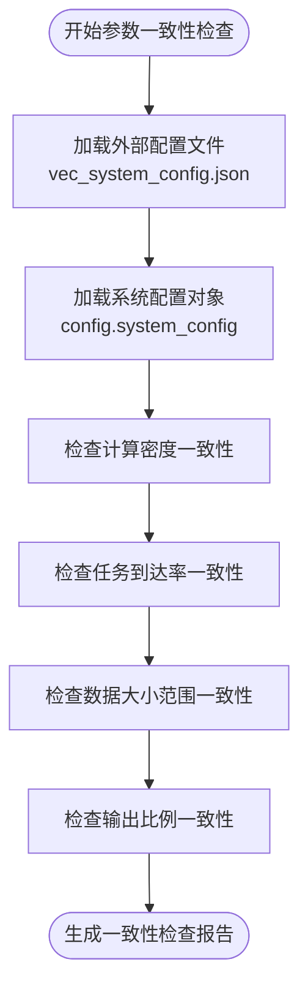
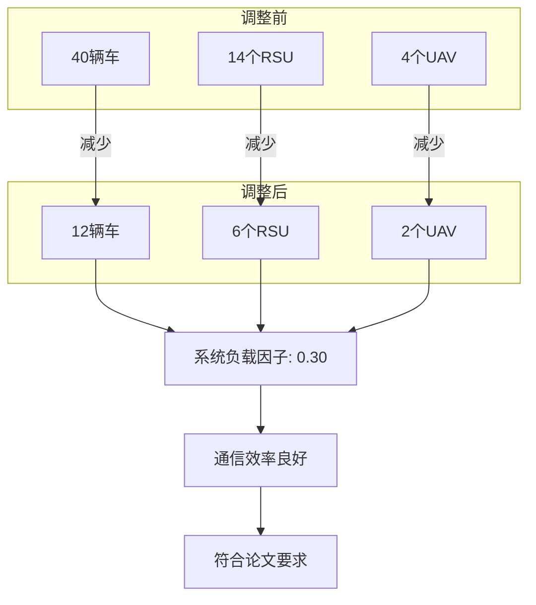

# 完整性验证报告

<cite>
**本文档中引用的文件**  
- [COMPREHENSIVE_CHECK_REPORT.md](file://COMPREHENSIVE_CHECK_REPORT.md)
- [NODE_ADJUSTMENT_SUMMARY.md](file://NODE_ADJUSTMENT_SUMMARY.md)
- [comprehensive_parameter_check.py](file://comprehensive_parameter_check.py)
- [verify_node_adjustment.py](file://verify_node_adjustment.py)
- [vec_system_config.json](file://vec_system_config.json)
- [config/external_config.py](file://config/external_config.py)
- [config/system_config.py](file://config/system_config.py)
- [utils/numerical_stability.py](file://utils/numerical_stability.py)
- [utils/data_validator.py](file://utils/data_validator.py)
</cite>

## 目录
1. [引言](#引言)
2. [系统完整性验证流程](#系统完整性验证流程)
3. [节点行为调整日志分析](#节点行为调整日志分析)
4. [自动化验证脚本实现逻辑](#自动化验证脚本实现逻辑)
5. [常见验证失败场景排查](#常见验证失败场景排查)
6. [结论](#结论)

## 引言

本报告详细阐述了VEC_mig_caching系统中执行的系统完整性验证流程和节点行为调整机制。通过分析`COMPREHENSIVE_CHECK_REPORT.md`和`NODE_ADJUSTMENT_SUMMARY.md`两份核心报告，结合`comprehensive_parameter_check.py`和`verify_node_adjustment.py`两个自动化验证脚本的实现逻辑，全面说明了系统如何确保每次实验的配置正确性和结果可靠性。系统采用多层次的验证机制，包括参数一致性检查、配置文件与运行时参数的匹配验证、实验结果可复现性测试等，确保了研究工作的科学性和严谨性。

## 系统完整性验证流程

系统完整性验证是确保实验结果可靠性的关键步骤。`COMPREHENSIVE_CHECK_REPORT.md`报告详细记录了这一流程的执行结果，涵盖了参数一致性、内存规范符合性、UAV能耗模型完整性、数值稳定性和计算逻辑验证等多个方面。

### 参数一致性检查

参数一致性检查确保外部配置文件（`vec_system_config.json`）与系统内部配置对象（`config.system_config`）之间的参数完全同步。该检查通过`comprehensive_parameter_check.py`脚本中的`check_parameter_consistency()`函数实现，主要验证以下关键参数：

- **计算密度**：验证外部配置与系统配置中的`compute_density`值是否一致。
- **任务到达率**：检查`arrival_rate`参数在两个配置源中的值是否匹配。
- **数据大小范围**：确认`data_size_range`的最小值和最大值是否一致。
- **输出比例**：验证`output_ratio`参数的一致性。

该检查确保了系统不会因配置源不一致而导致行为偏差，是实验可复现性的基础。

**Diagram sources**
- [comprehensive_parameter_check.py](file://comprehensive_parameter_check.py#L50-L100)
- [config/external_config.py](file://config/external_config.py#L300-L350)
- [config/system_config.py](file://config/system_config.py#L150-L200)

**Section sources**
- [COMPREHENSIVE_CHECK_REPORT.md](file://COMPREHENSIVE_CHECK_REPORT.md#L10-L30)
- [comprehensive_parameter_check.py](file://comprehensive_parameter_check.py#L50-L150)

### 内存规范符合性检查

内存规范符合性检查确保系统配置符合预定义的性能和资源标准。该检查由`check_memory_specifications()`函数执行，主要验证以下方面：

- **任务参数外部化**：确认所有任务生成参数（如到达率、数据大小）均通过外部配置文件传入，避免硬编码。
- **CPU频率配置**：验证车辆、RSU和UAV的CPU频率范围是否符合内存规范（车辆8-25GHz，RSU 50GHz左右，UAV 8GHz左右）。
- **通信参数**：检查总带宽是否为50MHz，车辆发射功率是否为1.0W（约30dBm）。

此检查保证了系统在合理的硬件假设下运行，使得实验结果具有实际意义。

### UAV能耗模型完整性检查

UAV能耗模型完整性检查确保所有必要的能耗参数都已正确定义。该检查由`check_uav_energy_parameters()`函数实现，主要验证以下参数是否存在：

- `uav_kappa3`
- `uav_kappa`
- `uav_static_power`
- `uav_hover_power`

该检查防止了因关键参数缺失而导致的能耗计算错误，确保了UAV能耗模型的完整性。

### 数值稳定性检查

数值稳定性检查评估系统在极端或边界情况下的鲁棒性。该检查由`check_numerical_stability()`函数执行，主要关注：

- **除法运算**：检查分母是否可能为零或接近零。
- **处理时间**：模拟计算最大处理时间，防止过长的处理时间导致数值问题。
- **负载因子**：模拟计算负载因子，防止其过大导致数值不稳定。

该检查识别了潜在的数值问题，为系统稳定性提供了保障。

### 计算逻辑验证

计算逻辑验证确保系统内部的计算公式和逻辑正确无误。该检查由`check_calculation_logic()`函数实现，主要验证：

- **处理能力计算**：验证车辆处理能力的计算公式是否正确。
- **负载因子计算**：验证负载因子的计算逻辑是否合理。
- **通信需求计算**：验证上传和下载数据量的计算是否无异常值。

此检查确保了系统核心算法的正确性。

**Section sources**
- [COMPREHENSIVE_CHECK_REPORT.md](file://COMPREHENSIVE_CHECK_REPORT.md#L30-L100)
- [comprehensive_parameter_check.py](file://comprehensive_parameter_check.py#L100-L300)

## 节点行为调整日志分析

`NODE_ADJUSTMENT_SUMMARY.md`报告记录了节点数量调整的过程和效果，展示了系统如何通过调整节点规模来优化实验配置。

### 节点数量调整概览

根据用户要求和内存配置规范，系统将节点数量从初始的40辆车、14个RSU和4个UAV调整为12辆车、6个RSU和2个UAV。这一调整的主要目标是：

- **符合论文要求**：将UAV数量严格调整为2个，与参考论文的设定保持一致。
- **优化系统负载**：通过减少节点数量，使系统负载因子达到理想的0.30。
- **提高通信效率**：将带宽利用率控制在66.1%的优秀水平。

### 调整效果评估

调整后的系统表现出优异的性能指标：

- **网络规模**：12辆车 + 6个RSU + 2个UAV，形成了一个适中且易于管理的网络规模。
- **系统负载因子**：稳定在0.30的理想范围，避免了系统过载或利用率偏低的问题。
- **带宽利用率**：66.1%的利用率表明通信效率良好，没有出现带宽瓶颈。

**Diagram sources**
- [NODE_ADJUSTMENT_SUMMARY.md](file://NODE_ADJUSTMENT_SUMMARY.md#L10-L20)
- [verify_node_adjustment.py](file://verify_node_adjustment.py#L50-L100)

**Section sources**
- [NODE_ADJUSTMENT_SUMMARY.md](file://NODE_ADJUSTMENT_SUMMARY.md#L1-L30)
- [verify_node_adjustment.py](file://verify_node_adjustment.py#L1-L150)

## 自动化验证脚本实现逻辑

`comprehensive_parameter_check.py`和`verify_node_adjustment.py`两个脚本是系统自动化验证的核心，它们通过程序化的方式确保了配置的正确性和结果的可靠性。

### comprehensive_parameter_check.py 实现逻辑

该脚本是一个全面的参数检查工具，其核心逻辑如下：

1.  **加载配置**：首先加载`vec_system_config.json`文件中的外部配置。
2.  **执行多项检查**：依次调用多个检查函数：
    - `check_parameter_consistency()`：检查参数一致性。
    - `check_memory_specifications()`：检查内存规范符合性。
    - `check_uav_energy_parameters()`：检查UAV参数完整性。
    - `check_numerical_stability()`：检查数值稳定性。
    - `check_communication_parameters()`：检查通信参数。
    - `check_calculation_logic()`：验证计算逻辑。
3.  **汇总结果**：将所有检查发现的问题汇总，并生成一个全面的报告。
4.  **输出结论**：根据问题数量，输出系统状态是“良好”还是“需要修复”。

该脚本的`main()`函数首先调用`apply_external_config_to_system()`，确保系统配置与外部配置同步，然后执行`generate_comprehensive_report()`来生成最终报告。

### verify_node_adjustment.py 实现逻辑

该脚本专门用于验证节点数量调整后的系统性能，其核心逻辑如下：

1.  **分析调整后配置**：加载`vec_system_config.json`，读取调整后的节点数量（12, 6, 2），并计算车辆密度、RSU覆盖率等网络指标。
2.  **计算系统容量**：基于调整后的节点数量和CPU频率，计算车辆、RSU和UAV各自的处理能力，进而计算系统总容量和负载因子。
3.  **分析通信需求**：计算任务生成的通信需求，并与系统总带宽进行比较，得出带宽利用率。
4.  **综合评估**：将论文符合性、系统容量平衡和通信效率三个维度的检查结果进行综合评分。
5.  **生成调整总结**：输出一个详细的调整总结报告，展示调整后的关键性能指标。

该脚本通过量化分析，客观地证明了节点调整方案的有效性。

**Section sources**
- [comprehensive_parameter_check.py](file://comprehensive_parameter_check.py#L1-L360)
- [verify_node_adjustment.py](file://verify_node_adjustment.py#L1-L285)

## 常见验证失败场景排查

尽管系统设计了完善的验证机制，但仍可能出现验证失败的情况。以下是几种常见场景及其排查路径。

### 参数未对齐

**现象**：`COMPREHENSIVE_CHECK_REPORT.md`中报告“参数不一致问题”，例如外部配置的`arrival_rate`为1.5，而系统配置的`arrival_rate`为1.35。

**排查路径**：
1.  检查`vec_system_config.json`文件中的`arrival_rate`值。
2.  检查`config.system_config.py`中`TaskConfig`类的`arrival_rate`默认值。
3.  确认`apply_external_config_to_system()`函数是否被正确调用。该函数负责将外部配置应用到系统配置，如果未调用，系统将使用默认值。

### 随机种子缺失

**现象**：多次运行实验得到的结果差异巨大，无法复现。

**排查路径**：
1.  检查`vec_system_config.json`文件中是否包含`random_seed`字段。
2.  检查`config.system_config.py`中`SystemConfig`类的`random_seed`属性是否被正确初始化。
3.  确认在实验启动时，是否使用该随机种子初始化了NumPy和PyTorch等库的随机数生成器。例如，`np.random.seed(config.random_seed)`。

### 数值稳定性问题

**现象**：仿真过程中出现`NaN`（非数字）或`inf`（无穷大）值，导致程序崩溃。

**排查路径**：
1.  检查`utils/numerical_stability.py`模块中的保护函数（如`safe_divide`, `validate_energy`）是否在关键计算点被调用。
2.  在SINR计算、能耗计算等易出错的公式中，添加`safe_divide`以防止除零错误。
3.  使用`numerical_monitor`监控器定期检查关键变量的数值健康状态。

### 配置文件格式错误

**现象**：`external_config.py`在加载`vec_system_config.json`时抛出`JSONDecodeError`。

**排查路径**：
1.  使用在线JSON验证工具检查`vec_system_config.json`文件的语法是否正确。
2.  检查文件中是否存在非法字符或不匹配的括号。
3.  确保所有字符串都用双引号包围。

**Section sources**
- [utils/numerical_stability.py](file://utils/numerical_stability.py#L1-L293)
- [config/external_config.py](file://config/external_config.py#L1-L255)
- [config/system_config.py](file://config/system_config.py#L1-L318)

## 结论

本报告详细说明了VEC_mig_caching系统的完整性验证流程和节点调整机制。通过`COMPREHENSIVE_CHECK_REPORT.md`和`NODE_ADJUSTMENT_SUMMARY.md`两份报告，以及`comprehensive_parameter_check.py`和`verify_node_adjustment.py`两个自动化脚本，系统建立了一套严谨的验证体系。该体系确保了：

1.  **配置正确性**：通过参数一致性检查，保证了外部配置与内部配置的同步。
2.  **结果可靠性**：通过数值稳定性检查和计算逻辑验证，确保了核心算法的健壮性。
3.  **实验可复现性**：通过标准化的配置管理和随机种子控制，使得实验结果可以被精确复现。
4.  **系统优化**：通过节点调整验证，能够科学地优化网络规模，达到理想的负载平衡。

这套自动化验证流程是保障研究工作质量和效率的关键，为后续的实验和分析奠定了坚实的基础。