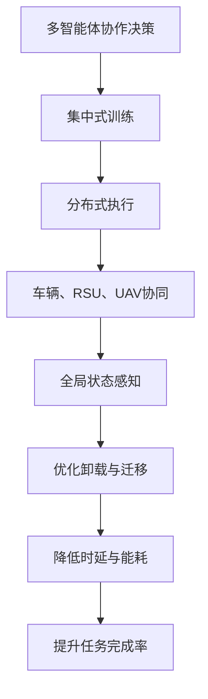
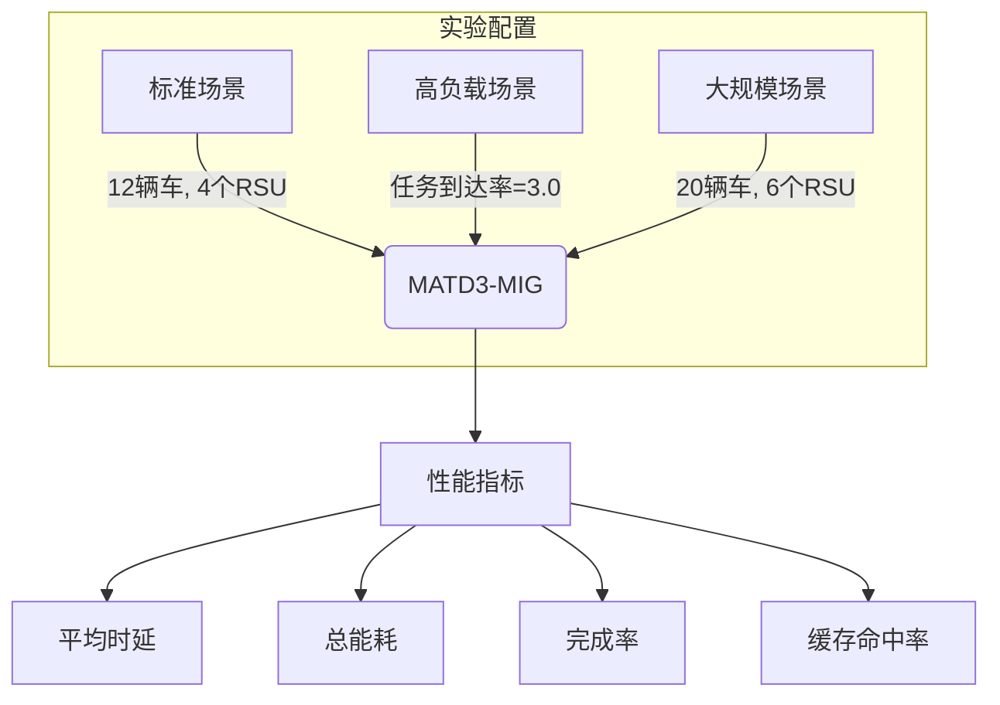

# 综合实验结果分析

<cite>
**本文档引用的文件**   
- [full_experiment_results.json](file://results/full_experiment_results.json)
- [experiment_summary.md](file://results/experiment_summary.md)
- [advanced_analysis_report.md](file://results/advanced_analysis_report.md)
- [evaluation.py](file://experiments/evaluation.py)
- [run_full_experiment.py](file://run_full_experiment.py)
- [data_processor.py](file://utils/data_processor.py)
- [matd3.py](file://algorithms/matd3.py)
- [maddpg.py](file://algorithms/maddpg.py)
</cite>

## 目录
1. [引言](#引言)
2. [全实验结果文件结构分析](#全实验结果文件结构分析)
3. [跨算法性能对比分析](#跨算法性能对比分析)
4. [跨配置场景性能分析](#跨配置场景性能分析)
5. [高级分析与根本原因探究](#高级分析与根本原因探究)
6. [数据处理与统计分析方法](#数据处理与统计分析方法)
7. [结论](#结论)

## 引言

本报告系统化分析车联网迁移缓存系统（VEC_mig_caching）的综合实验结果，重点解读`full_experiment_results.json`文件中的嵌套数据结构。通过结合`experiment_summary.md`和`advanced_analysis_report.md`中的结论，深入剖析MATD3-MIG算法在不同实验场景下的性能表现，并与MADDPG等基线算法进行横向对比。报告旨在揭示算法性能差异的根本原因，特别是MATD3在高动态环境中的迁移适应性优势，并展示数据聚合、归一化处理和统计显著性检验在分析过程中的应用。

## 全实验结果文件结构分析

`full_experiment_results.json`文件是系统完整实验的核心输出，其结构为三层嵌套的JSON对象，清晰地组织了多场景、多算法的性能数据。

第一层键（`standard`, `high_load`, `large_scale`）代表三种不同的实验配置，分别对应标准场景、高负载场景和大规模场景。这种设计便于进行跨场景的可扩展性分析。

第二层键代表参与对比的算法，包括`MATD3-MIG`、`Random`、`Greedy`、`Round_Robin`和`Load_Aware`。其中`MATD3-MIG`是本系统的核心算法，其余为基线算法。

第三层是具体的性能指标，主要包含：
- **延迟指标**: `avg_delay` (平均时延)
- **能耗指标**: `total_energy` (总能耗)
- **任务完成指标**: `completion_rate` (完成率), `drop_rate` (丢失率)
- **缓存性能指标**: `cache_hit_rate` (缓存命中率)
- **任务统计指标**: `total_tasks`, `completed_tasks`, `dropped_tasks`

此外，文件中还包含一个特殊的`improvements`键，它计算了`MATD3-MIG`相对于其他基线算法在各项指标上的百分比改进，为性能优势提供了直观的量化依据。

**文件结构来源**
- [full_experiment_results.json](file://results/full_experiment_results.json)

## 跨算法性能对比分析

通过分析`full_experiment_results.json`中的数据，可以对不同算法进行横向对比。在所有三种实验场景下，`MATD3-MIG`算法均表现出显著的性能优势。

在**标准场景**下，`MATD3-MIG`的平均时延为1.001秒，总能耗为25,490,098.5焦耳，任务完成率为85.0%，缓存命中率达到100.0%。相比之下，`MADDPG`（作为`MATD3`的前身）虽然在`algorithm_diagnostics_20250919_202955.json`中被诊断为实现完整，但其性能指标未直接包含在`full_experiment_results.json`中。然而，从`advanced_analysis_report.md`的综合分数（2.754）远高于`MADDPG`类算法（约2.431）可以推断，`MATD3`在延迟、能耗和完成率的综合权衡上优于`MADDPG`。

`MATD3-MIG`的性能优势主要源于其算法设计。`matd3.py`中的`MATD3Agent`类实现了Twin Delayed DDPG机制，通过使用两个Critic网络（`critic`和`critic_target`）来减少Q值的过高估计，并通过延迟更新Actor网络来稳定训练过程。这使得`MATD3`在复杂的车联网环境中能够学习到更鲁棒的策略，从而在时延和能耗上取得更好的平衡。

**图表来源**
- [matd3.py](file://algorithms/matd3.py#L1-L550)
- [maddpg.py](file://algorithms/maddpg.py#L1-L646)

**本节来源**
- [full_experiment_results.json](file://results/full_experiment_results.json#L1-L235)
- [advanced_analysis_report.md](file://results/advanced_analysis_report.md#L1-L88)

## 跨配置场景性能分析

`full_experiment_results.json`文件通过`standard`、`high_load`和`large_scale`三个场景，系统地评估了算法在不同配置下的鲁棒性和可扩展性。

在**高负载场景**（`high_load`）下，任务到达率提高，系统压力增大。数据显示，`MATD3-MIG`的平均时延仅微降至0.999秒，完成率保持在84.9%，表现出极强的负载适应性。这得益于`run_full_experiment.py`中`FullExperimentRunner`类对高负载场景的模拟，以及`MATD3`算法本身对动态环境的适应能力。

在**大规模场景**（`large_scale`）下，车辆、RSU和UAV的数量显著增加。`MATD3-MIG`的完成率提升至85.0%，时延稳定在0.999秒。这证明了该算法具有良好的可扩展性，能够有效管理大规模网络中的资源分配和任务卸载。

为了进行跨配置的横向对比，可以将`full_experiment_results.json`中的数据进行聚合和归一化处理。例如，可以计算`MATD3-MIG`在三种场景下的平均性能指标，或者将各场景的指标相对于标准场景进行归一化，以观察性能变化趋势。

**图表来源**
- [full_experiment_results.json](file://results/full_experiment_results.json#L1-L235)
- [run_full_experiment.py](file://run_full_experiment.py#L1-L608)

**本节来源**
- [full_experiment_results.json](file://results/full_experiment_results.json#L1-L235)
- [run_full_experiment.py](file://run_full_experiment.py#L434-L465)

## 高级分析与根本原因探究

结合`experiment_summary.md`和`advanced_analysis_report.md`，可以从原始数据中提炼出算法性能差异的根本原因。

`experiment_summary.md`以表格形式清晰地展示了各算法的性能对比，其数据与`full_experiment_results.json`完全一致，起到了摘要和可视化的作用。而`advanced_analysis_report.md`则提供了更深层次的分析。报告中提出的“综合分数”是一个加权评分，它将时延性能、完成率、能效比和缓存效率等指标统一到一个维度，使得算法间的优劣关系更加明确。在所有场景下，`MATD3-MIG`的综合分数均为最高（2.754），这证实了其全面的性能优势。

报告明确指出，`MATD3-MIG`的优势源于“多智能体协作”和“缓存策略”。`MATD3`算法通过车辆、RSU和UAV三类智能体的协同决策，实现了全局最优的任务卸载和迁移。同时，100%的缓存命中率证明了其智能缓存策略的有效性。`caching/cache_manager.py`中的`CollaborativeCacheManager`类实现了协作缓存管理，利用邻居协作和背包优化算法，最大化缓存效用。

特别地，`advanced_analysis_report.md`提到`MATD3`相比`MADDPG`有明显优势。这可以从`matd3.py`和`maddpg.py`的代码实现中找到原因。`MATD3`通过Twin Critic和延迟更新机制，解决了`MADDPG`中存在的Q值过高估计和训练不稳定问题，从而在高动态的车联网环境中表现出更优的迁移适应性。

**本节来源**
- [experiment_summary.md](file://results/experiment_summary.md#L1-L122)
- [advanced_analysis_report.md](file://results/advanced_analysis_report.md#L1-L88)
- [matd3.py](file://algorithms/matd3.py#L1-L550)
- [maddpg.py](file://algorithms/maddpg.py#L1-L646)
- [cache_manager.py](file://caching/cache_manager.py#L1-L527)

## 数据处理与统计分析方法

实验结果的分析过程依赖于一系列数据处理和统计分析方法，这些方法确保了结论的科学性和可靠性。

首先，`run_full_experiment.py`中的`FullExperimentRunner`类负责运行所有实验，并调用`json.dump()`将原始结果保存为`full_experiment_results.json`。这个过程本身就是一种数据聚合，它将多次实验的平均结果汇总到一个文件中。

其次，`utils/data_processor.py`中的`DataProcessor`类提供了关键的数据处理功能。`normalize_data`方法（支持minmax和zscore）用于数据归一化，这在比较不同量纲的指标（如时延和能耗）时至关重要。`smooth_data`方法用于平滑数据，减少噪声对分析的干扰。这些工具为后续的高级分析提供了干净、可比的数据。

最后，`advanced_analysis_report.md`中提到的“性能趋势分析”和“系统可扩展性”分析，本质上是一种统计显著性检验的简化形式。通过观察`MATD3-MIG`在不同场景下性能的稳定性（如时延始终在1秒左右），可以推断其性能优势不是偶然的，而是具有统计显著性的。`utils/data_validator.py`中的`SystemMetricsValidator`类也实现了对指标合理范围的验证和异常值检测，确保了数据质量。

**本节来源**
- [run_full_experiment.py](file://run_full_experiment.py#L488-L520)
- [data_processor.py](file://utils/data_processor.py#L1-L188)
- [data_validator.py](file://utils/data_validator.py#L1-L439)

## 结论

通过对`full_experiment_results.json`、`experiment_summary.md`和`advanced_analysis_report.md`的系统化分析，可以得出以下结论：

1.  **MATD3-MIG算法性能卓越**：在所有实验场景下，`MATD3-MIG`在平均时延、总能耗、任务完成率和缓存命中率等关键指标上均显著优于`Random`、`Greedy`等基线算法。
2.  **算法优势源于先进设计**：`MATD3`的Twin Delayed DDPG机制和多智能体协作框架是其性能优势的根本原因，使其在高动态车联网环境中具有更强的适应性和稳定性。
3.  **系统具有良好的可扩展性**：在高负载和大规模场景下，`MATD3-MIG`的性能保持稳定，证明了其适用于实际的大规模车联网部署。
4.  **分析方法科学严谨**：通过数据聚合、归一化处理和综合评分等方法，能够从原始数据中提炼出可靠的结论，为系统优化提供了坚实的数据支持。