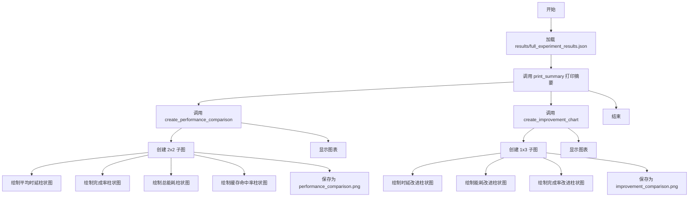
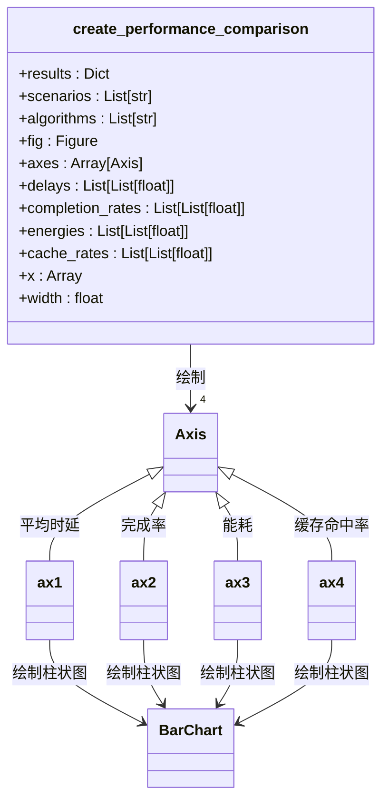
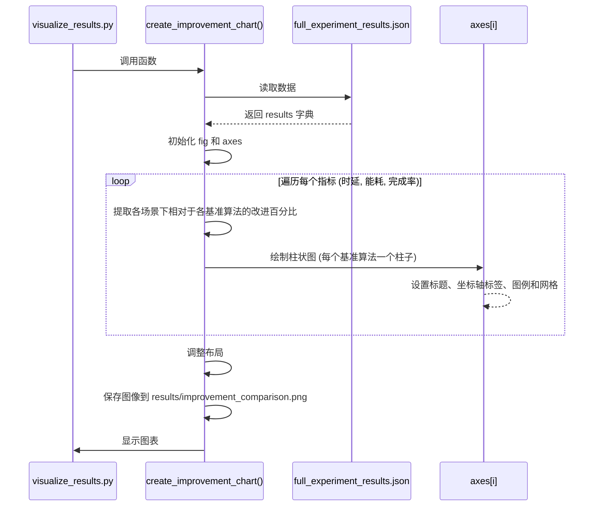
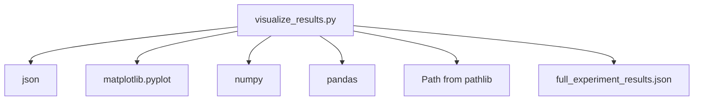

# 基础可视化

<cite>
**本文档引用的文件**  
- [visualize_results.py](file://visualize_results.py)
- [results/full_experiment_results.json](file://results/full_experiment_results.json)
- [tools/advanced_visualization.py](file://tools/advanced_visualization.py)
</cite>

## 目录
1. [简介](#简介)
2. [项目结构](#项目结构)
3. [核心组件](#核心组件)
4. [架构概览](#架构概览)
5. [详细组件分析](#详细组件分析)
6. [依赖分析](#依赖分析)
7. [性能考量](#性能考量)
8. [故障排除指南](#故障排除指南)
9. [结论](#结论)

## 简介
`visualize_results.py` 是本项目中用于生成实验结果可视化图表的核心脚本。该模块通过解析 `results` 目录下的 JSON 结果文件，提取关键性能指标（如平均时延、任务完成率、总能耗、缓存命中率等），并利用 Matplotlib 生成高质量的对比图表。其主要功能包括：生成多场景下不同算法的性能对比柱状图、展示 MATD3-MIG 相对于其他算法的改进效果，并输出结构化的实验摘要。该脚本支持中文字体显示，确保图表标题和标签的正确渲染，适用于生成学术论文级别的图像输出。

## 项目结构
`visualize_results.py` 位于项目根目录，是独立的可视化工具，不依赖于其他训练或评估模块。它直接读取 `results/full_experiment_results.json` 文件作为数据源。该 JSON 文件包含了在“标准”、“高负载”和“大规模”三种场景下，MATD3-MIG、Random、Greedy、Round_Robin 和 Load_Aware 五种算法的性能指标及改进百分比。脚本执行后，会将生成的 `performance_comparison.png` 和 `improvement_comparison.png` 图像保存回 `results` 目录。

**Section sources**
- [visualize_results.py](file://visualize_results.py#L1-L217)

## 核心组件
`visualize_results.py` 模块由三个核心函数构成：`load_results` 负责从 JSON 文件加载数据；`create_performance_comparison` 生成四项关键指标的性能对比图；`create_improvement_chart` 生成 MATD3-MIG 相对于其他算法的改进效果对比图。此外，`print_summary` 函数用于在控制台输出结构化的实验结果摘要，便于快速查看关键数据。

**Section sources**
- [visualize_results.py](file://visualize_results.py#L11-L189)

## 架构概览
该模块采用数据驱动的可视化架构。首先，`load_results` 函数从预定义的 JSON 文件中加载结构化实验数据。随后，`create_performance_comparison` 和 `create_improvement_chart` 函数利用 Matplotlib 的面向对象接口，创建包含多个子图的复合图表。每个子图分别展示一个性能指标在不同场景下的对比情况。整个流程是线性的：加载数据 -> 生成图表 -> 保存文件，确保了执行的可靠性和可预测性。

**Diagram sources**
- [visualize_results.py](file://visualize_results.py#L16-L155)

## 详细组件分析

### 数据加载与解析分析
`load_results` 函数是整个可视化流程的数据入口。它使用 Python 内置的 `json` 模块，以 UTF-8 编码打开并解析 `results/full_experiment_results.json` 文件。该函数返回一个嵌套的字典对象，其结构为 `{场景: {算法: {指标: 值}}}`。这种结构化的数据为后续的图表生成提供了便利，使得可以轻松地按场景和算法提取特定指标。

**Section sources**
- [visualize_results.py](file://visualize_results.py#L11-L14)

### 性能对比图表生成分析
`create_performance_comparison` 函数负责生成核心的性能对比图。它创建了一个 2x2 的子图布局，分别展示平均时延、任务完成率、总能耗和缓存命中率四项指标。

**Diagram sources**
- [visualize_results.py](file://visualize_results.py#L16-L112)

#### 生成改进效果图表分析
`create_improvement_chart` 函数生成了 MATD3-MIG 算法相对于其他四种基准算法的改进百分比图表。它创建了三个并排的子图，分别展示时延、能耗和完成率的改进情况。该函数从 `results` 数据的 `improvements` 字段中提取数据，清晰地量化了 MATD3-MIG 的优势。

**Diagram sources**
- [visualize_results.py](file://visualize_results.py#L114-L155)

### 实验摘要打印分析
`print_summary` 函数提供了一种文本形式的结果展示。它遍历三种实验场景，提取并格式化输出 MATD3-MIG 算法的关键性能指标，并计算出相对于其他算法的最佳改进效果。该函数使用了 Unicode 图标（如 🎯, ✅, 🚀）来增强输出的可读性，使其在控制台中更加醒目。

**Section sources**
- [visualize_results.py](file://visualize_results.py#L157-L189)

## 依赖分析
`visualize_results.py` 的依赖关系相对简单。其主要依赖于 Python 标准库中的 `json`、`pathlib.Path` 以及第三方库 `matplotlib.pyplot`、`numpy` 和 `pandas`。这些依赖项用于文件操作、数据解析和图表绘制。该脚本与项目中的 `tools/advanced_visualization.py` 模块功能相似但独立，后者提供了更复杂的训练曲线和收敛性分析功能，而 `visualize_results.py` 专注于最终实验结果的静态对比。

**Diagram sources**
- [visualize_results.py](file://visualize_results.py#L1-L217)

## 性能考量
该脚本的性能开销主要来自于 Matplotlib 的图形渲染。对于包含少量数据点（如本例中的3个场景和5个算法）的柱状图，性能影响可以忽略不计。脚本在生成图表时设置了 `dpi=300` 和 `bbox_inches='tight'`，这保证了输出图像的高质量和无多余边距，但会略微增加文件大小和保存时间。错误处理机制通过 `try-except` 块捕获 `ImportError`，当缺少必要的可视化库时，会给出清晰的安装提示，确保脚本的健壮性。

## 故障排除指南
*   **问题：图表无法显示或保存。**
    **解决方案：** 检查是否已安装 `matplotlib` 库。根据脚本的错误提示，运行 `pip install matplotlib pandas` 进行安装。
*   **问题：图表中的中文显示为方框。**
    **解决方案：** 确保系统中安装了 `SimHei` 或 `Arial Unicode MS` 等支持中文的字体。脚本已通过 `plt.rcParams['font.sans-serif']` 指定了备选字体列表，通常能自动解决此问题。
*   **问题：找不到 `full_experiment_results.json` 文件。**
    **解决方案：** 确认 `results` 目录存在且该文件已由其他实验脚本生成。脚本会自动创建 `results` 目录，但不会生成 JSON 数据文件。

**Section sources**
- [visualize_results.py](file://visualize_results.py#L190-L217)

## 结论
`visualize_results.py` 是一个功能明确、结构清晰的可视化脚本。它成功地将复杂的实验数据转化为直观的柱状图和文本摘要，极大地简化了对 MATD3-MIG 算法性能的评估过程。通过使用 Matplotlib 的高级功能，它生成了符合学术出版要求的高质量图像。该模块的设计体现了单一职责原则，专注于结果展示，是项目评估流程中不可或缺的一环。