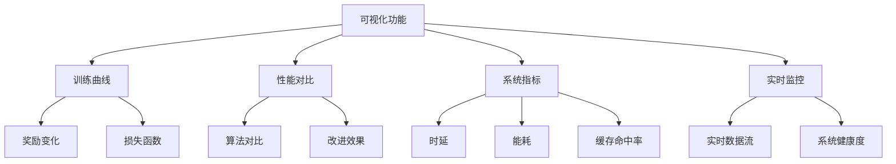
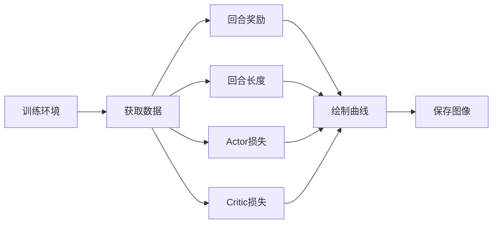
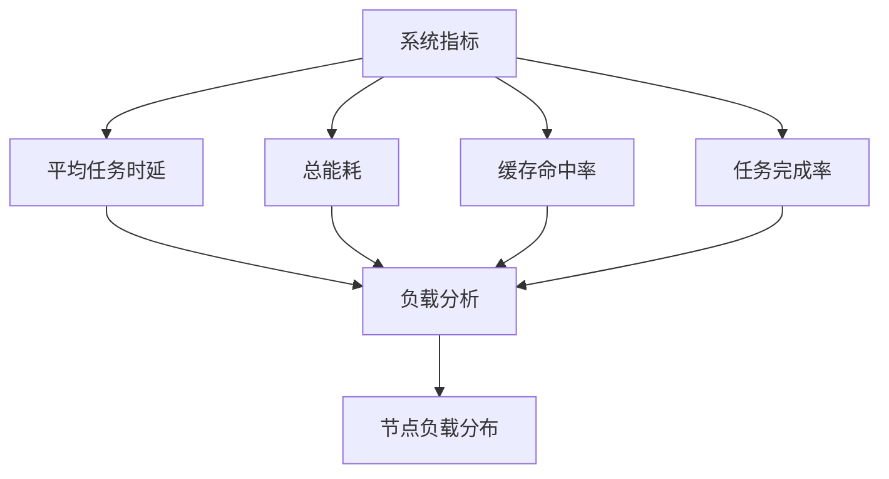
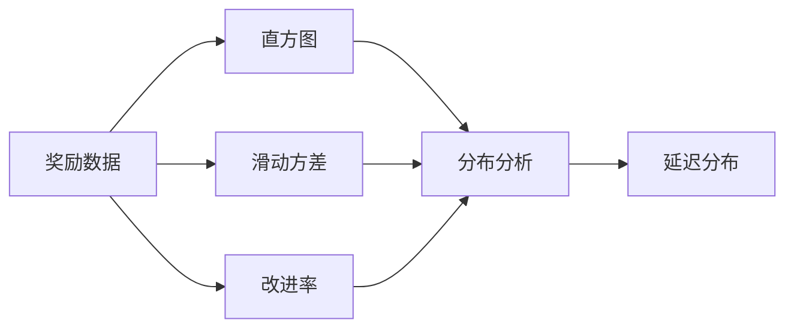
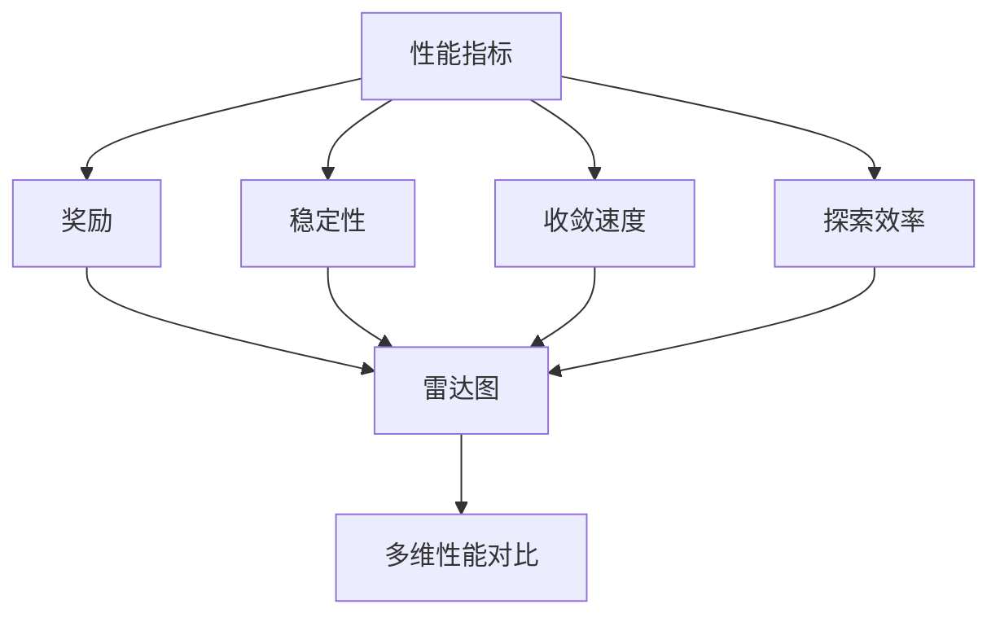
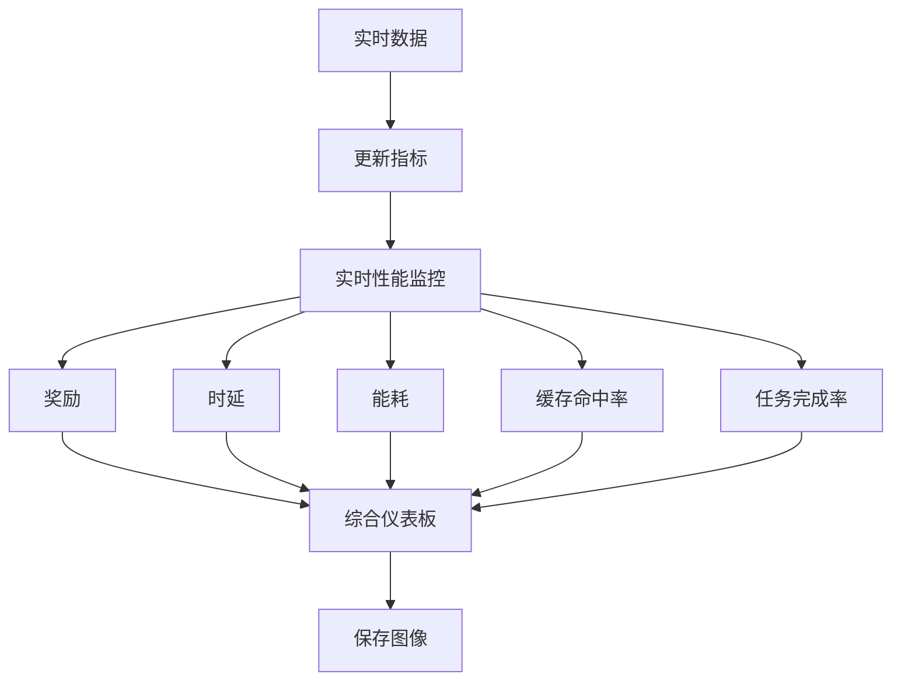

# 结果可视化

<cite>
**本文档引用的文件**   
- [visualize_results.py](file://visualize_results.py)
- [tools/advanced_visualization.py](file://tools/advanced_visualization.py)
- [tools/performance_dashboard.py](file://tools/performance_dashboard.py)
</cite>

## 目录
1. [简介](#简介)
2. [核心可视化功能](#核心可视化功能)
3. [训练曲线生成](#训练曲线生成)
4. [热力图与节点负载分布](#热力图与节点负载分布)
5. [箱线图与延迟分布](#箱线图与延迟分布)
6. [雷达图与多维性能对比](#雷达图与多维性能对比)
7. [实时性能监控仪表盘](#实时性能监控仪表盘)
8. [图表样式自定义](#图表样式自定义)
9. [高质量图像生成](#高质量图像生成)
10. [常见可视化问题解决方案](#常见可视化问题解决方案)

## 简介
本项目提供了一套完整的可视化工具，用于分析和展示边缘计算系统中的训练结果与性能指标。`visualize_results.py` 脚本负责解析JSON格式的实验结果文件，并利用Matplotlib和Seaborn生成各类图表。`tools/advanced_visualization.py` 模块提供了更高级的可视化功能，包括训练曲线、性能对比、系统指标变化等。`tools/performance_dashboard.py` 实现了实时性能监控仪表盘，能够动态展示系统状态。

**Section sources**
- [visualize_results.py](file://visualize_results.py#L1-L217)
- [tools/advanced_visualization.py](file://tools/advanced_visualization.py#L1-L513)
- [tools/performance_dashboard.py](file://tools/performance_dashboard.py#L1-L357)

## 核心可视化功能
系统提供了多种可视化功能，涵盖训练过程分析、性能对比、系统指标监控等多个方面。`visualize_results.py` 主要负责静态结果的可视化，而 `tools/advanced_visualization.py` 和 `tools/performance_dashboard.py` 提供了更丰富的动态和高级可视化能力。

**Diagram sources **
- [visualize_results.py](file://visualize_results.py#L1-L217)
- [tools/advanced_visualization.py](file://tools/advanced_visualization.py#L1-L513)
- [tools/performance_dashboard.py](file://tools/performance_dashboard.py#L1-L357)

**Section sources**
- [visualize_results.py](file://visualize_results.py#L1-L217)
- [tools/advanced_visualization.py](file://tools/advanced_visualization.py#L1-L513)
- [tools/performance_dashboard.py](file://tools/performance_dashboard.py#L1-L357)

## 训练曲线生成
`visualize_results.py` 和 `tools/advanced_visualization.py` 提供了生成训练曲线的功能。`enhanced_plot_training_curves` 函数可以绘制回合奖励、回合长度、Actor损失和Critic损失等曲线。该函数支持移动平均、趋势线等高级功能，帮助分析训练过程的收敛性。

**Diagram sources **
- [tools/advanced_visualization.py](file://tools/advanced_visualization.py#L22-L115)

**Section sources**
- [tools/advanced_visualization.py](file://tools/advanced_visualization.py#L22-L115)

## 热力图与节点负载分布
虽然当前代码中没有直接实现热力图，但可以通过 `plot_system_metrics` 函数生成的系统指标变化图来间接表示节点负载分布。通过分析平均任务时延、总能耗、缓存命中率和任务完成率等指标的变化，可以推断出系统的负载情况。

**Diagram sources **
- [tools/advanced_visualization.py](file://tools/advanced_visualization.py#L160-L215)

**Section sources**
- [tools/advanced_visualization.py](file://tools/advanced_visualization.py#L160-L215)

## 箱线图与延迟分布
`plot_convergence_analysis` 函数提供了奖励分布直方图，可以用于分析延迟分布。通过绘制滑动方差和性能改进率，可以进一步分析延迟的稳定性和改进趋势。

**Diagram sources **
- [tools/advanced_visualization.py](file://tools/advanced_visualization.py#L310-L391)

**Section sources**
- [tools/advanced_visualization.py](file://tools/advanced_visualization.py#L310-L391)

## 雷达图与多维性能对比
`create_training_summary_plot` 函数中的性能指标雷达图可以用于多维性能对比。该雷达图展示了奖励、稳定性、收敛速度和探索效率等多个维度的综合性能评估。

**Diagram sources **
- [tools/advanced_visualization.py](file://tools/advanced_visualization.py#L217-L290)

**Section sources**
- [tools/advanced_visualization.py](file://tools/advanced_visualization.py#L217-L290)

## 实时性能监控仪表盘
`tools/performance_dashboard.py` 实现了实时性能监控仪表盘。`PerformanceDashboard` 类提供了更新实时指标数据、创建综合性能仪表板等功能。`create_performance_dashboard` 函数可以创建包含实时性能监控、算法性能对比、系统资源利用率等多个子图的综合仪表板。

**Diagram sources **
- [tools/performance_dashboard.py](file://tools/performance_dashboard.py#L25-L320)

**Section sources**
- [tools/performance_dashboard.py](file://tools/performance_dashboard.py#L25-L320)

## 图表样式自定义
所有可视化函数都支持通过 `save_path` 参数指定保存路径，并自动创建目录。通过修改 `plt.rcParams` 可以自定义图表样式，如字体、颜色、网格等。`enhanced_plot_training_curves` 函数使用了 `seaborn-v0_8` 样式和 `husl` 调色板，提供了美观的默认样式。

**Section sources**
- [tools/advanced_visualization.py](file://tools/advanced_visualization.py#L22-L115)
- [tools/advanced_visualization.py](file://tools/advanced_visualization.py#L117-L158)
- [tools/advanced_visualization.py](file://tools/advanced_visualization.py#L160-L215)

## 高质量图像生成
所有可视化函数都支持生成高质量图像。通过设置 `dpi=300` 和 `bbox_inches='tight'`，可以生成高分辨率且无多余空白的图像。`plt.savefig` 函数确保了图像的高质量输出。

**Section sources**
- [visualize_results.py](file://visualize_results.py#L1-L217)
- [tools/advanced_visualization.py](file://tools/advanced_visualization.py#L1-L513)
- [tools/performance_dashboard.py](file://tools/performance_dashboard.py#L1-L357)

## 常见可视化问题解决方案
- **数据过载**：通过限制数据点数量（如 `max_points = 100`）和使用滑动平均来解决。
- **坐标轴失真**：通过设置 `bbox_inches='tight'` 和适当的 `figsize` 来避免。
- **中文字体问题**：通过配置 `matplotlib.rcParams['font.sans-serif']` 支持中文字体。
- **负号显示问题**：通过设置 `matplotlib.rcParams['axes.unicode_minus'] = False` 解决。

**Section sources**
- [tools/advanced_visualization.py](file://tools/advanced_visualization.py#L1-L513)
- [tools/performance_dashboard.py](file://tools/performance_dashboard.py#L1-L357)