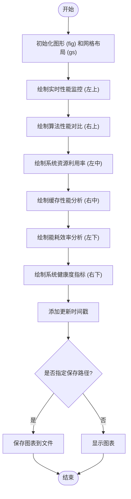

# 高级仪表盘

<cite>
**本文档中引用的文件**  
- [performance_dashboard.py](file://tools/performance_dashboard.py)
</cite>

## 目录
1. [简介](#简介)
2. [项目结构](#项目结构)
3. [核心组件](#核心组件)
4. [架构概述](#架构概述)
5. [详细组件分析](#详细组件分析)
6. [依赖分析](#依赖分析)
7. [性能考虑](#性能考虑)
8. [故障排除指南](#故障排除指南)
9. [结论](#结论)

## 简介
`performance_dashboard.py` 提供了一个全面的实时性能监控仪表盘，用于可视化 VEC 边缘计算系统的运行状态。该仪表盘能够动态展示关键性能指标，包括实时任务奖励、延迟、能耗、缓存命中率、任务完成率和系统负载等。通过集成 Matplotlib 和 Seaborn，仪表盘支持多种图表类型，如折线图、柱状图、饼图和雷达图，以直观呈现系统健康状况和算法性能对比。此外，该模块还提供了便捷函数用于快速启动监控界面，并支持将仪表盘保存为高分辨率图像文件。

## 项目结构
`performance_dashboard.py` 位于 `tools/` 目录下，是系统工具模块的一部分。该文件独立实现了性能监控功能，不依赖于其他核心业务逻辑模块，但可通过传入训练环境对象来获取实时数据。其主要功能包括创建综合性能仪表板和实时监控界面，适用于系统调试、性能评估和结果展示等场景。

**Diagram sources**
- [performance_dashboard.py](file://tools/performance_dashboard.py#L1-L10)

## 核心组件

`PerformanceDashboard` 类是本模块的核心，负责管理实时性能数据的存储、更新和可视化。它通过 `real_time_data` 字典维护多个关键指标的历史记录，并提供 `update_real_time_metrics` 方法用于接收外部系统传入的最新性能数据。该类支持创建包含六个子图的综合仪表板，全面展示系统运行状态。

**Section sources**
- [performance_dashboard.py](file://tools/performance_dashboard.py#L25-L58)

## 架构概述

`performance_dashboard.py` 采用面向对象的设计模式，将数据管理和可视化逻辑封装在 `PerformanceDashboard` 类中。外部系统通过调用 `update_real_time_metrics` 方法更新数据，然后通过 `create_comprehensive_dashboard` 或 `create_real_time_monitor` 方法生成可视化界面。整个流程实现了数据采集、处理和展示的分离，提高了代码的可维护性和可扩展性。

**Diagram sources**
- [performance_dashboard.py](file://tools/performance_dashboard.py#L25-L320)

## 详细组件分析

### PerformanceDashboard 类分析
`PerformanceDashboard` 类是性能监控功能的核心实现。它初始化时创建了 `real_time_data` 字典，用于存储时间戳、奖励、延迟、能耗、缓存命中率和任务完成率等指标的历史数据。该类通过 `update_real_time_metrics` 方法接收外部传入的性能数据，并自动维护最近100个数据点，确保内存使用不会无限增长。

#### 类图

**Diagram sources**
- [performance_dashboard.py](file://tools/performance_dashboard.py#L25-L58)

### 实时数据更新机制
仪表盘通过 `update_real_time_metrics` 方法实现数据的动态更新。该方法接收一个包含性能指标的字典作为输入，提取 `avg_reward`、`avg_task_delay`、`total_energy_consumption`、`cache_hit_rate` 和 `task_completion_rate` 等关键值，并将其追加到对应的历史数据列表中。同时，该方法会自动清理超出100个数据点的旧数据，保证数据集的时效性和内存效率。

**Section sources**
- [performance_dashboard.py](file://tools/performance_dashboard.py#L45-L58)

### 综合仪表板创建流程
`create_comprehensive_dashboard` 方法负责创建包含六个子图的综合性能仪表板。该方法使用 `matplotlib.gridspec` 进行复杂的布局设计，将不同类型的图表合理地排列在画布上。每个子图由独立的私有方法负责绘制，实现了关注点分离。最后，该方法会添加时间戳并显示或保存生成的图表。

#### 流程图

**Diagram sources**
- [performance_dashboard.py](file://tools/performance_dashboard.py#L58-L89)

### 可视化组件分析
仪表盘的可视化功能由多个私有绘图方法实现，每个方法负责一种特定类型的图表。这些方法利用 Matplotlib 的高级功能，如双Y轴、水平条形图、饼图和极坐标图，以最合适的视觉形式呈现不同类型的数据。

#### 实时性能监控
`_plot_realtime_metrics` 方法使用双Y轴技术，在同一图表中同时展示奖励值和延迟的变化趋势。当没有实时数据时，该方法会生成模拟数据用于演示，确保仪表盘在任何情况下都能正常显示。

**Section sources**
- [performance_dashboard.py](file://tools/performance_dashboard.py#L118-L149)

#### 算法性能对比
`_plot_algorithm_comparison` 方法使用分组柱状图对比不同算法的性能。它模拟了 MADDPG、MATD3、MAPPO、TD3 和 DDPG 五种算法在平均奖励、完成率和能耗效率三个维度上的表现，为算法选择提供直观参考。

**Section sources**
- [performance_dashboard.py](file://tools/performance_dashboard.py#L149-L176)

#### 系统资源利用率
`_plot_resource_utilization` 方法使用水平条形图展示 CPU、内存、网络和存储的利用率。该方法根据利用率的高低自动选择不同的颜色（红色、橙色、绿色），使资源瓶颈一目了然。

**Section sources**
- [performance_dashboard.py](file://tools/performance_dashboard.py#L176-L208)

#### 缓存性能分析
`_plot_cache_performance` 方法使用饼图展示不同类型缓存（热点内容、用户偏好、计算结果、临时数据）的命中率分布。该图表使用 Set3 调色板，并将百分比标签设置为白色加粗，提高了可读性。

**Section sources**
- [performance_dashboard.py](file://tools/performance_dashboard.py#L208-L246)

#### 能耗效率分析
`_plot_energy_efficiency` 方法使用折线图展示24小时内能耗效率的趋势。该方法计算任务数与能耗的比值作为效率指标，并使用绿色填充区域以增强视觉效果。

**Section sources**
- [performance_dashboard.py](file://tools/performance_dashboard.py#L246-L277)

#### 系统健康度评估
`_plot_system_health` 方法使用雷达图（极坐标图）评估系统的整体健康状况。该方法将网络延迟、服务可用性、错误率、响应时间和吞吐量五个指标映射到雷达图上，并对错误率进行反转处理（越低越好），形成直观的健康度视图。

**Section sources**
- [performance_dashboard.py](file://tools/performance_dashboard.py#L277-L320)

## 依赖分析

`performance_dashboard.py` 模块依赖于多个第三方库，包括 Matplotlib、Seaborn 和 NumPy。这些库提供了强大的数据可视化和数值计算功能。该模块通过 `tools/__init__.py` 被导出，可供其他模块直接导入使用。其依赖关系清晰，不与其他业务逻辑模块形成循环依赖。

**Diagram sources**
- [performance_dashboard.py](file://tools/performance_dashboard.py#L1-L10)
- [__init__.py](file://tools/__init__.py#L1-L17)

## 性能考虑

### 高频刷新性能瓶颈
由于 `create_comprehensive_dashboard` 方法创建了一个包含六个子图的复杂图形，其渲染过程可能消耗大量 CPU 资源。特别是在高频刷新（如每秒一次）的情况下，可能导致 CPU 占用过高，影响系统其他功能的正常运行。

### 优化建议
1. **异步数据加载**：将数据更新和图表渲染分离到不同的线程或进程中，避免阻塞主线程。
2. **图形渲染降级**：在检测到系统负载过高时，自动降低图表的复杂度，例如减少数据点数量、简化图表样式或降低刷新频率。
3. **增量更新**：对于实时监控界面，可以只更新变化的数据部分，而不是重新绘制整个图表。
4. **缓存机制**：对计算密集型的图表（如算法性能对比）进行缓存，避免重复计算。

## 故障排除指南

### 常见问题
1. **图表显示乱码**：确保系统中安装了中文字体（如 SimHei 或 Microsoft YaHei），并在代码中正确配置 `font.sans-serif`。
2. **CPU 占用过高**：检查刷新频率是否过高，考虑采用上述优化建议。
3. **数据更新延迟**：确认 `update_real_time_metrics` 方法被正确调用，并检查数据源的性能。

### 调试方法
1. 使用 `print` 语句或日志记录验证 `real_time_data` 字典中的数据是否及时更新。
2. 通过 `matplotlib.use('Agg')` 切换到非交互式后端进行性能测试。
3. 使用 Python 的 `cProfile` 模块分析代码性能瓶颈。

**Section sources**
- [performance_dashboard.py](file://tools/performance_dashboard.py#L1-L356)

## 结论
`performance_dashboard.py` 模块为 VEC 边缘计算系统提供了一个功能全面、可视化效果出色的性能监控解决方案。它通过面向对象的设计实现了数据与视图的分离，具有良好的可维护性和扩展性。尽管在高频刷新时可能存在性能瓶颈，但通过异步处理、渲染降级等优化策略可以有效缓解。该模块不仅可用于实时监控，还可作为性能评估和结果展示的重要工具，对系统的开发和优化具有重要价值。