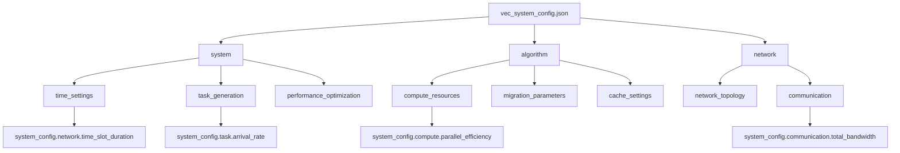
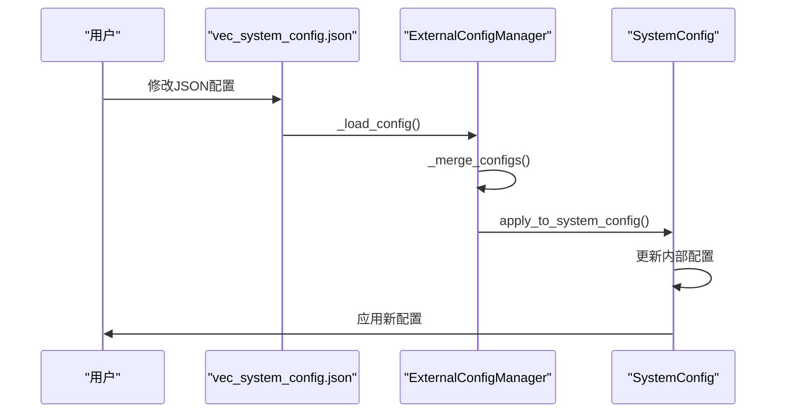
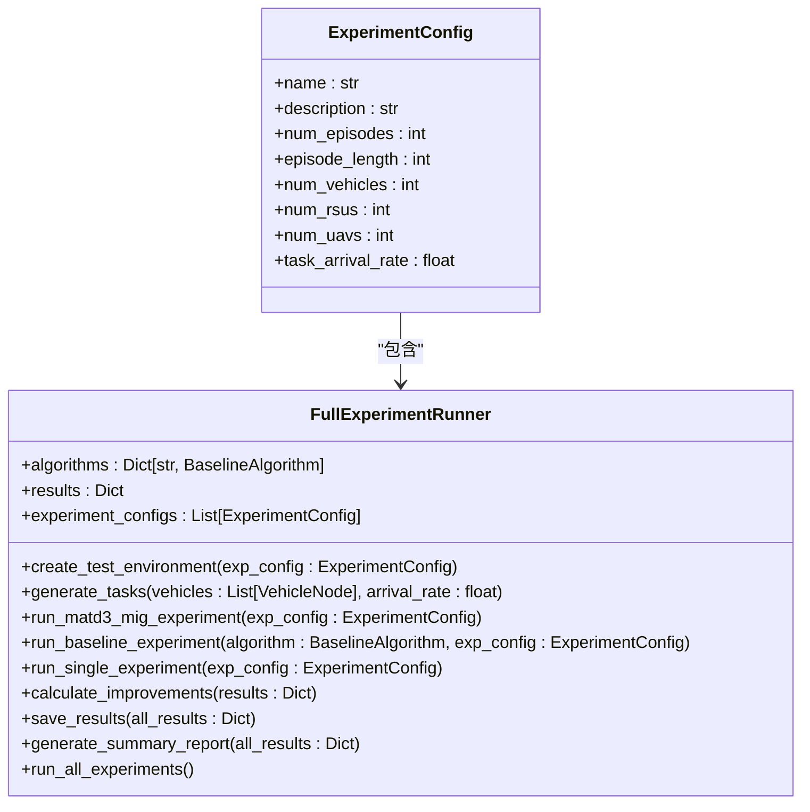
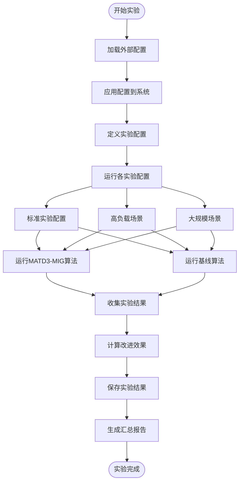

# 外部配置

<cite>
**本文档引用的文件**   
- [external_config.py](file://config/external_config.py)
- [vec_system_config.json](file://vec_system_config.json)
- [run_full_experiment.py](file://run_full_experiment.py)
- [system_config.py](file://config/system_config.py)
</cite>

## 目录
1. [简介](#简介)
2. [外部配置管理机制](#外部配置管理机制)
3. [JSON配置结构设计](#json配置结构设计)
4. [运行时参数覆盖机制](#运行时参数覆盖机制)
5. [完整配置示例](#完整配置示例)
6. [实验场景应用](#实验场景应用)

## 简介
本系统通过外部配置文件 `vec_system_config.json` 实现运行时参数动态调整，提升系统灵活性和可配置性。外部配置机制允许在不修改源码的情况下，通过修改JSON文件来调整系统行为，支持可复现的实验设置和多组对比实验管理。

## 外部配置管理机制

`ExternalConfigManager` 类负责管理外部配置的加载、保存和应用。系统启动时会自动加载 `vec_system_config.json` 文件，若文件不存在则创建默认配置文件。

```mermaid
classDiagram
class ExternalConfigManager {
+config_file : str
+config : Dict[str, Any]
+__init__(config_file : str)
+_load_config() Dict[str, Any]
+_merge_configs(default : Dict, loaded : Dict) Dict
+save_config(config : Dict[str, Any])
+get(*keys) Any
+set(*keys, value)
+update_from_system_config(system_config)
+apply_to_system_config(system_config)
+validate_config() bool
+print_config_summary()
}
class ExternalConfigManager --> "1" DEFAULT_CONFIG : "包含"
```

**代码片段路径**
- [ExternalConfigManager类定义](file://config/external_config.py#L74-L246)
- [DEFAULT_CONFIG默认配置](file://config/external_config.py#L7-L66)

## JSON配置结构设计

外部配置文件采用分层结构，主要分为三大配置块：system、algorithm、network，通过 `ExternalConfigManager` 与系统内部配置对象进行映射。

### 配置块映射关系



**代码片段路径**
- [apply_to_system_config方法](file://config/external_config.py#L156-L208)
- [update_from_system_config方法](file://config/external_config.py#L132-L158)

## 运行时参数覆盖机制

系统通过 `apply_external_config_to_system()` 函数将外部配置应用到系统配置对象，实现运行时参数覆盖。

### 参数覆盖流程



当系统启动或需要重新加载配置时，调用 `apply_external_config_to_system()` 函数，该函数会从 `external_config` 全局实例中获取配置并应用到 `config` 系统配置对象。

**代码片段路径**
- [apply_external_config_to_system函数](file://config/external_config.py#L251-L255)
- [system_config.py中的config实例](file://config/system_config.py#L318)

## 完整配置示例

以下是 `vec_system_config.json` 的完整示例，包含所有可配置参数及其含义与数据类型。

```json
{
    "time_settings": {
        "time_slot_duration": 0.2,
        "simulation_time": 1000
    },
    "task_generation": {
        "arrival_rate": 1.35,
        "data_size_range": [
            5000000.0,
            25000000.0
        ],
        "compute_density": 500,
        "deadline_range": [
            3.5,
            25.0
        ],
        "output_ratio": 0.05
    },
    "network_topology": {
        "num_vehicles": 12,
        "num_rsus": 6,
        "num_uavs": 2,
        "area_width": 2500,
        "area_height": 2500,
        "rsu_coverage_radius": 360
    },
    "compute_resources": {
        "vehicle_cpu_freq_range": [
            8000000000.0,
            25000000000.0
        ],
        "rsu_cpu_freq_range": [
            45000000000.0,
            55000000000.0
        ],
        "uav_cpu_freq_range": [
            7000000000.0,
            9000000000.0
        ],
        "parallel_efficiency": 0.9
    },
    "communication": {
        "total_bandwidth": 50000000.0,
        "vehicle_tx_power": 30,
        "rsu_tx_power": 35,
        "uav_tx_power": 25
    },
    "migration_parameters": {
        "migration_threshold": 0.75,
        "rsu_overload_threshold": 0.85,
        "uav_overload_threshold": 0.8,
        "cooldown_period": 8.0,
        "max_migration_distance": 800
    },
    "cache_settings": {
        "vehicle_cache_capacity": 2000000000.0,
        "rsu_cache_capacity": 20000000000.0,
        "uav_cache_capacity": 4000000000.0,
        "cache_hit_threshold": 0.85,
        "prediction_window": 15
    },
    "performance_optimization": {
        "enable_adaptive_scheduling": true,
        "enable_load_balancing": true,
        "enable_energy_optimization": true,
        "batch_size_optimization": true,
        "parallel_environments": 8
    }
}
```

**配置字段说明**

| 配置块 | 字段 | 含义 | 数据类型 |
|--------|------|------|----------|
| time_settings | time_slot_duration | 时隙长度（秒） | float |
| time_settings | simulation_time | 仿真总时间（秒） | int |
| task_generation | arrival_rate | 任务到达率（任务/秒） | float |
| task_generation | data_size_range | 任务数据大小范围（字节） | list[float] |
| task_generation | compute_density | 计算密度（周期/比特） | float |
| task_generation | deadline_range | 截止时间范围（秒） | list[float] |
| task_generation | output_ratio | 输出大小比例 | float |
| network_topology | num_vehicles | 车辆数量 | int |
| network_topology | num_rsus | RSU数量 | int |
| network_topology | num_uavs | UAV数量 | int |
| network_topology | area_width | 区域宽度（米） | int |
| network_topology | area_height | 区域高度（米） | int |
| network_topology | rsu_coverage_radius | RSU覆盖半径（米） | int |
| compute_resources | vehicle_cpu_freq_range | 车辆CPU频率范围（Hz） | list[float] |
| compute_resources | rsu_cpu_freq_range | RSU CPU频率范围（Hz） | list[float] |
| compute_resources | uav_cpu_freq_range | UAV CPU频率范围（Hz） | list[float] |
| compute_resources | parallel_efficiency | 并行效率 | float |
| communication | total_bandwidth | 总带宽（Hz） | float |
| communication | vehicle_tx_power | 车辆发射功率（dBm） | float |
| communication | rsu_tx_power | RSU发射功率（dBm） | float |
| communication | uav_tx_power | UAV发射功率（dBm） | float |
| migration_parameters | migration_threshold | 迁移阈值 | float |
| migration_parameters | rsu_overload_threshold | RSU过载阈值 | float |
| migration_parameters | uav_overload_threshold | UAV过载阈值 | float |
| migration_parameters | cooldown_period | 冷却期（秒） | float |
| migration_parameters | max_migration_distance | 最大迁移距离（米） | float |
| cache_settings | vehicle_cache_capacity | 车辆缓存容量（字节） | float |
| cache_settings | rsu_cache_capacity | RSU缓存容量（字节） | float |
| cache_settings | uav_cache_capacity | UAV缓存容量（字节） | float |
| cache_settings | cache_hit_threshold | 缓存命中阈值 | float |
| cache_settings | prediction_window | 预测窗口 | int |
| performance_optimization | enable_adaptive_scheduling | 是否启用自适应调度 | bool |
| performance_optimization | enable_load_balancing | 是否启用负载均衡 | bool |
| performance_optimization | enable_energy_optimization | 是否启用能耗优化 | bool |
| performance_optimization | batch_size_optimization | 是否启用批大小优化 | bool |
| performance_optimization | parallel_environments | 并行环境数量 | int |

**代码片段路径**
- [vec_system_config.json完整内容](file://vec_system_config.json#L0-L68)

## 实验场景应用

在 `run_full_experiment.py` 中，外部配置被用于实现可复现的实验设置和多组对比实验管理。

### 实验配置管理



### 实验执行流程



通过外部配置，可以在不同实验场景中快速切换参数设置，如在"高负载场景"中提高任务到达率，在"大规模场景"中增加车辆、RSU和UAV数量，从而进行多组对比实验。

**代码片段路径**
- [ExperimentConfig类](file://run_full_experiment.py#L29-L38)
- [FullExperimentRunner类](file://run_full_experiment.py#L151-L583)
- [实验配置列表](file://run_full_experiment.py#L163-L181)