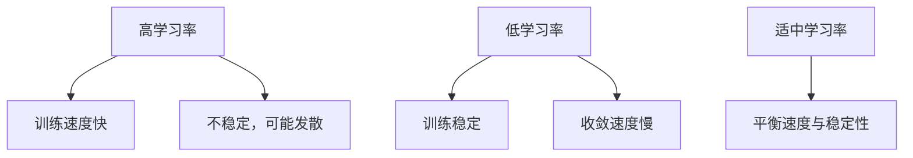
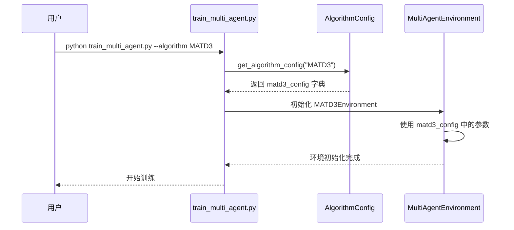

# 算法配置

<cite>
**本文档引用的文件**
- [algorithm_config.py](file://config/algorithm_config.py)
- [train_multi_agent.py](file://train_multi_agent.py)
- [train_single_agent.py](file://train_single_agent.py)
- [qmix.py](file://algorithms/qmix.py)
- [mappo.py](file://algorithms/mappo.py)
- [sac_ma.py](file://algorithms/sac_ma.py)
- [ddpg.py](file://single_agent/ddpg.py)
- [dqn.py](file://single_agent/dqn.py)
- [ppo.py](file://single_agent/ppo.py)
- [sac.py](file://single_agent/sac.py)
- [td3.py](file://single_agent/td3.py)
</cite>

## 目录
1. [多智能体算法配置](#多智能体算法配置)
2. [单智能体算法配置](#单智能体算法配置)
3. [关键超参数详解](#关键超参数详解)
4. [配置调用示例](#配置调用示例)

## 多智能体算法配置

`algorithm_config.py` 文件中定义了多种多智能体强化学习算法的超参数配置，包括 MATD3、MADDPG、QMIX、MAPPO 和 SAC-MA。这些配置通过 `AlgorithmConfig` 类进行管理，每个算法都有其专属的参数集合。

MATD3 和 MADDPG 的配置在 `algorithm_config.py` 中直接定义，包含学习率、折扣因子、目标网络更新频率等关键参数。对于 QMIX、MAPPO 和 SAC-MA 算法，其配置在各自的实现文件（`qmix.py`、`mappo.py`、`sac_ma.py`）中通过 `@dataclass` 定义的配置类进行管理，这些配置类提供了更丰富的算法特定参数。

**多智能体算法配置来源**
- [algorithm_config.py](file://config/algorithm_config.py#L7-L54)
- [qmix.py](file://algorithms/qmix.py#L47-L87)
- [mappo.py](file://algorithms/mappo.py#L47-L86)
- [sac_ma.py](file://algorithms/sac_ma.py#L50-L90)

## 单智能体算法配置

`algorithm_config.py` 文件中也包含了单智能体算法的配置，目前主要定义了 DDPG 和 PPO 算法的参数。与多智能体配置类似，这些参数通过 `AlgorithmConfig` 类的实例属性进行存储和管理。

对于 DQN、SAC 和 TD3 等其他单智能体算法，其配置在 `single_agent` 目录下的对应文件（`dqn.py`、`sac.py`、`td3.py`）中通过 `@dataclass` 定义的配置类进行管理。这些配置类不仅包含了基础的训练参数，还包含了算法特有的超参数，如 DQN 的探索率衰减、SAC 的温度参数等。

**单智能体算法配置来源**
- [algorithm_config.py](file://config/algorithm_config.py#L50-L54)
- [ddpg.py](file://single_agent/ddpg.py#L179-L208)
- [dqn.py](file://single_agent/dqn.py#L56-L106)
- [ppo.py](file://single_agent/ppo.py#L52-L102)
- [sac.py](file://single_agent/sac.py#L50-L90)
- [td3.py](file://single_agent/td3.py#L214-L245)

## 关键超参数详解

本节详细解析各类算法中关键超参数的意义及其对训练过程的影响。

### 学习率 (learning_rate)

学习率控制着模型参数更新的步长。过高的学习率可能导致训练不稳定，出现震荡甚至发散；过低的学习率则会导致收敛速度过慢。在本项目中，大多数算法的初始学习率设置在 `3e-4` 左右，这是一个在深度强化学习中被广泛验证为有效的默认值。

**Diagram sources**
- [algorithm_config.py](file://config/algorithm_config.py#L10-L11)
- [mappo.py](file://algorithms/mappo.py#L48-L49)

### 折扣因子 (gamma)

折扣因子决定了智能体对未来奖励的重视程度。`gamma` 值越接近 1，智能体越重视长期回报；值越小，则更关注即时奖励。本项目中，所有算法的 `gamma` 值均设置为 `0.99`，表明智能体被设计为追求长期的、累积的奖励最大化。

### 目标网络更新频率 (tau)

`tau` 参数用于软更新目标网络，其值越小，目标网络的更新越缓慢，这有助于提高训练的稳定性。例如，MATD3 的 `tau` 设置为 `0.005`，而 MADDPG 为 `0.01`，这表明 MATD3 的目标网络更新更平滑，可能带来更稳定的训练过程。

### 批处理大小 (batch_size)

批处理大小影响了每次训练迭代中使用的样本数量。较大的批处理大小可以提供更稳定的梯度估计，但需要更多的内存。本项目中，多智能体算法（如 MATD3、MADDPG）通常使用 `128` 的批处理大小，而单智能体算法（如 DDPG）使用 `64`，这反映了多智能体环境通常需要更大的批次来稳定训练。

### 噪声参数 (noise_std)

噪声参数主要用于 DDPG、TD3 等基于 Actor-Critic 框架的算法中，通过向动作添加噪声来促进探索。DDPG 的 `noise_std` 设置为 `0.2`，高于 MATD3 和 MADDPG 的 `0.1`，这表明单智能体 DDPG 需要更强的探索来应对环境的不确定性。

**关键超参数详解来源**
- [algorithm_config.py](file://config/algorithm_config.py#L7-L54)
- [mappo.py](file://algorithms/mappo.py#L47-L86)
- [sac_ma.py](file://algorithms/sac_ma.py#L50-L90)

## 配置调用示例

算法配置主要在 `train_multi_agent.py` 和 `train_single_agent.py` 两个训练脚本中被调用。`AlgorithmConfig` 类提供了 `get_algorithm_config` 方法，允许根据算法名称动态获取对应的配置字典。

在 `train_multi_agent.py` 中，`MultiAgentTrainingEnvironment` 类在初始化时会根据传入的算法名称创建相应的环境实例，并使用 `AlgorithmConfig` 中的配置来初始化这些环境。例如，当选择 `MATD3` 算法时，系统会加载 `matd3_config` 中定义的超参数。

**Diagram sources**
- [train_multi_agent.py](file://train_multi_agent.py#L100-L115)
- [train_single_agent.py](file://train_single_agent.py#L100-L115)
- [algorithm_config.py](file://config/algorithm_config.py#L59-L68)

**配置调用示例来源**
- [train_multi_agent.py](file://train_multi_agent.py#L100-L115)
- [train_single_agent.py](file://train_single_agent.py#L100-L115)
- [algorithm_config.py](file://config/algorithm_config.py#L59-L68)