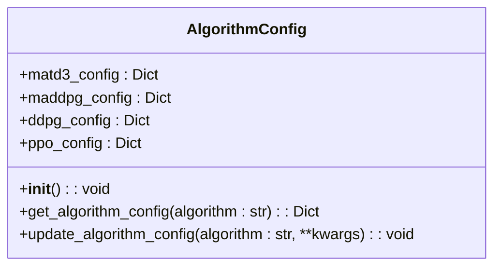
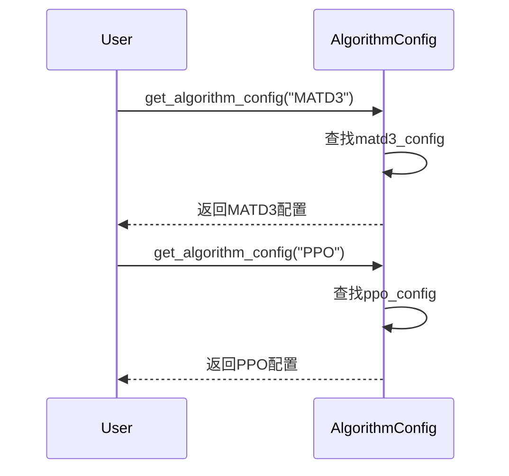
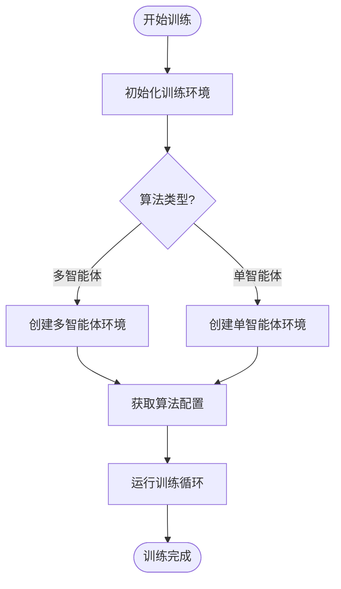

# 算法配置

<cite>
**本文档中引用的文件**   
- [algorithm_config.py](file://config/algorithm_config.py)
- [train_multi_agent.py](file://train_multi_agent.py)
- [train_single_agent.py](file://train_single_agent.py)
- [vec_system_config.json](file://vec_system_config.json)
</cite>

## 目录
1. [引言](#引言)
2. [核心算法配置](#核心算法配置)
3. [多智能体与单智能体算法对比](#多智能体与单智能体算法对比)
4. [关键超参数详解](#关键超参数详解)
5. [算法配置的动态切换机制](#算法配置的动态切换机制)
6. [配置与训练流程集成](#配置与训练流程集成)
7. [外部JSON配置定制](#外部json配置定制)
8. [典型配置示例](#典型配置示例)
9. [参数调优建议](#参数调优建议)
10. [结论](#结论)

## 引言
本文件深入解析`algorithm_config.py`模块的设计与使用，涵盖多智能体（MATD3、MADDPG）和单智能体（DDPG、PPO）强化学习算法的超参数设置。详细说明学习率、折扣因子、探索噪声、网络结构、经验回放缓冲区大小等关键参数的含义与调优建议。解释如何通过配置文件动态切换不同算法及其参数集，并描述算法配置与训练流程的集成方式。

## 核心算法配置
`AlgorithmConfig`类是算法配置的核心，封装了多种强化学习算法的默认超参数。该类通过初始化方法为不同算法预设配置，并提供获取和更新配置的接口。



**图源**
- [algorithm_config.py](file://config/algorithm_config.py#L7-L73)

**节源**
- [algorithm_config.py](file://config/algorithm_config.py#L7-L73)

## 多智能体与单智能体算法对比
系统支持多智能体与单智能体两类算法，其配置存在显著差异：

| 算法类型 | 代表算法 | 批次大小 | 经验回放大小 | 学习率 | 探索噪声 |
|---------|--------|--------|------------|-------|--------|
| 多智能体 | MATD3, MADDPG | 128 | 100000 | 0.0003 | 0.1 |
| 单智能体 | DDPG, PPO | 64 | 50000 | 0.0003 | 0.2 |

多智能体算法通常使用更大的批次和回放缓冲区以应对更复杂的协作学习任务。

**节源**
- [algorithm_config.py](file://config/algorithm_config.py#L15-L54)

## 关键超参数详解
### 学习率 (Learning Rate)
控制模型参数更新的步长。过高的学习率可能导致训练不稳定，过低则收敛缓慢。当前配置中，actor和critic网络的学习率统一设为0.0003。

### 折扣因子 (Gamma)
决定未来奖励的重要性，值为0.99。较高的折扣因子鼓励智能体考虑长期收益。

### 探索噪声 (Noise)
通过添加噪声促进探索。MATD3/MADDPG使用0.1的标准差，而DDPG使用0.2以增强探索能力。

### 网络结构
所有算法均采用256维隐藏层，形成统一的网络架构基础。

### 经验回放缓冲区
存储历史经验用于训练。多智能体算法使用100000容量，单智能体使用50000。

**节源**
- [algorithm_config.py](file://config/algorithm_config.py#L15-L54)

## 算法配置的动态切换机制
通过`get_algorithm_config`方法实现算法的动态切换。该方法接收算法名称作为参数，返回对应的配置字典。



**图源**
- [algorithm_config.py](file://config/algorithm_config.py#L59-L68)

**节源**
- [algorithm_config.py](file://config/algorithm_config.py#L59-L68)

## 配置与训练流程集成
算法配置与训练流程通过训练环境类紧密集成。多智能体和单智能体分别由`MultiAgentTrainingEnvironment`和`SingleAgentTrainingEnvironment`管理。



**图源**
- [train_multi_agent.py](file://train_multi_agent.py#L66-L124)
- [train_single_agent.py](file://train_single_agent.py#L58-L96)

**节源**
- [train_multi_agent.py](file://train_multi_agent.py#L66-L124)
- [train_single_agent.py](file://train_single_agent.py#L58-L96)

## 外部JSON配置定制
系统支持通过外部JSON文件实现算法参数的灵活定制。`vec_system_config.json`文件包含系统级配置，可与算法配置协同工作。

```json
{
    "performance_optimization": {
        "enable_adaptive_scheduling": true,
        "enable_load_balancing": true,
        "batch_size_optimization": true
    }
}
```

此机制允许在不修改代码的情况下调整系统行为。

**节源**
- [vec_system_config.json](file://vec_system_config.json#L55-L68)

## 典型配置示例
### MATD3配置
```python
{
    'actor_lr': 0.0003,
    'critic_lr': 0.0003,
    'gamma': 0.99,
    'tau': 0.005,
    'policy_delay': 2,
    'noise_std': 0.1,
    'noise_clip': 0.5,
    'hidden_dim': 256,
    'batch_size': 128,
    'memory_size': 100000
}
```

### PPO配置
```python
{
    'lr': 0.0003,
    'gamma': 0.99,
    'eps_clip': 0.2,
    'k_epochs': 4,
    'hidden_dim': 256,
    'batch_size': 64
}
```

**节源**
- [algorithm_config.py](file://config/algorithm_config.py#L15-L54)

## 参数调优建议
### 训练稳定性
- **学习率**：若出现剧烈波动，尝试降低至0.0001
- **批次大小**：增大批次可提高稳定性，但会增加内存消耗
- **探索噪声**：过高的噪声可能导致学习困难，建议在0.1-0.3间调整

### 收敛速度
- **折扣因子**：适当提高gamma可加速长期策略学习
- **缓冲区大小**：确保足够大以包含多样化的经验
- **更新频率**：多智能体算法中，适当的策略延迟可提高稳定性

### 网络结构
保持256维隐藏层通常能取得良好效果，如需更高复杂度可尝试512维。

**节源**
- [algorithm_config.py](file://config/algorithm_config.py#L15-L54)

## 结论
`algorithm_config.py`模块提供了灵活且可扩展的算法配置框架，支持多智能体与单智能体强化学习算法的统一管理。通过合理的超参数设置和动态切换机制，系统能够适应不同的训练需求。外部JSON配置的集成进一步增强了系统的可定制性，为实际应用提供了便利。