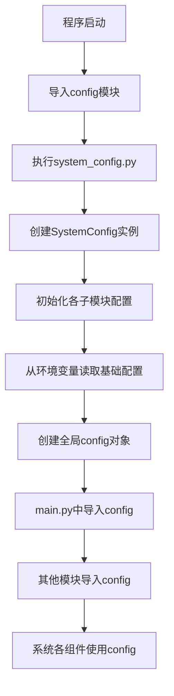

# 系统配置

<cite>
**本文档引用的文件**
- [system_config.py](file://config/system_config.py)
- [main.py](file://main.py)
- [external_config.py](file://config/external_config.py)
</cite>

## 目录
1. [系统配置](#系统配置)
2. [核心配置项详解](#核心配置项详解)
3. [配置加载与初始化流程](#配置加载与初始化流程)
4. [配置修改示例](#配置修改示例)

## 核心配置项详解

`system_config.py` 文件定义了车联网边缘计算系统的核心全局参数，这些参数直接影响系统的仿真行为、性能指标和实验结果。配置通过 `SystemConfig` 类进行组织，并包含多个子配置模块。

### 仿真配置
仿真配置定义了系统运行的基本时间参数。

- **SIMULATION_TIME** (`simulation_time`): 仿真总时长，单位为秒。默认值为 `1000` 秒。该参数决定了整个仿真过程的持续时间，较长的仿真时间可以提供更稳定的性能评估，但会增加计算开销。合理取值范围为 `300-3600` 秒。
- **TIME_SLOT** (`time_slot`): 仿真时隙长度，单位为秒。默认值为 `0.2` 秒。系统以离散时隙的方式推进，所有任务生成、决策和状态更新都基于此时间单位。较短的时隙能提供更精细的模拟，但会增加计算量。合理取值范围为 `0.1-1.0` 秒。

### 网络拓扑配置
网络拓扑配置定义了系统中各类节点的数量。

- **NUM_VEHICLES** (`num_vehicles`): 车辆节点（Vehicle）的数量。默认值为 `12`。车辆是任务的生成源和移动终端。在高密度城市交通场景下，可增加至 `20-40`；在低密度高速公路场景下，可减少至 `5-10`。
- **NUM_RSUS** (`num_rsus`): 路侧单元（RSU）的数量。默认值为 `6`。RSU提供固定的边缘计算和缓存服务。其数量应与车辆数量和道路长度相匹配。高密度场景可设为 `8-12`，低密度场景可设为 `3-5`。
- **NUM_UAVS** (`num_uavs`): 无人机（UAV）的数量。默认值为 `2`。UAV提供灵活的空中计算和缓存支持。其数量通常较少，以符合实际部署成本。推荐值为 `1-3`。

### 计算资源配置
计算资源配置定义了各类节点的计算能力。

- **UAV_COMPUTATION_CAPACITY** (`uav_cpu_freq`): 无人机的默认CPU频率，单位为Hz。默认值为 `8e9` (8 GHz)。该参数直接影响UAV处理任务的速度和能耗。合理取值范围为 `7e9-9e9` (7-9 GHz)。在计算密集型场景下可适当提高。
- **VEHICLE_CPU_FREQ** (`vehicle_cpu_freq`): 车辆的默认CPU频率，单位为Hz。默认值为 `16e9` (16 GHz)，合理范围为 `8e9-25e9`。
- **RSU_CPU_FREQ** (`rsu_cpu_freq`): RSU的默认CPU频率，单位为Hz。默认值为 `50e9` (50 GHz)，合理范围为 `45e9-55e9`。

### 通信配置
通信配置定义了系统的通信能力。

- **COMMUNICATION_BANDWIDTH** (`total_bandwidth`): 系统总通信带宽，单位为Hz。默认值为 `50e6` (50 MHz)。该参数决定了车辆与RSU/UAV之间数据传输的速率，直接影响任务卸载和迁移的延迟。合理取值范围为 `20e6-100e6` (20-100 MHz)。在高密度场景下，带宽需求更高，建议设置为 `60e6-80e6`。

**Section sources**
- [system_config.py](file://config/system_config.py#L263-L301)

## 配置加载与初始化流程

系统配置的加载和初始化主要在 `main.py` 中完成。程序启动时，会自动创建一个全局的 `config` 实例，该实例在 `system_config.py` 中被定义为 `SystemConfig` 类的单例。



**Diagram sources**
- [system_config.py](file://config/system_config.py#L318-L318)
- [main.py](file://main.py#L1-L215)

**Section sources**
- [system_config.py](file://config/system_config.py#L257-L318)
- [main.py](file://main.py#L1-L215)

## 配置修改示例

可以通过多种方式修改系统配置。

### 方式一：直接修改 system_config.py
最直接的方式是编辑 `system_config.py` 文件中的 `SystemConfig` 类的 `__init__` 方法。例如，将仿真时间改为2000秒，车辆数量改为20：

```python
# 在 system_config.py 中修改
self.simulation_time = 2000
self.num_vehicles = 20
```

### 方式二：使用外部JSON配置文件
系统支持通过 `vec_system_config.json` 文件动态覆盖默认配置。首先创建或修改该文件：

```json
{
  "time_settings": {
    "simulation_time": 1500,
    "time_slot_duration": 0.25
  },
  "network_topology": {
    "num_vehicles": 15,
    "num_rsus": 8,
    "num_uavs": 3
  },
  "communication": {
    "total_bandwidth": 60000000
  }
}
```

然后，在程序启动前，通过 `external_config.py` 中的 `apply_external_config_to_system()` 函数应用外部配置。`run_full_experiment.py` 和 `verify_node_adjustment.py` 等脚本在运行时会自动调用此函数。

### 方式三：在代码中动态更新
在程序运行时，可以通过 `config` 对象的 `update_config` 方法动态更新配置。

```python
# 假设在某个模块中
from config import config

# 动态修改配置
config.update_config(simulation_time=1200, num_vehicles=18)
print(f"新的仿真时间: {config.simulation_time}")
print(f"新的车辆数量: {config.num_vehicles}")
```

**Section sources**
- [system_config.py](file://config/system_config.py#L310-L315)
- [external_config.py](file://config/external_config.py#L251-L255)