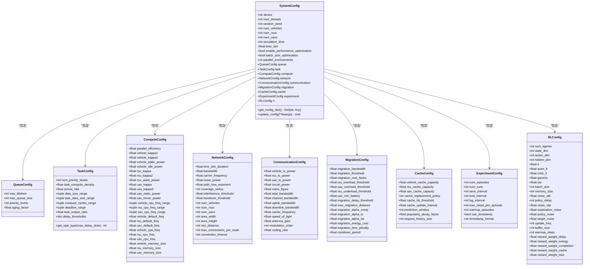
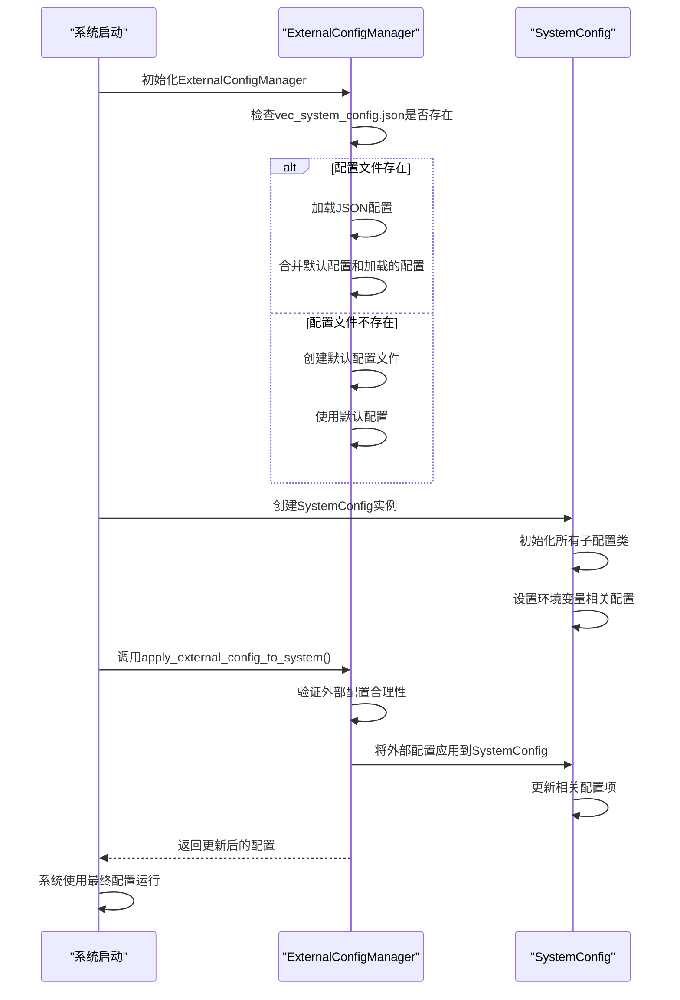
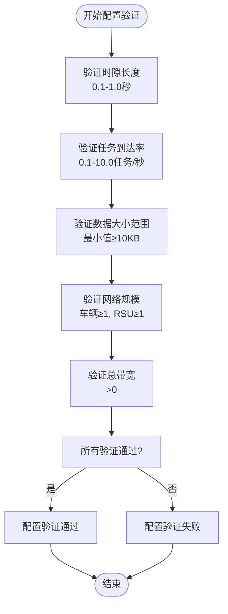

# 系统配置

<cite>
**本文档引用的文件**  
- [system_config.py](file://config/system_config.py)
- [vec_system_config.json](file://vec_system_config.json)
- [external_config.py](file://config/external_config.py)
</cite>

## 目录
1. [系统配置模块概述](#系统配置模块概述)
2. [核心配置类结构](#核心配置类结构)
3. [主配置文件详解](#主配置文件详解)
4. [配置映射与加载机制](#配置映射与加载机制)
5. [系统配置项清单](#系统配置项清单)
6. [车联网场景建模](#车联网场景建模)
7. [配置验证与错误排查](#配置验证与错误排查)
8. [配置加载代码示例](#配置加载代码示例)

## 系统配置模块概述

系统配置模块是车联网仿真系统的核心组件，负责定义和管理所有系统级参数。该模块通过`system_config.py`文件中的`SystemConfig`类实现，采用分层配置结构，将不同功能领域的配置分离到独立的子配置类中。这种设计提高了配置的可维护性和可扩展性。

系统配置模块的主要功能包括：
- 定义仿真环境的基本参数（如仿真时长、时隙长度）
- 配置网络拓扑（车辆、RSU、UAV数量）
- 设置任务生成参数（到达率、数据大小范围）
- 管理计算资源参数（CPU频率、内存大小）
- 控制通信参数（带宽、发射功率）
- 配置迁移策略参数（阈值、冷却期）
- 管理缓存策略参数（容量、替换策略）

配置系统支持通过环境变量设置基本系统配置（如设备类型、线程数、随机种子），同时允许通过外部JSON文件进行运行时参数调整，提高了系统的灵活性和可配置性。

**Section sources**
- [system_config.py](file://config/system_config.py#L257-L318)

## 核心配置类结构

系统配置采用面向对象的设计模式，通过主配置类`SystemConfig`聚合多个子配置类，形成层次化的配置结构。



**Diagram sources**
- [system_config.py](file://config/system_config.py#L8-L255)

**Section sources**
- [system_config.py](file://config/system_config.py#L8-L255)

## 主配置文件详解

主配置文件`vec_system_config.json`是一个JSON格式的外部配置文件，用于在不修改代码的情况下调整系统参数。该文件采用分层结构，将相关配置项组织在不同的逻辑组中。

```json
{
    "time_settings": {
        "time_slot_duration": 0.2,
        "simulation_time": 1000
    },
    "task_generation": {
        "arrival_rate": 1.35,
        "data_size_range": [
            5000000.0,
            25000000.0
        ],
        "compute_density": 500,
        "deadline_range": [
            3.5,
            25.0
        ],
        "output_ratio": 0.05
    },
    "network_topology": {
        "num_vehicles": 12,
        "num_rsus": 6,
        "num_uavs": 2,
        "area_width": 2500,
        "area_height": 2500,
        "rsu_coverage_radius": 360
    },
    "compute_resources": {
        "vehicle_cpu_freq_range": [
            8000000000.0,
            25000000000.0
        ],
        "rsu_cpu_freq_range": [
            45000000000.0,
            55000000000.0
        ],
        "uav_cpu_freq_range": [
            7000000000.0,
            9000000000.0
        ],
        "parallel_efficiency": 0.9
    },
    "communication": {
        "total_bandwidth": 50000000.0,
        "vehicle_tx_power": 30,
        "rsu_tx_power": 35,
        "uav_tx_power": 25
    },
    "migration_parameters": {
        "migration_threshold": 0.75,
        "rsu_overload_threshold": 0.85,
        "uav_overload_threshold": 0.8,
        "cooldown_period": 8.0,
        "max_migration_distance": 800
    },
    "cache_settings": {
        "vehicle_cache_capacity": 2000000000.0,
        "rsu_cache_capacity": 20000000000.0,
        "uav_cache_capacity": 4000000000.0,
        "cache_hit_threshold": 0.85,
        "prediction_window": 15
    },
    "performance_optimization": {
        "enable_adaptive_scheduling": true,
        "enable_load_balancing": true,
        "enable_energy_optimization": true,
        "batch_size_optimization": true,
        "parallel_environments": 8
    }
}
```

配置文件包含以下主要部分：
- **time_settings**: 时间相关参数，定义仿真时长和时隙长度
- **task_generation**: 任务生成参数，控制任务的到达率、数据大小等
- **network_topology**: 网络拓扑参数，定义车辆、RSU和UAV的数量及区域大小
- **compute_resources**: 计算资源参数，配置各节点的CPU频率范围和并行效率
- **communication**: 通信参数，设置总带宽和各节点的发射功率
- **migration_parameters**: 迁移参数，定义迁移触发阈值和冷却期
- **cache_settings**: 缓存参数，配置各节点的缓存容量和预测窗口
- **performance_optimization**: 性能优化参数，控制各种优化功能的开关

**Section sources**
- [vec_system_config.json](file://vec_system_config.json#L0-L68)

## 配置映射与加载机制

系统配置模块采用双重配置机制，结合Python配置类和JSON配置文件的优点，实现灵活的配置管理。



**Diagram sources**
- [system_config.py](file://config/system_config.py#L257-L318)
- [external_config.py](file://config/external_config.py#L74-L246)

**Section sources**
- [system_config.py](file://config/system_config.py#L257-L318)
- [external_config.py](file://config/external_config.py#L74-L246)

配置映射与加载机制的关键特点：
1. **默认配置**: 系统定义了完整的默认配置，确保在没有外部配置文件时也能正常运行
2. **配置合并**: 外部配置文件中的设置会与默认配置合并，只覆盖明确指定的参数
3. **配置验证**: 在应用外部配置前会进行合理性验证，防止无效配置导致系统异常
4. **双向同步**: 支持从系统配置更新外部配置文件，便于保存运行时调整的参数
5. **环境变量**: 基本系统配置（如设备类型、线程数）可通过环境变量设置，优先级最高

## 系统配置项清单

以下表格列出了系统的主要配置项，包括默认值、取值范围、单位和对系统行为的影响。

| 配置项 | 默认值 | 取值范围 | 单位 | 说明 |
|--------|--------|---------|------|------|
| **仿真参数** | | | | |
| simulation_time | 1000 | > 0 | 秒 | 仿真总时长，影响实验运行时间和数据量 |
| time_slot | 0.2 | 0.1-1.0 | 秒 | 时隙长度，影响时间分辨率和计算频率 |
| num_threads | 4 | ≥ 1 | 无 | 并行线程数，影响计算性能 |
| device | 'cuda'/'cpu' | 'cuda','cpu' | 无 | 计算设备，影响计算速度 |
| random_seed | 42 | ≥ 0 | 无 | 随机种子，影响实验可重现性 |
| **网络拓扑** | | | | |
| num_vehicles | 12 | ≥ 1 | 无 | 车辆数量，影响网络密度和任务负载 |
| num_rsus | 6 | ≥ 1 | 无 | RSU数量，影响覆盖范围和计算资源 |
| num_uavs | 2 | ≥ 0 | 无 | UAV数量，影响移动计算能力 |
| area_width | 2500 | > 0 | 米 | 仿真区域宽度 |
| area_height | 2500 | > 0 | 米 | 仿真区域高度 |
| **任务生成** | | | | |
| arrival_rate | 1.35 | 0.1-10.0 | 任务/秒 | 任务到达率，影响系统负载 |
| data_size_range | (5e6,25e6) | 最小值≥1e4 | 字节 | 任务数据大小范围 |
| compute_density | 500 | > 0 | 周期/比特 | 计算密度，影响计算需求 |
| deadline_range | (1.0,10.0) | 最小值>0 | 秒 | 任务截止时间范围 |
| **计算资源** | | | | |
| vehicle_cpu_freq_range | (8e9,25e9) | 最小值>0 | 赫兹 | 车辆CPU频率范围 |
| rsu_cpu_freq_range | (45e9,55e9) | 最小值>0 | 赫兹 | RSU CPU频率范围 |
| uav_cpu_freq_range | (7e9,9e9) | 最小值>0 | 赫兹 | UAV CPU频率范围 |
| parallel_efficiency | 0.8 | 0.0-1.0 | 无 | 并行计算效率 |
| **通信参数** | | | | |
| total_bandwidth | 50e6 | > 0 | 赫兹 | 总带宽，影响通信能力 |
| vehicle_tx_power | 23 | 0-30 | dBm | 车辆发射功率 |
| rsu_tx_power | 30 | 0-40 | dBm | RSU发射功率 |
| uav_tx_power | 20 | 0-30 | dBm | UAV发射功率 |
| **迁移参数** | | | | |
| migration_threshold | 0.8 | 0.0-1.0 | 无 | 迁移触发阈值 |
| rsu_overload_threshold | 0.8 | 0.0-1.0 | 无 | RSU过载阈值 |
| uav_overload_threshold | 0.7 | 0.0-1.0 | 无 | UAV过载阈值 |
| cooldown_period | 10.0 | ≥ 0 | 秒 | 迁移冷却期 |
| max_migration_distance | 1000 | > 0 | 米 | 最大迁移距离 |
| **缓存参数** | | | | |
| vehicle_cache_capacity | 1e9 | > 0 | 字节 | 车辆缓存容量 |
| rsu_cache_capacity | 10e9 | > 0 | 字节 | RSU缓存容量 |
| uav_cache_capacity | 2e9 | > 0 | 字节 | UAV缓存容量 |
| cache_hit_threshold | 0.8 | 0.0-1.0 | 无 | 缓存命中阈值 |
| prediction_window | 10 | ≥ 1 | 时隙 | 预测窗口大小 |

**Section sources**
- [system_config.py](file://config/system_config.py#L8-L255)
- [vec_system_config.json](file://vec_system_config.json#L0-L68)

## 车联网场景建模

通过调整系统配置参数，可以模拟不同类型的车联网场景，如城市道路环境和高速公路环境。

### 城市道路环境配置

城市道路环境通常具有高车辆密度、复杂交通模式和频繁的通信切换。以下配置参数适合模拟城市道路场景：

```json
{
    "task_generation": {
        "arrival_rate": 2.5,
        "data_size_range": [1e6, 10e6]
    },
    "network_topology": {
        "num_vehicles": 30,
        "num_rsus": 10,
        "area_width": 1500,
        "area_height": 1500
    },
    "communication": {
        "total_bandwidth": 30e6,
        "vehicle_tx_power": 20,
        "rsu_tx_power": 25
    },
    "migration_parameters": {
        "migration_threshold": 0.6,
        "cooldown_period": 5.0
    }
}
```

城市道路场景的特点：
- **高车辆密度**: 增加车辆数量，减小区域面积
- **高任务负载**: 提高任务到达率，模拟频繁的车联网应用
- **有限通信资源**: 降低总带宽，模拟拥挤的无线环境
- **频繁迁移**: 降低迁移阈值，缩短冷却期，适应频繁的网络切换

### 高速公路环境配置

高速公路环境通常具有较低的车辆密度、较高的车速和较长的通信距离。以下配置参数适合模拟高速公路场景：

```json
{
    "task_generation": {
        "arrival_rate": 0.8,
        "data_size_range": [5e6, 50e6]
    },
    "network_topology": {
        "num_vehicles": 8,
        "num_rsus": 4,
        "area_width": 5000,
        "area_height": 500
    },
    "communication": {
        "total_bandwidth": 80e6,
        "vehicle_tx_power": 28,
        "rsu_tx_power": 35
    },
    "migration_parameters": {
        "migration_threshold": 0.9,
        "cooldown_period": 15.0
    }
}
```

高速公路场景的特点：
- **低车辆密度**: 减少车辆数量，增加区域长度
- **大任务数据**: 增加数据大小范围，模拟大文件传输
- **充足通信资源**: 增加总带宽，提高发射功率
- **稀疏迁移**: 提高迁移阈值，延长冷却期，适应稳定的网络连接

**Section sources**
- [vec_system_config.json](file://vec_system_config.json#L0-L68)
- [external_config.py](file://config/external_config.py#L0-L255)

## 配置验证与错误排查

系统提供了配置验证机制，确保配置参数的合理性和有效性，防止因配置错误导致系统异常。

### 配置验证流程



**Diagram sources**
- [external_config.py](file://config/external_config.py#L209-L246)

**Section sources**
- [external_config.py](file://config/external_config.py#L209-L246)

### 常见错误及排查方法

#### 类型不匹配错误

**错误现象**: 配置值类型与预期类型不符，如将字符串赋值给数值型参数

**排查方法**:
1. 检查JSON文件中的数值是否被引号包围
2. 确认布尔值使用`true`/`false`而非`"true"`/`"false"`
3. 使用配置验证工具检查类型一致性

**修复示例**:
```json
// 错误
"simulation_time": "1000"

// 正确
"simulation_time": 1000
```

#### 必填项缺失错误

**错误现象**: 关键配置项缺失，导致系统使用不合理的默认值

**排查方法**:
1. 检查配置文件是否包含所有必需的配置组
2. 确认每个配置组包含必要的参数
3. 使用配置摘要功能检查关键参数

**修复示例**:
```json
// 确保包含所有必要配置
{
    "time_settings": {
        "time_slot_duration": 0.2,
        "simulation_time": 1000
    },
    "task_generation": {
        "arrival_rate": 1.35,
        "data_size_range": [5e6, 25e6]
    }
    // 其他配置组...
}
```

#### 范围越界错误

**错误现象**: 配置值超出合理范围，如负的带宽或过大的车辆数量

**排查方法**:
1. 检查数值是否在合理范围内
2. 确认单位是否正确（如MB与字节的转换）
3. 使用配置验证工具自动检测范围问题

**修复示例**:
```json
// 错误
"total_bandwidth": -10e6

// 正确
"total_bandwidth": 50e6
```

## 配置加载代码示例

以下代码示例演示了如何加载和使用系统配置。

```python
# 导入配置模块
from config.system_config import config
from config.external_config import apply_external_config_to_system

# 方法1: 使用默认配置
print("使用默认配置:")
print(f"仿真时长: {config.simulation_time}秒")
print(f"车辆数量: {config.num_vehicles}")
print(f"任务到达率: {config.task.arrival_rate}任务/秒")

# 方法2: 应用外部配置
print("\n应用外部配置...")
updated_config = apply_external_config_to_system()
print(f"更新后任务到达率: {config.task.arrival_rate}任务/秒")
print(f"更新后车辆数量: {config.num_vehicles}")

# 方法3: 动态更新配置
print("\n动态更新配置...")
config.update_config(simulation_time=2000, num_vehicles=15)
print(f"动态更新后仿真时长: {config.simulation_time}秒")
print(f"动态更新后车辆数量: {config.num_vehicles}")

# 方法4: 获取配置字典
config_dict = config.get_config_dict()
print("\n配置字典:")
for key, value in config_dict.items():
    print(f"  {key}: {value}")
```

**Section sources**
- [system_config.py](file://config/system_config.py#L257-L318)
- [external_config.py](file://config/external_config.py#L251-L255)