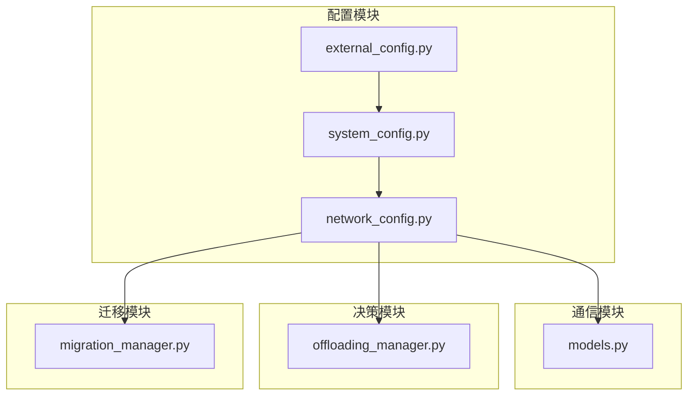
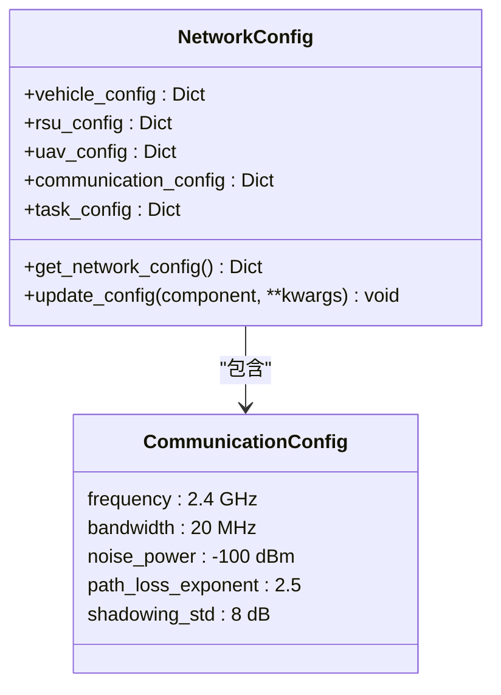
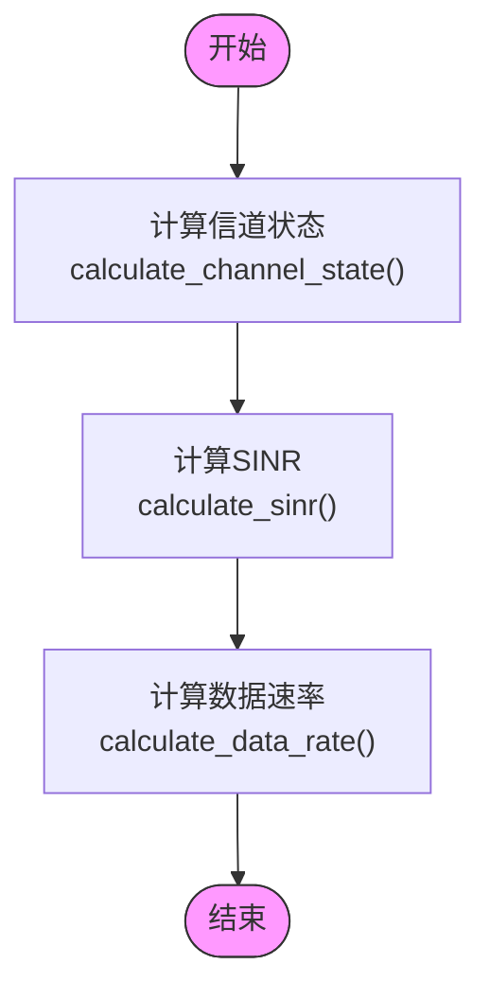
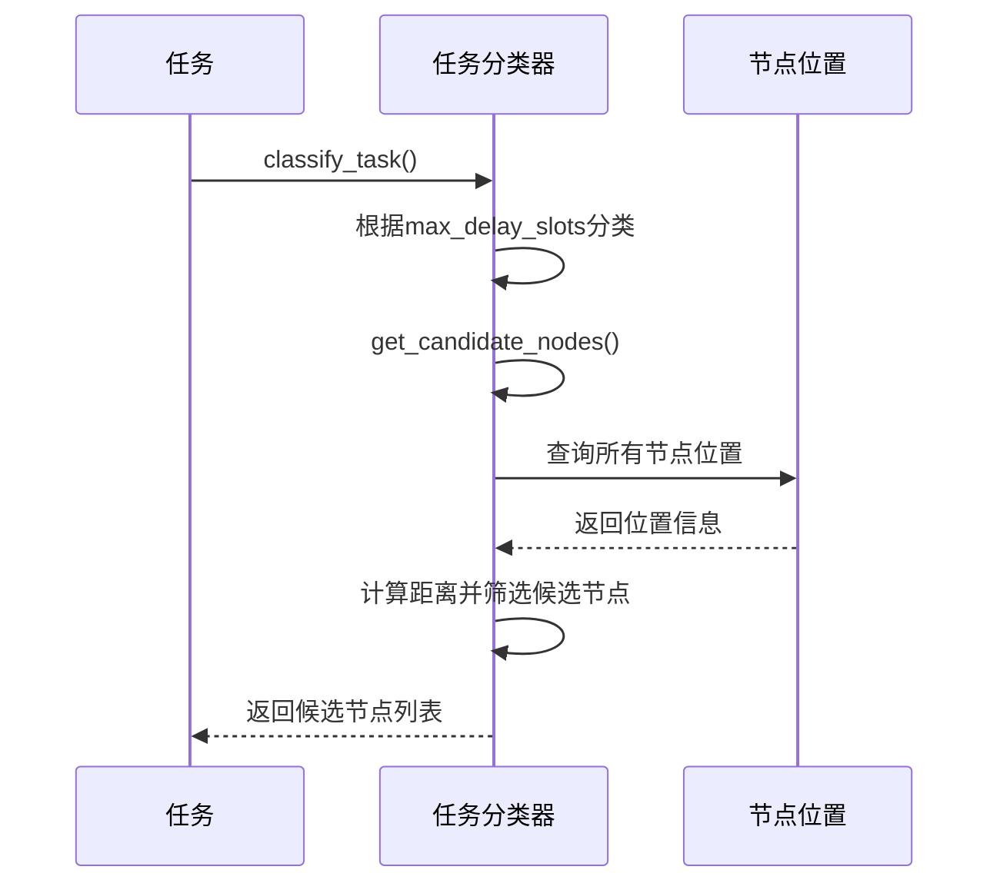
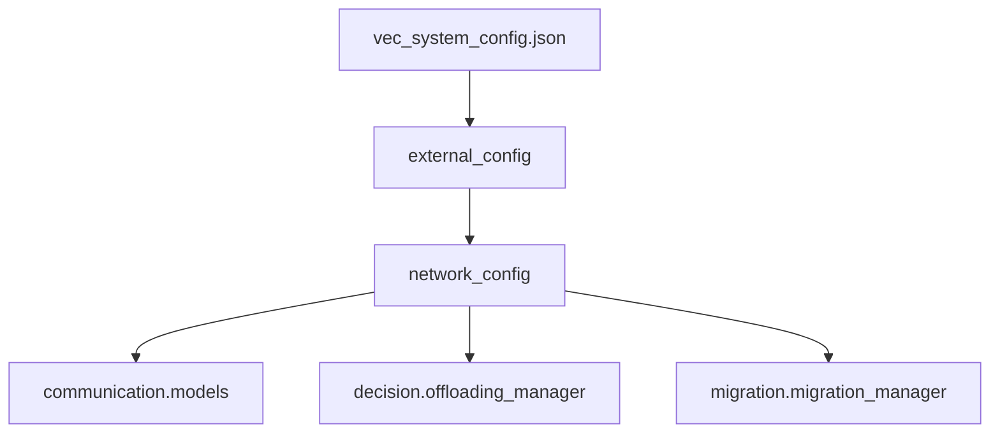

# 网络配置

<cite>
**本文档中引用的文件**   
- [network_config.py](file://config/network_config.py)
- [models.py](file://communication/models.py)
- [vec_system_config.json](file://vec_system_config.json)
- [external_config.py](file://config/external_config.py)
- [system_config.py](file://config/system_config.py)
</cite>

## 目录
1. [引言](#引言)
2. [项目结构](#项目结构)
3. [核心组件](#核心组件)
4. [架构概述](#架构概述)
5. [详细组件分析](#详细组件分析)
6. [依赖分析](#依赖分析)
7. [性能考虑](#性能考虑)
8. [故障排除指南](#故障排除指南)
9. [结论](#结论)

## 引言
本文档全面阐述了车联网（VEC）系统中`network_config.py`模块的功能与实现，重点聚焦于通信特性建模、动态网络属性配置及其对任务卸载和迁移管理的影响。文档详细说明了无线信道、传输功率、路径损耗、SINR计算等关键参数的定义与配置方法，并通过真实场景案例展示了不同交通密度下的配置策略。

## 项目结构
本项目采用模块化设计，`config`目录下的`network_config.py`是网络配置的核心文件，它与`communication`模块紧密协作，为`decision`和`migration`模块提供必要的网络参数。

**Diagram sources**
- [network_config.py](file://config/network_config.py)
- [system_config.py](file://config/system_config.py)
- [external_config.py](file://config/external_config.py)

**Section sources**
- [network_config.py](file://config/network_config.py)
- [project_structure](file://project_structure)

## 核心组件
`NetworkConfig`类是网络配置的核心，它通过多个字典属性（`vehicle_config`, `rsu_config`, `uav_config`, `communication_config`, `task_config`）来组织和管理不同网络实体的参数。该类提供了`get_network_config`方法以获取完整的配置信息，并通过`update_config`方法支持运行时动态更新。

**Section sources**
- [network_config.py](file://config/network_config.py#L7-L80)

## 架构概述
系统架构围绕一个中心化的配置管理展开。`network_config.py`定义了基础网络参数，这些参数被`communication/models.py`中的`WirelessCommunicationModel`用于执行具体的通信计算（如SINR和数据速率）。决策模块（`offloading_manager.py`）则利用这些计算结果来做出任务卸载和迁移的决策。

**Diagram sources**
- [network_config.py](file://config/network_config.py)
- [models.py](file://communication/models.py)
- [offloading_manager.py](file://decision/offloading_manager.py)
- [migration_manager.py](file://migration/migration_manager.py)
- [vec_system_config.json](file://vec_system_config.json)

## 详细组件分析

### 通信参数配置分析
`communication_config`字典定义了无线通信的物理层参数，这些参数是计算SINR和数据传输速率的基础。

**Diagram sources**
- [network_config.py](file://config/network_config.py#L43-L55)

#### 信号干扰噪声比（SINR）与数据速率计算
`WirelessCommunicationModel`类实现了从物理参数到通信性能指标的完整计算链路。它首先根据位置计算信道状态（包括路径损耗和阴影衰落），然后计算SINR，最终得出数据传输速率。

**Diagram sources**
- [models.py](file://communication/models.py#L25-L226)

### 动态网络属性配置分析
网络配置不仅包含静态参数，还通过`velocity_range`等属性隐式定义了车辆移动性模型。邻居节点的发现机制由`offloading_manager.py`中的`TaskClassifier`类实现，它根据任务类型和节点位置动态确定候选处理节点。

**Diagram sources**
- [offloading_manager.py](file://decision/offloading_manager.py#L55-L206)

### 网络配置对决策的影响分析
网络配置直接影响任务卸载和迁移的性能评估。例如，`ProcessingModeEvaluator`在评估`RSU_OFFLOAD`模式时，会使用`network_config`提供的带宽和传输功率来计算通信时延和能耗。

**Diagram sources**
- [models.py](file://communication/models.py)
- [offloading_manager.py](file://decision/offloading_manager.py)

**Section sources**
- [network_config.py](file://config/network_config.py)
- [models.py](file://communication/models.py)
- [offloading_manager.py](file://decision/offloading_manager.py)

## 依赖分析
`network_config.py`是系统的核心依赖之一，被多个模块直接或间接引用。

**Diagram sources**
- [network_config.py](file://config/network_config.py)
- [models.py](file://communication/models.py)
- [offloading_manager.py](file://decision/offloading_manager.py)
- [migration_manager.py](file://migration/migration_manager.py)
- [external_config.py](file://config/external_config.py)
- [vec_system_config.json](file://vec_system_config.json)

## 性能考虑
合理的网络配置对系统性能至关重要。例如，过高的`path_loss_exponent`会导致信号衰减过快，从而降低数据速率和增加通信时延。在`vec_system_config.json`中，`total_bandwidth`被设置为50MHz，这比`network_config.py`中的20MHz更符合实际5G网络场景，体现了外部配置对基础配置的覆盖和优化。

## 故障排除指南
配置错误是导致通信模拟失真的常见原因。例如，如果`noise_power`的单位从dBm误设为W，会导致噪声功率被严重高估，从而使SINR趋近于零，模拟结果将完全失真。另一个常见问题是`bandwidth`单位不一致，代码中应确保所有带宽值都使用相同的单位（如Hz或MHz）。

**Section sources**
- [network_config.py](file://config/network_config.py)
- [models.py](file://communication/models.py)
- [vec_system_config.json](file://vec_system_config.json)

## 结论
`network_config.py`模块为整个VEC系统提供了灵活且可扩展的网络参数配置框架。它通过清晰的结构化设计，将复杂的车联网通信特性建模为可配置的参数集合。该模块与外部JSON配置文件和内部通信模型的协同工作，使得系统能够适应不同的仿真场景，为任务卸载和迁移管理的性能评估提供了坚实的基础。未来的工作可以进一步增强配置的验证机制，以防止因参数错误而导致的模拟失真。