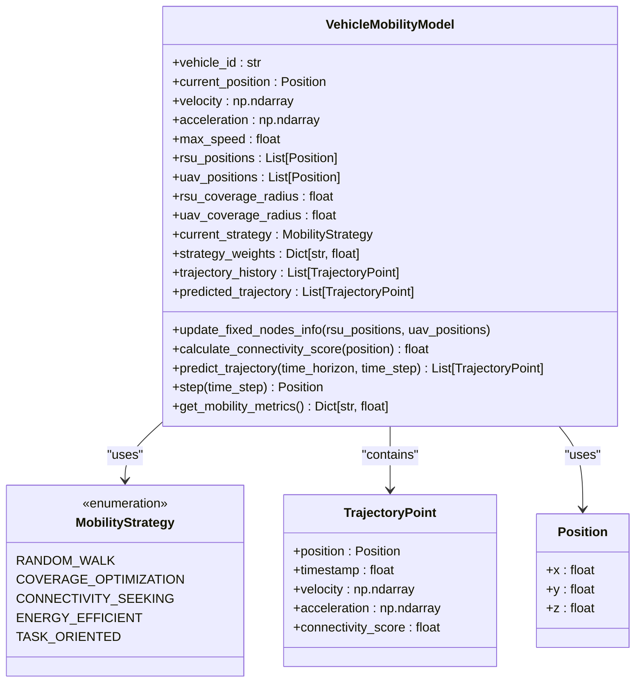

# 网络配置

<cite>
**本文档引用的文件**   
- [network_config.py](file://config/network_config.py)
- [enhanced_vehicle_mobility.py](file://models/enhanced_vehicle_mobility.py)
- [system_config.py](file://config/system_config.py)
- [data_structures.py](file://models/data_structures.py)
</cite>

## 目录
1. [引言](#引言)
2. [核心网络参数](#核心网络参数)
3. [网络拓扑与通信参数详解](#网络拓扑与通信参数详解)
4. [任务卸载决策与通信延迟分析](#任务卸载决策与通信延迟分析)
5. [动态网络变化对系统性能的影响](#动态网络变化对系统性能的影响)
6. [典型场景配置示例](#典型场景配置示例)
7. [结论](#结论)

## 引言
本文档全面介绍基于`network_config.py`定义的网络拓扑与通信参数，阐述这些参数如何共同构建车联网（VEC）仿真环境的网络结构。通过分析`ROAD_LENGTH`、`LANE_COUNT`、`VEHICLE_SPEED_RANGE`、`RSU_COVERAGE_RADIUS`、`UAV_FLIGHT_HEIGHT`等关键参数，揭示其对任务卸载决策、通信延迟和节点间连接稳定性的影响。结合`models/enhanced_vehicle_mobility.py`中的移动模型，深入探讨动态网络变化对系统性能的作用机制，并提供适用于不同交通环境的典型配置建议。

## 核心网络参数
在`network_config.py`中，`NetworkConfig`类定义了车辆、RSU、UAV和通信系统的核心参数。这些参数共同决定了仿真环境的物理布局、节点能力及通信特性。

**Section sources**
- [network_config.py](file://config/network_config.py#L7-L80)

## 网络拓扑与通信参数详解
`network_config.py`中的配置将网络拓扑与通信参数紧密结合，形成一个完整的仿真环境。

### 车辆配置
车辆配置定义了移动节点的基本属性：
- **车辆数量** (`num_vehicles`): 12辆，决定了网络的密度和交互复杂度。
- **速度范围** (`velocity_range`): (10, 30) m/s，模拟了城市道路的典型车速，影响节点的移动性和连接持续时间。
- **发射功率** (`transmission_power`): 0.1 W，决定了车辆的通信范围和能耗。
- **计算能力** (`computation_capacity`): 100 MIPS，代表车辆本地处理任务的能力。
- **电池容量** (`battery_capacity`): 1000 J，限制了车辆的续航和可执行任务量。

### RSU配置
RSU作为固定的路侧基础设施，提供强大的计算和通信支持：
- **RSU数量** (`num_rsus`): 6个，与车辆数量形成合理的服务比例。
- **覆盖半径** (`coverage_radius`): 200米，定义了RSU的有效服务区域。
- **发射功率** (`transmission_power`): 1.0 W，远高于车辆，确保稳定覆盖。
- **计算能力** (`computation_capacity`): 1000 MIPS，是车辆的10倍，适合处理复杂任务。
- **缓存容量** (`cache_capacity`): 100 MB，用于存储热门内容，减少重复传输。
- **带宽** (`bandwidth`): 20 MHz，提供高吞吐量的数据传输。

### UAV配置
UAV作为空中移动节点，提供了灵活的覆盖和计算能力：
- **UAV数量** (`num_uavs`): 2架，作为RSU的补充。
- **飞行高度** (`altitude`): 100米，影响其覆盖范围和与地面节点的通信质量。
- **速度范围** (`velocity_range`): (20, 50) m/s，比车辆更快，能快速响应网络需求。
- **发射功率** (`transmission_power`): 0.5 W，介于车辆和RSU之间。
- **计算能力** (`computation_capacity`): 500 MIPS，是车辆的5倍。
- **缓存容量** (`cache_capacity`): 50 MB，支持空中缓存服务。
- **电池容量** (`battery_capacity`): 5000 J，远高于车辆，但需考虑悬停能耗。

### 通信配置
通信配置定义了无线信道的物理特性：
- **频率** (`frequency`): 2.4 GHz，是常见的ISM频段。
- **带宽** (`bandwidth`): 20 MHz，决定了信道容量。
- **噪声功率** (`noise_power`): -100 dBm，影响信噪比和通信质量。
- **路径损耗指数** (`path_loss_exponent`): 2.5，反映了信号在传播过程中的衰减程度。
- **阴影衰落标准差** (`shadowing_std`): 8 dB，模拟了环境对信号的随机影响。

**Section sources**
- [network_config.py](file://config/network_config.py#L7-L80)

## 任务卸载决策与通信延迟分析
网络参数直接影响任务卸载决策和通信延迟。

### 任务卸载决策
任务卸载决策依赖于对目标节点连接质量、计算能力和能耗的综合评估。`enhanced_vehicle_mobility.py`中的`calculate_connectivity_score`方法通过计算车辆与RSU/UAV的距离，评估连接性评分。该评分结合了RSU和UAV的权重（0.6和0.4），为卸载决策提供依据。例如，当车辆接近RSU时，其连接性评分高，更倾向于将任务卸载到RSU。

### 通信延迟
通信延迟由传播延迟和传输延迟组成。传播延迟与节点间距离成正比，而传输延迟与数据大小和信道速率成反比。`communication_config`中的`path_loss_exponent`和`noise_power`直接影响信道速率。较高的路径损耗指数或噪声功率会降低信噪比，从而降低数据速率，增加传输延迟。此外，`task_config`中的`data_size_mean`（1.0 MB）和`deadline_mean`（1.0秒）定义了任务的时延要求，系统必须在满足这些要求的前提下进行卸载。

**Section sources**
- [network_config.py](file://config/network_config.py#L7-L80)
- [enhanced_vehicle_mobility.py](file://models/enhanced_vehicle_mobility.py#L79-L102)

## 动态网络变化对系统性能的影响
`models/enhanced_vehicle_mobility.py`中的`VehicleMobilityModel`类实现了车辆的动态移动，对系统性能产生深远影响。

### 移动性模型
该模型支持多种移动策略，如`CONNECTIVITY_SEEKING`（连接性寻求）、`COVERAGE_OPTIMIZATION`（覆盖优化）等。车辆根据当前策略调整加速度，从而改变其轨迹。例如，在`CONNECTIVITY_SEEKING`策略下，车辆会向连接性更好的区域移动，这可以提高通信质量，但也可能导致车辆聚集，增加局部网络拥塞。

### 动态连接性
车辆的移动导致其与RSU/UAV的连接状态动态变化。`calculate_connectivity_score`方法在每个时间步计算车辆的连接性评分，反映了网络拓扑的实时状态。这种动态性增加了任务卸载的复杂性，因为一个在当前时隙连接良好的节点，在下一个时隙可能已超出覆盖范围。

### 性能指标
`get_mobility_metrics`方法提供了评估移动性影响的指标，如`average_speed`、`connectivity_score`和`trajectory_efficiency`。这些指标可用于分析不同移动策略对系统性能的影响。例如，高`connectivity_score`通常意味着更稳定的通信，而高`trajectory_efficiency`表示车辆移动路径更直接，可能减少不必要的能耗。

**Diagram sources **
- [enhanced_vehicle_mobility.py](file://models/enhanced_vehicle_mobility.py#L33-L398)

**Section sources**
- [enhanced_vehicle_mobility.py](file://models/enhanced_vehicle_mobility.py#L33-L398)

## 典型场景配置示例
根据不同的交通环境，可以调整网络参数以适应特定场景。

### 密集城区
在密集城区，建筑物多，信号遮挡严重，且车辆密度高。
- **调整建议**:
  - 增加`num_rsus`至10-15，以提供更密集的覆盖。
  - 降低`RSU_COVERAGE_RADIUS`至150米，以减少干扰。
  - 提高`VEHICLE_SPEED_RANGE`上限至25 m/s，反映拥堵路况。
  - 增加`path_loss_exponent`至3.0，模拟城市峡谷效应。
  - 增大`shadowing_std`至10 dB，反映更强的信号波动。

### 郊区道路
郊区道路相对开阔，车辆速度较高，但节点密度较低。
- **调整建议**:
  - 保持`num_rsus`为6，但增加`RSU_COVERAGE_RADIUS`至300米。
  - 提高`VEHICLE_SPEED_RANGE`至(15, 35) m/s。
  - 降低`path_loss_exponent`至2.0，反映更自由的传播环境。
  - 减少`shadowing_std`至5 dB。

### 高速公路
高速公路车辆速度极高，连接时间短，对任务卸载的时延要求苛刻。
- **调整建议**:
  - 增加`num_uavs`至3-4，利用其高速移动性进行动态覆盖。
  - 提高`UAV_FLIGHT_HEIGHT`至150米，扩大覆盖范围。
  - 显著提高`UAV_VELOCITY_RANGE`至(50, 80) m/s，以匹配车流速度。
  - 增加`task_config`中的`deadline_mean`至2.0秒，以适应高速场景下的卸载挑战。

**Section sources**
- [network_config.py](file://config/network_config.py#L7-L80)
- [enhanced_vehicle_mobility.py](file://models/enhanced_vehicle_mobility.py#L33-L398)

## 结论
`network_config.py`和`enhanced_vehicle_mobility.py`中的参数共同构建了一个复杂且动态的车联网仿真环境。通过精细调整车辆、RSU、UAV的配置以及通信参数，可以模拟从密集城区到高速公路的各种交通场景。移动模型的引入使得网络拓扑动态变化，对任务卸载决策、通信延迟和连接稳定性提出了更高要求。理解这些参数之间的相互作用，对于设计和优化VEC系统至关重要。未来的工作可以探索更复杂的移动模型和自适应参数调整策略，以进一步提升系统性能。