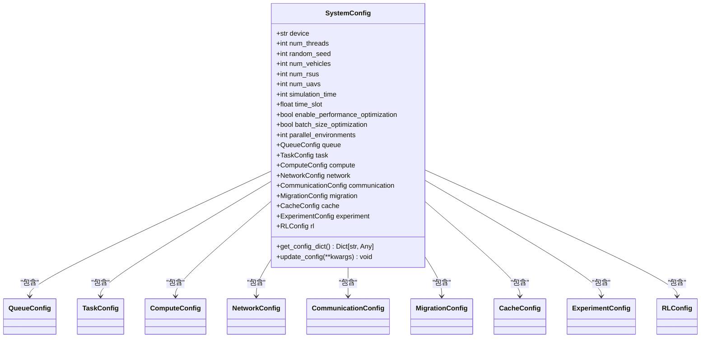
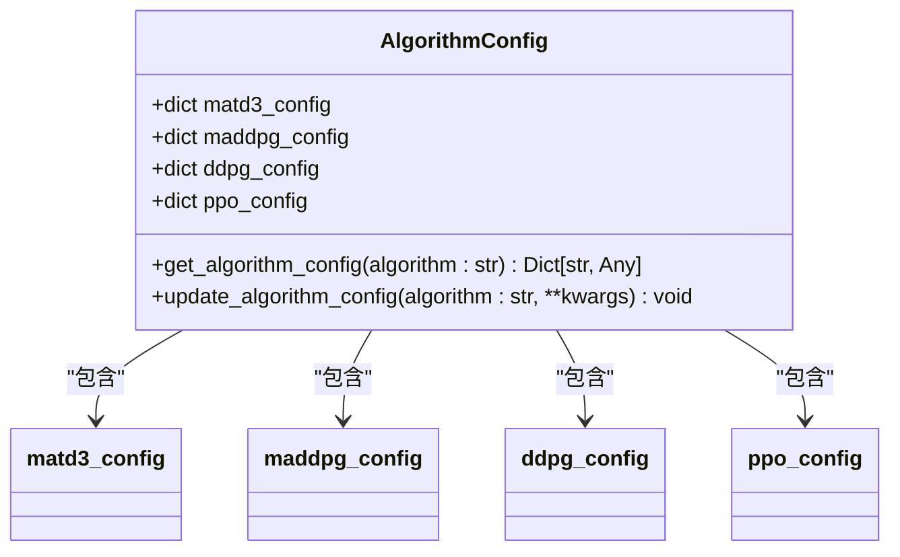
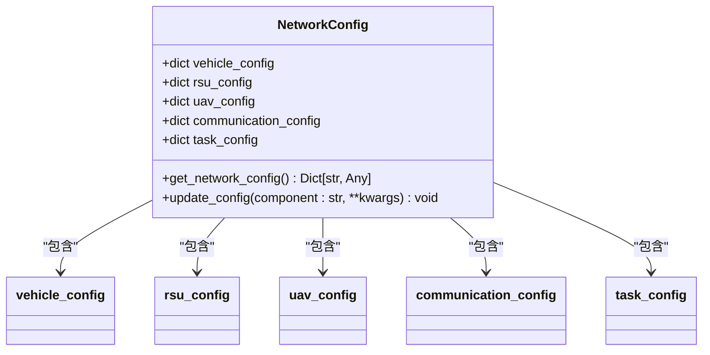
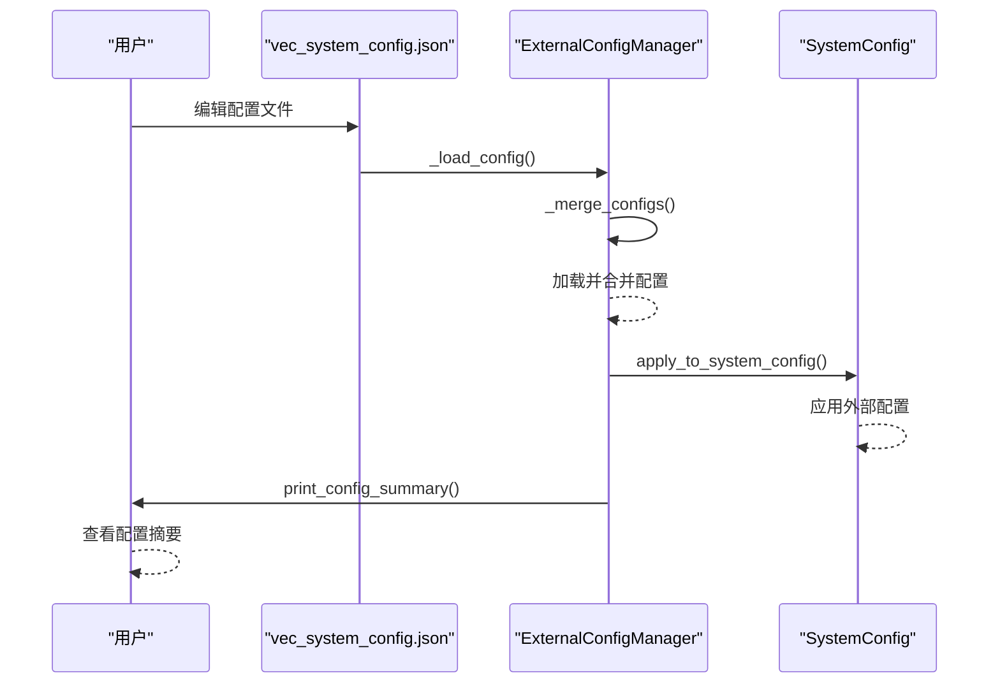

# 配置管理

<cite>
**本文档中引用的文件**  
- [system_config.py](file://config/system_config.py)
- [algorithm_config.py](file://config/algorithm_config.py)
- [network_config.py](file://config/network_config.py)
- [external_config.py](file://config/external_config.py)
- [vec_system_config.json](file://vec_system_config.json)
</cite>

## 目录
1. [简介](#简介)
2. [系统配置](#系统配置)
3. [算法配置](#算法配置)
4. [网络配置](#网络配置)
5. [外部配置管理](#外部配置管理)
6. [配置项清单](#配置项清单)
7. [实验场景配置示例](#实验场景配置示例)
8. [结论](#结论)

## 简介
本配置管理文档系统性地介绍了 VEC_mig_caching 项目中的所有核心配置模块。文档详细说明了 `system_config.py` 如何定义全局系统参数，`algorithm_config.py` 如何为不同强化学习算法设置超参数，`network_config.py` 如何描述网络拓扑结构，以及 `external_config.py` 如何通过加载外部 JSON 配置文件 `vec_system_config.json` 来支持运行时参数覆盖。通过本指南，用户可以全面了解配置体系的结构、作用范围和使用方法，并能根据不同的实验需求（如城市道路与高速公路场景）灵活调整系统参数。

## 系统配置
`system_config.py` 文件定义了系统的全局参数，是整个仿真环境的核心配置文件。它通过 `SystemConfig` 类集中管理所有基础设置，包括仿真时间、节点数量、性能优化选项等。该类还通过组合模式（Composition）集成了多个子配置模块，如任务、计算、网络、通信、迁移和缓存等，实现了配置的模块化和层次化管理。

**图示来源**
- [system_config.py](file://config/system_config.py#L257-L315)

**本节来源**
- [system_config.py](file://config/system_config.py#L1-L318)

## 算法配置
`algorithm_config.py` 文件专门用于管理不同强化学习算法的超参数。它通过 `AlgorithmConfig` 类为 MATD3、MADDPG、DDPG 和 PPO 等算法提供独立的配置字典。这种设计允许用户在不修改核心代码的情况下，轻松地为不同算法定制学习率、折扣因子、网络层数等关键参数。

**图示来源**
- [algorithm_config.py](file://config/algorithm_config.py#L7-L73)

**本节来源**
- [algorithm_config.py](file://config/algorithm_config.py#L1-L73)

## 网络配置
`network_config.py` 文件定义了网络拓扑结构和相关组件的静态属性。它通过 `NetworkConfig` 类为车辆（Vehicle）、路侧单元（RSU）和无人机（UAV）等网络实体提供详细的配置，包括数量、速度范围、传输功率、计算能力和缓存容量等。此外，它还定义了通信和任务生成的默认参数。

**图示来源**
- [network_config.py](file://config/network_config.py#L7-L80)

**本节来源**
- [network_config.py](file://config/network_config.py#L1-L80)

## 外部配置管理
`external_config.py` 文件实现了外部配置管理功能，通过 `ExternalConfigManager` 类加载和管理 `vec_system_config.json` 文件。该机制允许用户在不修改 Python 代码的情况下，通过编辑 JSON 文件来动态调整系统参数，极大地提高了实验的灵活性。`ExternalConfigManager` 提供了配置的加载、保存、验证和应用功能，并能与 `system_config.py` 中的全局配置实例进行双向同步。

**图示来源**
- [external_config.py](file://config/external_config.py#L74-L246)
- [vec_system_config.json](file://vec_system_config.json)

**本节来源**
- [external_config.py](file://config/external_config.py#L1-L255)

## 配置项清单
下表列出了系统中所有关键配置项，包括其默认值、取值范围和对系统行为的影响。

| 配置项 | 默认值 | 取值范围 | 作用范围 | 影响 |
| :--- | :--- | :--- | :--- | :--- |
| `simulation_time` | 1000 | > 0 (seconds) | system_config.py | 定义仿真的总时长，影响实验的持续时间和数据收集量。 |
| `time_slot_duration` | 0.2 | 0.1 - 1.0 (seconds) | system_config.py, external_config.py | 定义每个仿真时隙的长度，影响事件的粒度和计算频率。 |
| `num_vehicles` | 12 | > 0 (integer) | system_config.py, network_config.py, external_config.py | 定义仿真中车辆的数量，直接影响网络密度和任务负载。 |
| `num_rsus` | 6 | > 0 (integer) | system_config.py, network_config.py, external_config.py | 定义路侧单元的数量，影响服务覆盖范围和计算资源。 |
| `num_uavs` | 2 | > 0 (integer) | system_config.py, network_config.py, external_config.py | 定义无人机的数量，增加移动计算和通信节点。 |
| `arrival_rate` | 1.35 | 0.1 - 10.0 (tasks/s) | system_config.py, external_config.py | 定义任务的到达率，控制系统的负载水平。 |
| `data_size_range` | (5e6, 25e6) | (min, max) bytes | system_config.py, external_config.py | 定义任务数据大小的范围，影响传输和计算开销。 |
| `total_bandwidth` | 50e6 | > 0 (Hz) | system_config.py, external_config.py | 定义总通信带宽，影响数据传输速率和网络拥塞。 |
| `actor_lr` / `critic_lr` | 0.0003 | > 0 (float) | algorithm_config.py | 定义强化学习算法中Actor和Critic网络的学习率，影响模型收敛速度和稳定性。 |
| `gamma` | 0.99 | (0, 1) (float) | algorithm_config.py | 定义折扣因子，影响智能体对未来奖励的重视程度。 |
| `hidden_dim` | 256 | > 0 (integer) | algorithm_config.py | 定义神经网络的隐藏层维度，影响模型的表达能力和计算复杂度。 |
| `parallel_environments` | 6 | > 0 (integer) | system_config.py, external_config.py | 定义并行仿真的环境数量，影响训练效率和数据多样性。 |

## 实验场景配置示例
本节通过两个示例展示如何修改配置以适应不同的实验场景。

### 城市道路场景
城市道路通常具有高车辆密度、频繁的通信切换和复杂的任务分布。为此，可以调整以下参数：
- **增加节点数量**：将 `num_vehicles` 提高到 30，`num_rsus` 提高到 8，以模拟高密度交通。
- **提高任务到达率**：将 `arrival_rate` 调整为 2.0，以模拟繁忙的业务请求。
- **缩短时隙长度**：将 `time_slot_duration` 设为 0.1，以更精细地捕捉快速变化的网络状态。
- **增加带宽**：将 `total_bandwidth` 提升至 60e6，以应对高并发通信需求。

这些修改可以通过编辑 `vec_system_config.json` 文件中的 `network_topology` 和 `task_generation` 字段来实现。

### 高速公路场景
高速公路场景的特点是车辆速度快、RSU覆盖范围广、任务相对简单。配置调整如下：
- **增加车辆速度范围**：在 `network_config.py` 的 `vehicle_config` 中，将 `velocity_range` 修改为 (30, 50) m/s。
- **扩大RSU覆盖半径**：将 `rsu_coverage_radius` 增加到 500 米，以减少切换频率。
- **延长任务截止时间**：在 `task_generation` 中，将 `deadline_range` 扩大到 (5.0, 30.0) 秒。
- **降低任务到达率**：将 `arrival_rate` 降低至 0.8，以反映较低的业务密度。

这些配置同样可以通过 `external_config.py` 机制在运行时动态应用。

## 结论
VEC_mig_caching 项目的配置管理系统设计精良，层次分明。`system_config.py` 提供了坚实的全局基础，`algorithm_config.py` 和 `network_config.py` 分别负责算法和网络的精细化设置，而 `external_config.py` 则通过 JSON 文件实现了强大的运行时可配置性。这种组合使得系统既稳定又灵活，能够轻松适应从城市道路到高速公路等多种复杂的实验场景。用户应优先使用 `vec_system_config.json` 文件进行参数调整，以保持代码的整洁和实验的可复现性。