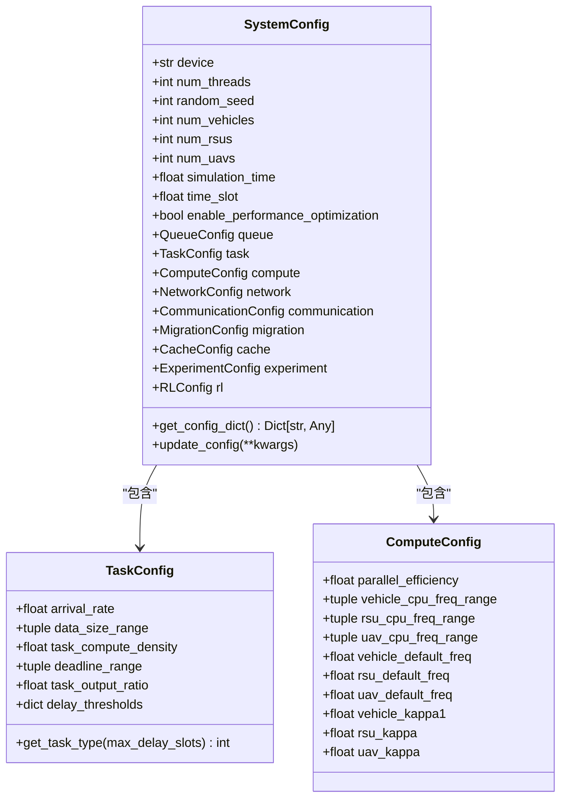
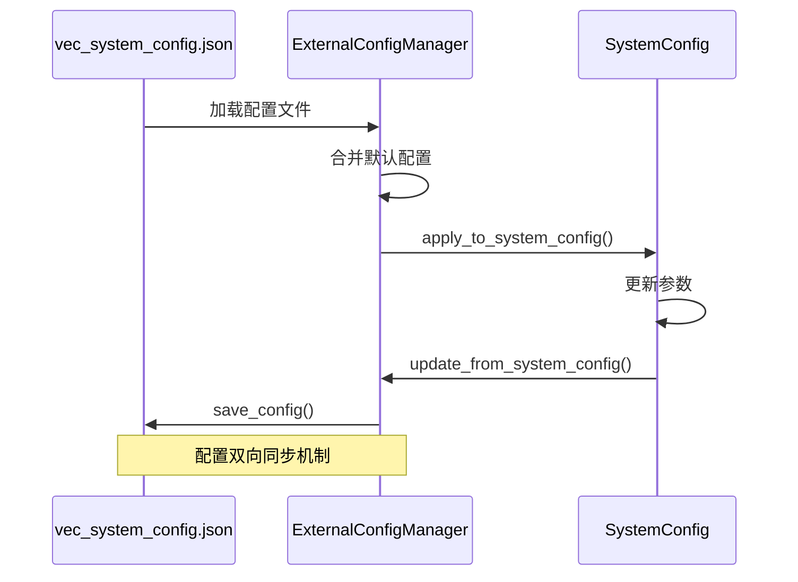

# 配置管理

<cite>
**本文档中引用的文件**  
- [vec_system_config.json](file://vec_system_config.json)
- [system_config.py](file://config/system_config.py)
- [algorithm_config.py](file://config/algorithm_config.py)
- [network_config.py](file://config/network_config.py)
- [external_config.py](file://config/external_config.py)
</cite>

## 目录
1. [配置体系概述](#配置体系概述)
2. [系统配置结构](#系统配置结构)
3. [算法配置管理](#算法配置管理)
4. [网络配置参数](#网络配置参数)
5. [JSON配置与Python模块关系](#json配置与python模块关系)
6. [配置项清单与参数说明](#配置项清单与参数说明)
7. [配置验证机制与错误排查](#配置验证机制与错误排查)
8. [实验场景快速部署](#实验场景快速部署)

## 配置体系概述

本系统采用分层配置管理体系，包含三类核心配置：系统配置、算法配置和网络配置。系统通过`vec_system_config.json`作为外部可编辑的JSON配置文件，与Python配置模块协同工作，实现运行时参数调整和环境定制。配置体系支持算法切换、参数调优和多场景快速部署，确保系统灵活性和可扩展性。

**Section sources**
- [system_config.py](file://config/system_config.py#L257-L315)
- [external_config.py](file://config/external_config.py#L74-L246)

## 系统配置结构

系统配置由`SystemConfig`类统一管理，包含多个子配置模块，如任务、计算、通信、迁移和缓存等。核心参数包括仿真时间、时隙长度、节点数量和性能优化开关。系统配置通过环境变量初始化设备类型（CUDA或CPU）、线程数和随机种子，确保实验可复现性。



**Diagram sources**
- [system_config.py](file://config/system_config.py#L257-L315)

**Section sources**
- [system_config.py](file://config/system_config.py#L157-L182)

## 算法配置管理

算法配置由`AlgorithmConfig`类集中管理，支持多种强化学习算法（MATD3、MADDPG、DDPG、PPO）的参数设置。每种算法拥有独立的超参数字典，包括学习率、折扣因子、噪声标准差、批量大小等。通过`get_algorithm_config()`方法可动态获取指定算法的配置，实现算法切换。

```mermaid
classDiagram
class AlgorithmConfig {
+dict matd3_config
+dict maddpg_config
+dict ddpg_config
+dict ppo_config
+get_algorithm_config(algorithm) Dict[str, Any]
+update_algorithm_config(algorithm, **kwargs)
}
AlgorithmConfig : matd3_config : {actor_lr : 0.0003, critic_lr : 0.0003, gamma : 0.99, tau : 0.005, ...}
AlgorithmConfig : maddpg_config : {actor_lr : 0.0003, critic_lr : 0.0003, gamma : 0.99, tau : 0.01, ...}
AlgorithmConfig : ddpg_config : {actor_lr : 0.0003, critic_lr : 0.0003, gamma : 0.99, tau : 0.001, ...}
AlgorithmConfig : ppo_config : {lr : 0.0003, gamma : 0.99, eps_clip : 0.2, k_epochs : 4, ...}
```

**Diagram sources**
- [algorithm_config.py](file://config/algorithm_config.py#L7-L73)

**Section sources**
- [algorithm_config.py](file://config/algorithm_config.py#L7-L73)

## 网络配置参数

网络配置由`NetworkConfig`类定义，涵盖车辆、RSU、UAV和通信链路的物理参数。包括节点数量、移动速度范围、发射功率、计算能力、电池容量、覆盖半径和带宽等。该配置用于构建仿真环境的拓扑结构和通信模型。

```mermaid
classDiagram
class NetworkConfig {
+dict vehicle_config
+dict rsu_config
+dict uav_config
+dict communication_config
+dict task_config
+get_network_config() Dict[str, Any]
+update_config(component, **kwargs)
}
NetworkConfig : vehicle_config : {num_vehicles : 12, velocity_range : (10,30), ...}
NetworkConfig : rsu_config : {num_rsus : 6, coverage_radius : 200, ...}
NetworkConfig : uav_config : {num_uavs : 2, altitude : 100, ...}
NetworkConfig : communication_config : {frequency : 2.4, bandwidth : 20, ...}
NetworkConfig : task_config : {arrival_rate : 0.8, data_size_mean : 1.0, ...}
```

**Diagram sources**
- [network_config.py](file://config/network_config.py#L7-L80)

**Section sources**
- [network_config.py](file://config/network_config.py#L7-L80)

## JSON配置与Python模块关系

`vec_system_config.json`作为外部配置文件，与Python配置模块通过`ExternalConfigManager`实现双向同步。系统启动时，`ExternalConfigManager`加载JSON文件并合并默认配置，随后通过`apply_to_system_config()`方法将参数应用到`SystemConfig`实例。反之，可通过`update_from_system_config()`将当前系统状态保存回JSON文件，实现配置持久化。



**Diagram sources**
- [external_config.py](file://config/external_config.py#L74-L246)
- [system_config.py](file://config/system_config.py#L257-L315)

**Section sources**
- [external_config.py](file://config/external_config.py#L74-L246)

## 配置项清单与参数说明

| 配置类别 | 配置项 | 默认值 | 取值范围 | 影响说明 |
|--------|------|------|--------|--------|
| **时间设置** | time_slot_duration | 0.2 | 0.1-1.0 (秒) | 控制仿真时隙长度，影响任务调度粒度 |
| | simulation_time | 1000 | >0 (秒) | 仿真总时长，决定实验运行周期 |
| **任务生成** | arrival_rate | 1.35 | 0.1-10.0 (任务/秒) | 任务到达频率，影响系统负载 |
| | data_size_range | [5e6,25e6] | 最小1e4 (字节) | 任务数据大小范围，影响传输和计算开销 |
| | compute_density | 500 | >0 (周期/比特) | 计算密度，决定任务计算量 |
| | deadline_range | [3.5,25.0] | >0 (秒) | 任务截止时间范围，影响调度策略 |
| | output_ratio | 0.05 | 0-1 | 输出数据与输入数据比例，影响迁移成本 |
| **网络拓扑** | num_vehicles | 12 | ≥1 | 车辆数量，影响网络密度和通信开销 |
| | num_rsus | 6 | ≥1 | RSU数量，影响边缘计算资源 |
| | num_uavs | 2 | ≥1 | UAV数量，影响移动边缘覆盖 |
| | area_width | 2500 | >0 (米) | 仿真区域宽度，影响节点分布 |
| | area_height | 2500 | >0 (米) | 仿真区域高度，影响节点分布 |
| | rsu_coverage_radius | 360 | >0 (米) | RSU覆盖半径，影响通信连接 |
| **计算资源** | vehicle_cpu_freq_range | [8e9,25e9] | 正数 (Hz) | 车辆CPU频率范围，影响计算能力 |
| | rsu_cpu_freq_range | [45e9,55e9] | 正数 (Hz) | RSU CPU频率范围，影响边缘计算性能 |
| | uav_cpu_freq_range | [7e9,9e9] | 正数 (Hz) | UAV CPU频率范围，影响移动计算能力 |
| | parallel_efficiency | 0.9 | 0-1 | 并行计算效率，影响多任务处理性能 |
| **通信** | total_bandwidth | 50e6 | >0 (Hz) | 总带宽，影响数据传输速率 |
| | vehicle_tx_power | 30 | >0 (dBm) | 车辆发射功率，影响通信距离和能耗 |
| | rsu_tx_power | 35 | >0 (dBm) | RSU发射功率，影响覆盖范围 |
| | uav_tx_power | 25 | >0 (dBm) | UAV发射功率，影响空中通信 |
| **迁移参数** | migration_threshold | 0.75 | 0-1 | 迁移触发阈值，影响迁移频率 |
| | rsu_overload_threshold | 0.85 | 0-1 | RSU过载阈值，影响负载均衡 |
| | uav_overload_threshold | 0.8 | 0-1 | UAV过载阈值，影响移动节点负载 |
| | cooldown_period | 8.0 | >0 (秒) | 迁移冷却期，防止频繁迁移 |
| | max_migration_distance | 800 | >0 (米) | 最大迁移距离，限制迁移范围 |
| **缓存设置** | vehicle_cache_capacity | 2e9 | >0 (字节) | 车辆缓存容量，影响本地数据存储 |
| | rsu_cache_capacity | 20e9 | >0 (字节) | RSU缓存容量，影响边缘缓存能力 |
| | uav_cache_capacity | 4e9 | >0 (字节) | UAV缓存容量，影响移动缓存 |
| | cache_hit_threshold | 0.85 | 0-1 | 缓存命中阈值，影响缓存策略 |
| | prediction_window | 15 | >0 (时隙) | 预测窗口大小，影响缓存预取准确性 |
| **性能优化** | enable_adaptive_scheduling | true | true/false | 是否启用自适应调度 |
| | enable_load_balancing | true | true/false | 是否启用负载均衡 |
| | enable_energy_optimization | true | true/false | 是否启用能耗优化 |
| | batch_size_optimization | true | true/false | 是否启用批量优化 |
| | parallel_environments | 8 | ≥1 | 并行环境数量，影响训练效率 |

**Section sources**
- [vec_system_config.json](file://vec_system_config.json#L0-L68)
- [external_config.py](file://config/external_config.py#L10-L68)

## 配置验证机制与错误排查

系统提供`validate_config()`方法对配置进行合理性检查，确保关键参数在有效范围内。验证内容包括：时隙长度（0.1-1.0秒）、任务到达率（0.1-10.0任务/秒）、数据大小范围（最小1e4字节）、网络规模（车辆和RSU数量≥1）。若验证失败，系统将输出具体错误信息并使用默认配置。

常见错误及排查方法：
- **配置文件加载失败**：检查`vec_system_config.json`是否存在且JSON格式正确。
- **参数类型错误**：确保数值型参数为数字，布尔型参数为true/false。
- **参数范围越界**：参照配置项清单检查取值是否在合理范围内。
- **配置未生效**：确认已调用`apply_external_config_to_system()`函数应用配置。
- **缓存命中率低**：调整`cache_hit_threshold`或`prediction_window`参数优化缓存策略。

**Section sources**
- [external_config.py](file://config/external_config.py#L200-L235)

## 实验场景快速部署

通过修改`vec_system_config.json`文件，可快速部署不同实验场景。例如：
- **高负载场景**：增加`arrival_rate`至2.0，`num_vehicles`至20，测试系统在高并发下的性能。
- **低带宽场景**：降低`total_bandwidth`至20e6，评估通信瓶颈对任务完成率的影响。
- **节能优化场景**：启用`enable_energy_optimization`，调整`vehicle_tx_power`和`uav_tx_power`，研究能耗与性能的权衡。
- **大规模迁移场景**：降低`migration_threshold`至0.6，缩短`cooldown_period`至5.0，分析频繁迁移对系统稳定性的影响。

配置变更后，重启系统或调用`apply_external_config_to_system()`即可生效，无需修改代码，极大提升实验效率。

**Section sources**
- [external_config.py](file://config/external_config.py#L74-L246)
- [vec_system_config.json](file://vec_system_config.json#L0-L68)