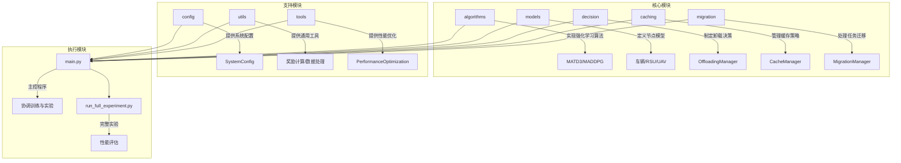
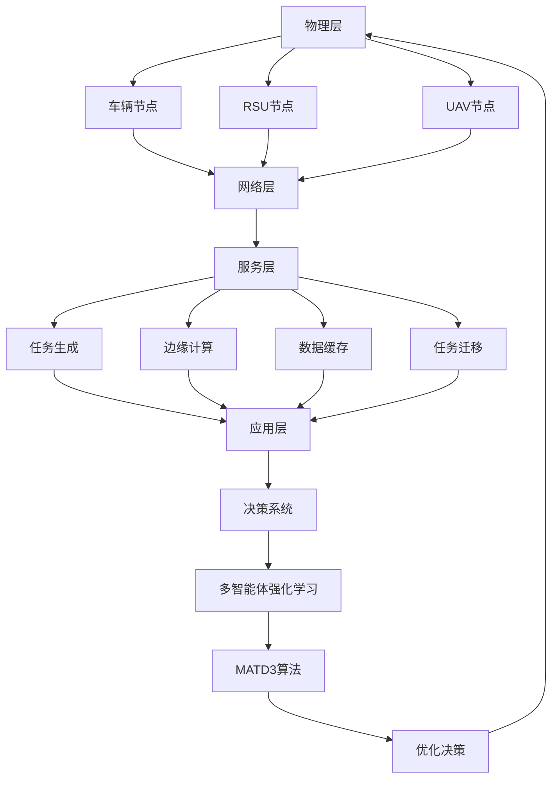
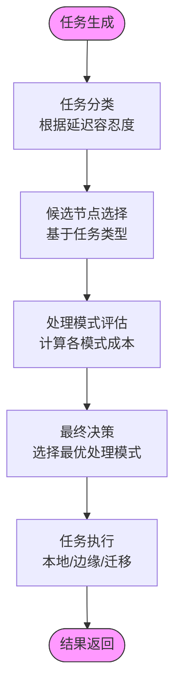
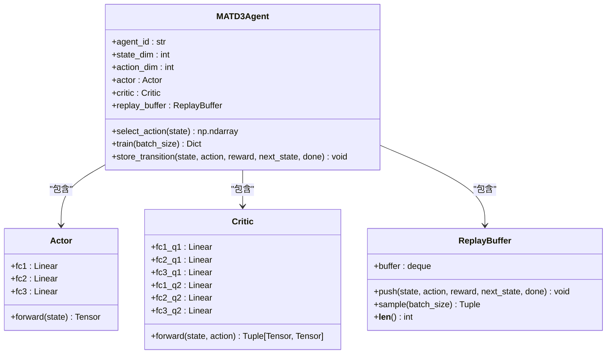
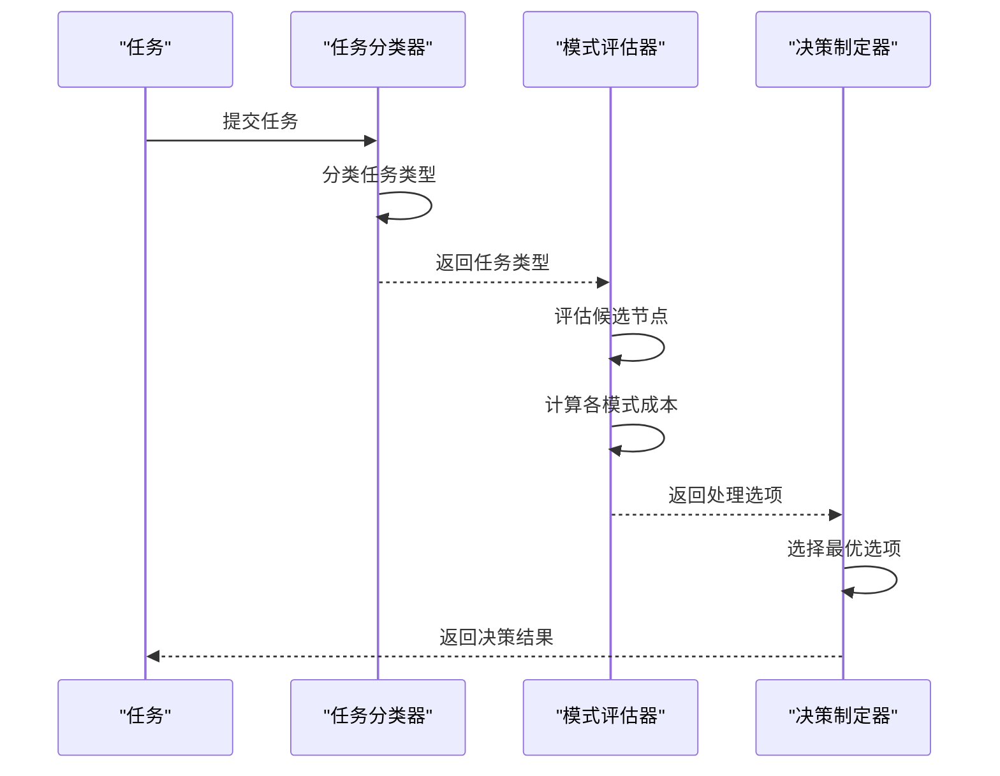
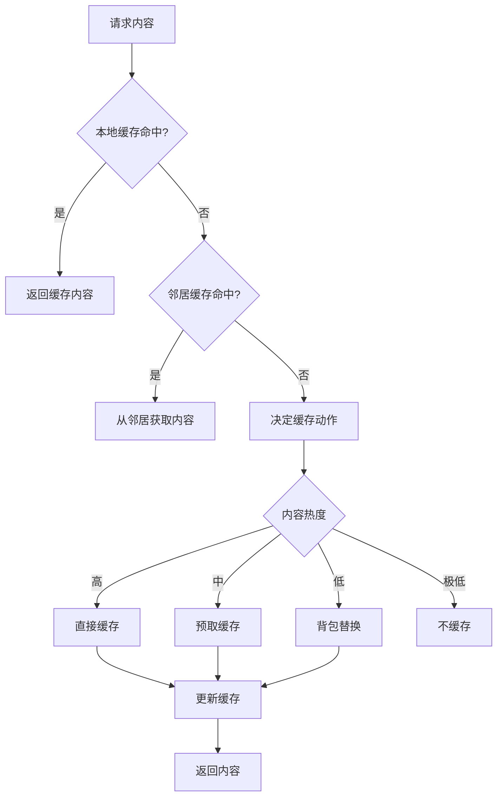
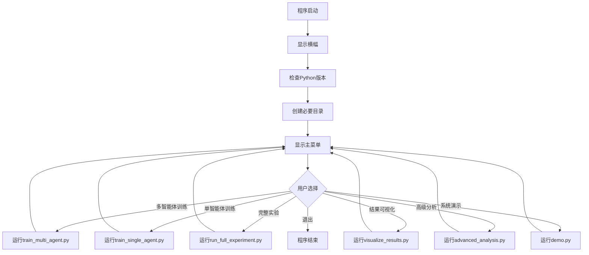

# 项目概述

<cite>
**本文档引用文件**   
- [main.py](file://main.py)
- [README.md](file://README.md)
- [run_full_experiment.py](file://run_full_experiment.py)
- [algorithms/matd3.py](file://algorithms/matd3.py)
- [models/vehicle_node.py](file://models/vehicle_node.py)
- [models/rsu_node.py](file://models/rsu_node.py)
- [models/uav_node.py](file://models/uav_node.py)
- [decision/offloading_manager.py](file://decision/offloading_manager.py)
- [caching/cache_manager.py](file://caching/cache_manager.py)
- [config/system_config.py](file://config/system_config.py)
- [utils/standardized_reward.py](file://utils/standardized_reward.py)
</cite>

## 目录
1. [引言](#引言)
2. [项目结构](#项目结构)
3. [核心组件](#核心组件)
4. [系统架构与工作流](#系统架构与工作流)
5. [详细组件分析](#详细组件分析)
6. [主控流程分析](#主控流程分析)
7. [背景知识与技术实现](#背景知识与技术实现)
8. [结论](#结论)

## 引言

VEC_mig_caching项目是一个基于多智能体深度强化学习的车联网边缘缓存与任务迁移系统。该项目旨在通过先进的机器学习算法优化智能交通系统中的边缘计算资源分配，解决车辆计算能力有限、网络延迟高和能耗大的问题。系统通过多智能体协作，实现了边缘缓存优化、任务卸载决策和能耗管理等核心功能，为智能交通系统的高效运行提供了创新的解决方案。

本项目采用MATD3（Multi-Agent Twin Delayed DDPG）算法作为核心强化学习框架，通过车辆、路边单元（RSU）和无人机（UAV）三种节点的协同工作，构建了一个复杂的分布式决策系统。系统能够根据实时网络状况和任务需求，智能地决定任务的处理方式，包括本地计算、边缘卸载、缓存利用和任务迁移，从而在时延、能耗和任务完成率之间达到最优平衡。

**Section sources**
- [README.md](file://README.md)

## 项目结构

VEC_mig_caching项目采用模块化设计，将不同功能分离到独立的目录中，提高了代码的可维护性和可扩展性。项目主要由算法、模型、决策、缓存、迁移、配置和工具等模块组成，形成了一个完整的系统架构。

**Diagram sources **
- [main.py](file://main.py)
- [run_full_experiment.py](file://run_full_experiment.py)

**Section sources**
- [README.md](file://README.md)

## 核心组件

VEC_mig_caching项目的核心组件包括算法模块、决策系统、缓存管理、节点模型和配置系统。这些组件协同工作，构成了一个完整的车联网边缘计算系统。算法模块实现了多智能体深度强化学习的核心逻辑，决策系统负责制定任务卸载和缓存策略，缓存管理模块优化了边缘节点的缓存利用，节点模型定义了车辆、RSU和UAV的行为特征，而配置系统则为整个系统提供了灵活的参数调整能力。

系统通过多智能体协作，实现了复杂的分布式决策。每个节点（车辆、RSU、UAV）都作为一个智能体，根据全局状态和局部信息做出决策。这些决策通过强化学习算法不断优化，最终达到系统性能的全局最优。这种分布式架构不仅提高了系统的可扩展性，还增强了其在动态车联网环境中的适应能力。

**Section sources**
- [algorithms/matd3.py](file://algorithms/matd3.py)
- [decision/offloading_manager.py](file://decision/offloading_manager.py)
- [caching/cache_manager.py](file://caching/cache_manager.py)
- [models/vehicle_node.py](file://models/vehicle_node.py)
- [models/rsu_node.py](file://models/rsu_node.py)
- [models/uav_node.py](file://models/uav_node.py)
- [config/system_config.py](file://config/system_config.py)

## 系统架构与工作流

VEC_mig_caching系统采用分层架构设计，从底层的物理节点到顶层的决策控制，形成了一个完整的闭环系统。系统架构包括物理层、网络层、服务层和应用层，每一层都承担着特定的功能，共同协作以实现系统的整体目标。

**Diagram sources **
- [models/vehicle_node.py](file://models/vehicle_node.py)
- [models/rsu_node.py](file://models/rsu_node.py)
- [models/uav_node.py](file://models/uav_node.py)
- [decision/offloading_manager.py](file://decision/offloading_manager.py)
- [algorithms/matd3.py](file://algorithms/matd3.py)

系统的工作流程始于车辆节点生成计算任务，然后通过决策系统评估各种处理模式的性能，最终选择最优的处理方案。这一流程包括任务分类、候选节点选择、处理模式评估和最终决策四个主要步骤。系统通过持续的训练和优化，不断提高决策的准确性和效率，从而在复杂的车联网环境中实现最优的资源利用。

**Diagram sources **
- [decision/offloading_manager.py](file://decision/offloading_manager.py)

## 详细组件分析

### 算法模块分析

算法模块是VEC_mig_caching系统的核心，实现了多智能体深度强化学习的关键算法。MATD3算法作为主要的强化学习框架，通过Actor-Critic架构和Twin网络设计，有效解决了传统DDPG算法在多智能体环境中的训练不稳定问题。

**Diagram sources **
- [algorithms/matd3.py](file://algorithms/matd3.py)

MATD3算法通过引入目标网络、延迟更新和策略噪声等机制，提高了学习的稳定性和效率。每个智能体都有独立的Actor网络和共享的Critic网络，这种设计既保证了智能体的独立性，又促进了智能体之间的协作。算法还实现了经验回放机制，通过存储和重用历史经验，提高了样本的利用效率。

### 决策系统分析

决策系统是连接算法模块和物理节点的桥梁，负责将强化学习的决策结果转化为具体的任务处理指令。该系统实现了基于延迟容忍度的任务分类框架和多模式处理评估机制，能够根据任务特性和系统状态选择最优的处理方案。

**Diagram sources **
- [decision/offloading_manager.py](file://decision/offloading_manager.py)

决策系统首先根据任务的最大延迟容忍度将其分类为极度延迟敏感型、延迟敏感型、中度延迟容忍型和延迟容忍型四类。然后，系统根据任务类型确定候选处理节点集合，并评估各种处理模式（本地计算、RSU卸载、UAV卸载、任务迁移）的性能。最终，系统选择加权成本最小的处理模式作为最终决策。

### 缓存管理分析

缓存管理模块实现了智能的边缘缓存策略，通过协作缓存和背包优化算法，最大化缓存资源的利用效率。该模块不仅考虑了内容的访问频率，还结合了时间槽热度和Zipf流行度分布，实现了更精准的缓存决策。

**Diagram sources **
- [caching/cache_manager.py](file://caching/cache_manager.py)

缓存管理模块实现了四种主要的缓存动作：缓存命中、邻居协作、直接缓存和背包替换。系统通过热度计算、访问频率统计和预测模型，动态调整缓存策略。当缓存空间不足时，系统采用背包优化算法，综合考虑内容的价值、大小和访问频率，选择最优的替换方案，从而在有限的缓存空间内实现最大的缓存效益。

## 主控流程分析

主控流程由main.py文件实现，作为系统的入口点，协调训练、实验和可视化等各项功能。该流程通过一个交互式菜单系统，为用户提供了便捷的操作界面，使用户能够轻松地启动各种实验和分析任务。

**Diagram sources **
- [main.py](file://main.py)

主控流程的设计充分考虑了用户体验和系统稳定性。程序启动时会进行必要的环境检查，确保系统能够正常运行。交互式菜单系统提供了清晰的操作指引，用户可以通过简单的数字选择来执行各种功能。此外，程序还实现了命令行参数支持，允许用户通过命令行直接启动特定功能，提高了自动化实验的便利性。

## 背景知识与技术实现

### 车联网边缘计算背景

车联网边缘计算是一种将计算能力从云端下沉到网络边缘的技术，旨在解决传统云计算在延迟、带宽和隐私方面的局限性。在智能交通系统中，车辆产生的大量数据需要实时处理，如自动驾驶决策、交通状况分析和紧急事件响应等。传统的云计算架构由于网络延迟和带宽限制，难以满足这些实时性要求高的应用需求。

边缘计算通过在靠近数据源的网络边缘部署计算资源，如路边单元（RSU）和无人机（UAV），实现了数据的本地化处理。这不仅大大降低了数据传输的延迟，还减少了对核心网络带宽的占用。在VEC_mig_caching系统中，边缘计算的概念被进一步扩展，通过多智能体协作和任务迁移，实现了更加灵活和高效的资源利用。

### 多智能体强化学习原理

多智能体强化学习（Multi-Agent Reinforcement Learning, MARL）是强化学习在多智能体系统中的扩展，旨在解决多个智能体在共享环境中协同学习和决策的问题。与单智能体强化学习不同，MARL需要考虑智能体之间的交互、竞争和协作，这使得学习过程更加复杂但也更接近真实世界的场景。

在VEC_mig_caching系统中，每个车辆、RSU和UAV都被视为一个独立的智能体，它们通过共享的环境状态进行交互。MATD3算法作为MARL的一种实现，通过集中式训练和分布式执行的架构，既保证了智能体的独立决策能力，又促进了全局最优策略的学习。智能体通过试错学习，不断优化其策略，以最大化长期奖励，从而实现系统性能的持续改进。

### 技术实现概览

VEC_mig_caching系统的技术实现涵盖了从底层节点模型到顶层决策系统的各个方面。系统采用Python作为主要开发语言，利用PyTorch框架实现深度神经网络，通过模块化设计提高了代码的可维护性和可扩展性。

系统的核心技术特点包括：
- **分布式决策架构**：每个节点作为独立的智能体，根据局部信息和全局状态做出决策。
- **实时性能评估**：系统通过多种性能指标（时延、能耗、完成率等）实时评估决策效果。
- **动态任务迁移**：当边缘节点过载时，系统能够智能地将任务迁移到其他可用节点。
- **智能缓存策略**：通过热度计算和预测模型，优化边缘节点的缓存利用效率。

这些技术的综合应用，使得VEC_mig_caching系统能够在复杂的车联网环境中实现高效、稳定的运行，为智能交通系统的发展提供了有力的技术支持。

**Section sources**
- [algorithms/matd3.py](file://algorithms/matd3.py)
- [models/vehicle_node.py](file://models/vehicle_node.py)
- [models/rsu_node.py](file://models/rsu_node.py)
- [models/uav_node.py](file://models/uav_node.py)
- [decision/offloading_manager.py](file://decision/offloading_manager.py)
- [caching/cache_manager.py](file://caching/cache_manager.py)
- [utils/standardized_reward.py](file://utils/standardized_reward.py)

## 结论

VEC_mig_caching项目成功实现了一个基于多智能体深度强化学习的车联网边缘缓存与任务迁移系统。通过创新的算法设计和系统架构，项目在时延、能耗和任务完成率等关键性能指标上取得了显著的改进。系统采用MATD3算法作为核心强化学习框架，通过车辆、RSU和UAV三种节点的协同工作，构建了一个高效的分布式决策系统。

项目的成功实施为智能交通系统的发展提供了重要的技术参考。系统不仅解决了传统云计算在车联网应用中的局限性，还通过多智能体协作和智能决策，实现了资源的最优利用。未来，该系统可以进一步扩展，支持更多类型的智能体和更复杂的交通场景，为智慧城市的建设做出更大的贡献。

尽管项目已经取得了显著的成果，但仍有一些方面可以进一步改进。例如，可以引入更复杂的环境模型，考虑天气、路况等外部因素对系统性能的影响；可以探索更高效的通信协议，进一步降低数据传输的开销；还可以研究联邦学习等隐私保护技术，在保证数据安全的同时实现协同学习。

总的来说，VEC_mig_caching项目展示了多智能体深度强化学习在车联网领域的巨大潜力，为未来智能交通系统的发展指明了方向。