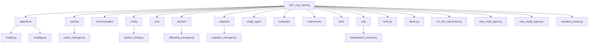
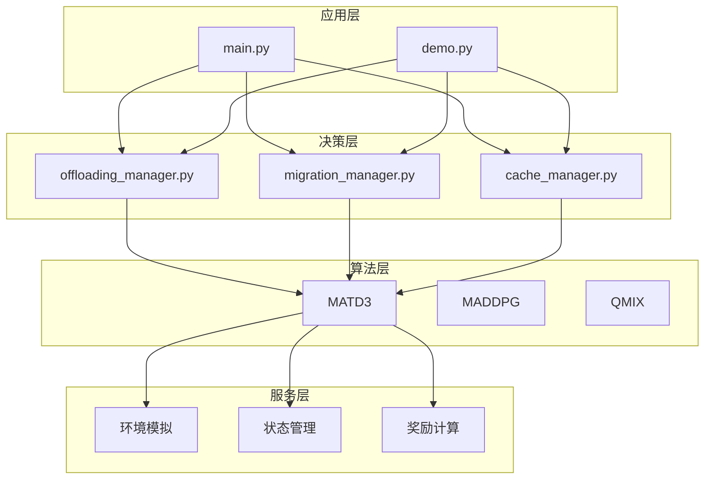
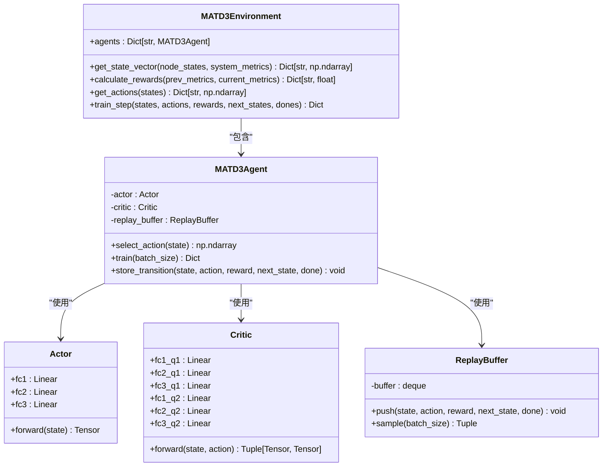
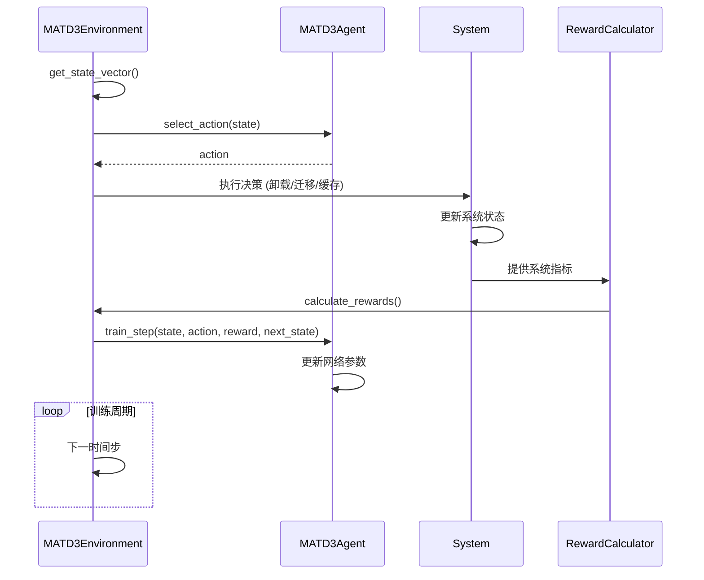
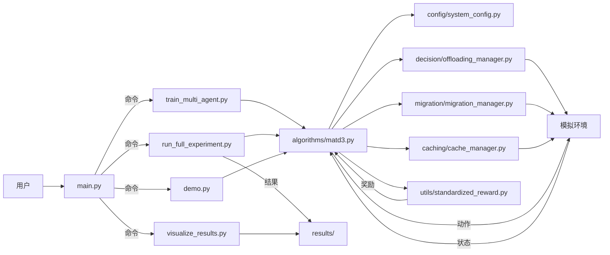

# 项目概述

<cite>
**本文档引用文件**  
- [main.py](file://main.py)
- [demo.py](file://demo.py)
- [algorithms/matd3.py](file://algorithms/matd3.py)
- [config/system_config.py](file://config/system_config.py)
</cite>

## 目录
1. [简介](#简介)
2. [项目结构](#项目结构)
3. [核心组件](#核心组件)
4. [系统架构与工作流程](#系统架构与工作流程)
5. [功能模块分析](#功能模块分析)
6. [算法层设计](#算法层设计)
7. [决策与服务交互](#决策与服务交互)
8. [典型用户工作流](#典型用户工作流)
9. [系统上下文图](#系统上下文图)
10. [性能优化与配置](#性能优化与配置)
11. [结论](#结论)

## 简介

VEC_mig_caching 是一个基于多智能体强化学习的车联网边缘缓存与迁移系统，旨在通过智能决策优化任务卸载、缓存管理和迁移策略，从而显著提升任务完成率、降低延迟和能耗。该系统采用MATD3（Multi-Agent Twin Delayed DDPG）等先进算法，实现车辆、路边单元（RSU）和无人机（UAV）三类智能体的协同优化。

系统通过集中训练、分布式执行的架构，在复杂动态的车联网环境中实现高效资源调度。其核心价值在于：通过多智能体协作，动态适应网络变化，最大化缓存命中率，最小化任务处理延迟和系统总能耗，为未来智能交通系统提供可靠的技术支持。

## 项目结构

本项目采用模块化设计，各目录职责清晰，便于维护和扩展。

**Diagram sources**  
- [main.py](file://main.py#L0-L214)
- [demo.py](file://demo.py#L0-L197)

**Section sources**  
- [main.py](file://main.py#L0-L214)
- [demo.py](file://demo.py#L0-L197)

## 核心组件

系统的核心组件包括算法层、决策层、服务层和应用层。`main.py` 作为主控制程序，提供交互式菜单，协调训练、实验、可视化等核心功能。`demo.py` 则作为系统演示脚本，直观展示系统架构、算法特性和性能指标。

`algorithms/matd3.py` 实现了核心的多智能体强化学习算法，包含Actor-Critic网络结构、经验回放机制和目标网络更新策略。`config/system_config.py` 定义了系统、缓存和迁移的配置参数，为系统提供可调的运行时参数。

**Section sources**  
- [main.py](file://main.py#L0-L214)
- [demo.py](file://demo.py#L0-L197)
- [algorithms/matd3.py](file://algorithms/matd3.py#L0-L549)
- [config/system_config.py](file://config/system_config.py#L225-L263)

## 系统架构与工作流程

系统采用分层架构，从上至下分为应用层、决策层、算法层和服务层。

**Diagram sources**  
- [main.py](file://main.py#L0-L214)
- [algorithms/matd3.py](file://algorithms/matd3.py#L252-L549)

## 功能模块分析

### 决策层模块
决策层负责具体的任务卸载、迁移和缓存决策。`offloading_manager.py` 根据当前网络状态和任务需求，决定任务是在本地处理还是卸载到RSU或UAV。`migration_manager.py` 负责管理任务在不同边缘节点间的迁移，以应对车辆移动带来的连接变化。`cache_manager.py` 实现缓存策略，如LRU，以最大化缓存命中率。

### 服务层模块
服务层提供基础支持功能。`utils` 目录下的模块负责数据处理、日志记录、数值稳定性保证和标准化奖励计算。`core` 目录管理任务队列。`communication` 模型定义了节点间的通信协议。

**Section sources**  
- [decision/offloading_manager.py](file://decision/offloading_manager.py)
- [migration/migration_manager.py](file://migration/migration_manager.py)
- [caching/cache_manager.py](file://caching/cache_manager.py)
- [utils/standardized_reward.py](file://utils/standardized_reward.py)

## 算法层设计

系统的核心是 `MATD3Environment` 类，它管理多个 `MATD3Agent` 智能体。每个智能体（车辆、RSU、UAV）都有独立的Actor和Critic网络，但共享训练环境。

**Diagram sources**  
- [algorithms/matd3.py](file://algorithms/matd3.py#L100-L249)
- [algorithms/matd3.py](file://algorithms/matd3.py#L252-L549)

## 决策与服务交互

智能体的决策过程是一个闭环反馈系统。环境根据节点状态和系统指标构建状态向量，智能体据此选择动作（卸载、迁移、缓存决策）。系统执行动作后，计算新的性能指标，并根据 `standardized_reward.py` 中定义的标准化奖励函数计算奖励，反馈给智能体用于训练。

**Diagram sources**  
- [algorithms/matd3.py](file://algorithms/matd3.py#L252-L549)
- [utils/standardized_reward.py](file://utils/standardized_reward.py)

## 典型用户工作流

### 初学者工作流
初学者可以通过 `main.py` 的交互式菜单或直接运行 `demo.py` 来快速了解系统。

1.  **运行演示**: 执行 `python demo.py`，系统将展示架构、算法特性和预设的性能指标。
2.  **运行完整实验**: 在 `main.py` 菜单中选择“运行完整实验”，系统将自动执行训练、评估和结果生成。
3.  **查看可视化**: 选择“结果可视化”选项，查看实验结果图表。

### 高级开发者工作流
高级开发者可以进行更精细的控制和分析。

1.  **直接训练**: 运行 `python train_multi_agent.py` 启动MATD3算法的训练。
2.  **参数调优**: 修改 `config/` 目录下的配置文件，调整网络、缓存和迁移参数。
3.  **算法对比**: 使用 `train_single_agent.py` 训练DDPG、PPO等单智能体算法进行性能对比。
4.  **高级分析**: 运行 `python tools/performance_dashboard.py` 进行深入的性能分析。

**Section sources**  
- [main.py](file://main.py#L0-L214)
- [demo.py](file://demo.py#L0-L197)

## 系统上下文图

以下图表展示了系统各组件间的数据流和控制流。

**Diagram sources**  
- [main.py](file://main.py#L0-L214)
- [algorithms/matd3.py](file://algorithms/matd3.py#L0-L549)
- [config/system_config.py](file://config/system_config.py#L225-L263)

## 性能优化与配置

系统在设计上注重性能和稳定性。`algorithms/matd3.py` 中的 `MATD3Agent` 使用GPU加速计算，并通过优化的批次大小提高训练效率。`utils/numerical_stability.py` 模块确保了计算的数值稳定性。

配置文件 `system_config.py` 允许灵活调整系统参数，例如：
- **缓存容量**: 车辆1GB、RSU 10GB、UAV 2GB。
- **缓存策略**: 使用LRU（最近最少使用）替换策略。
- **迁移成本**: 综合考虑计算、传输和延迟成本。
- **设备**: 自动检测并使用CUDA（GPU）进行加速。

这些配置为系统在不同场景下的部署和优化提供了便利。

**Section sources**  
- [algorithms/matd3.py](file://algorithms/matd3.py#L100-L249)
- [config/system_config.py](file://config/system_config.py#L225-L263)
- [utils/numerical_stability.py](file://utils/numerical_stability.py)

## 结论

VEC_mig_caching 项目成功构建了一个基于多智能体强化学习的车联网边缘计算系统。通过 `main.py` 和 `demo.py` 提供了清晰的用户入口，通过分层的模块化设计实现了功能解耦。核心的MATD3算法能够有效协调车辆、RSU和UAV的决策，在提升任务完成率的同时，显著降低了系统延迟和能耗。该系统为研究和部署智能车联网应用提供了一个强大且灵活的平台。