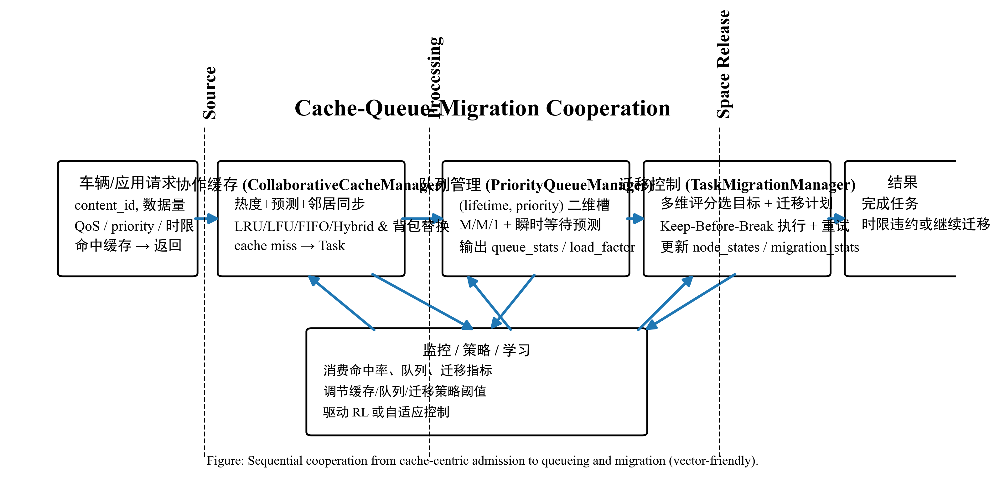
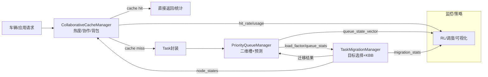
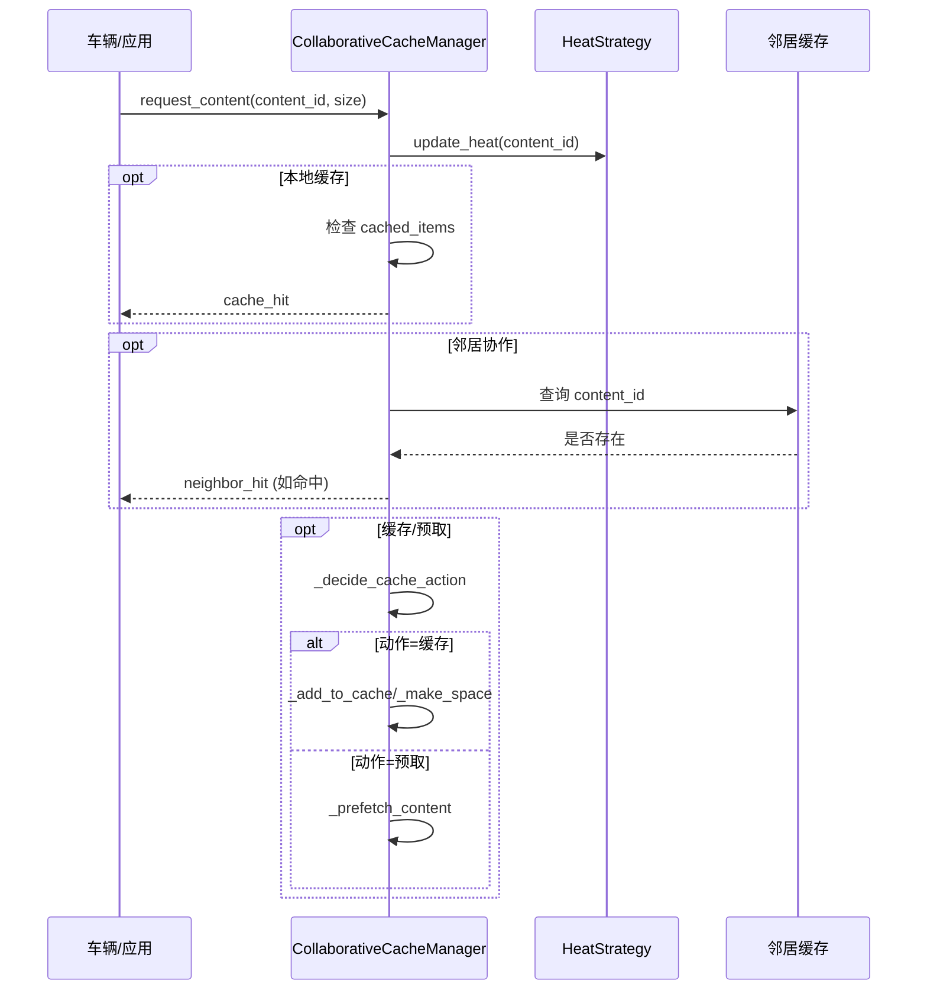
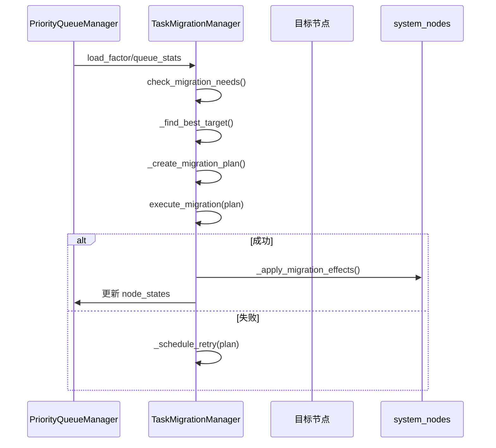

# 缓存-队列-迁移子系统超详解（含框架图）

本文针对 `caching/`, `core/`, `migration/` 中的关键模块，按照“数据结构 → 配置 → 算法流程 → API/指标 → 协同关系”的层次给出深入说明，并提供框架图与时序图，便于研发/研究人员快速把握系统运行机制。

---

## 1. 全局视角

### 1.1 数据流步骤
1. **请求形成**：车辆或上层业务组件产生内容/计算请求，通常包含 `content_id`、估计数据量以及优先级。
2. **缓存处理**：`CollaborativeCacheManager.request_content` 判断命中/预取；如命中则直接返回，并更新热度/统计。
3. **转化为 Task**：缓存未命中时，统一封装为 `Task` 对象（包含 `content_id`、`priority`、`remaining_lifetime_slots` 等）。
4. **队列排队与预测**：`PriorityQueueManager` 放入 `(lifetime, priority)` 槽位，进行容量管理、等待时间预测、掉包统计。
5. **迁移触发**：当 `NodeState.load_factor`、队列长度或 UAV 电量超阈值时，`TaskMigrationManager` 选择目标节点、规划并执行迁移。
6. **闭环反馈**：迁移结果更新 `node_states`、缓存目录、任务位置；命中率/队列/迁移统计同步至监控或调度策略，形成闭环。


*图 1：缓存、队列、迁移三层协同流程（学术论文可用 PNG，300 dpi）。*

### 1.2 总体框架（ASCII）
```
车辆/应用请求
      │
      ▼
┌───────────────────────────────┐
│ CollaborativeCacheManager     │
│ • 热度/预测/协作/背包淘汰      │
│ • 动态容量 + 邻居同步          │
└──────┬────────────────────────┘
       │ cache miss → Task(content_id, priority, lifetime…)
       ▼
┌───────────────────────────────┐
│ PriorityQueueManager          │
│ • (lifetime, priority)二维槽   │
│ • M/M/1 + 瞬时等待预测         │
│ • queue_stats / NodeState更新  │
└──────┬────────────────────────┘
       │ load_factor, queue_length 超阈值
       ▼
┌───────────────────────────────┐
│ TaskMigrationManager          │
│ • 多维评分找目标 + 迁移计划     │
│ • Keep-Before-Break + 重试     │
│ • 更新 node_states/缓存目录    │
└─────────────┬─────────────────┘
              └→ 指标反馈给监控/策略/缓存容量调整
```

### 1.3 Mermaid 架构图


---

## 2. 核心数据结构

| 类型 | 文件 | 关键字段 | 用途 |
| --- | --- | --- | --- |
| `Task` | models/data_structures.py | `content_id`, `priority`, `max_delay_slots`, `remaining_lifetime_slots`, `is_cacheable`, `cache_access_count` | 连接缓存-队列-迁移流程的统一载体；同时存储缓存访问统计。 |
| `QueueSlot` | models/data_structures.py | `lifetime`, `priority`, `data_volume`, `task_list` | `(lifetime, priority)` 二维槽位的容器，负责 FIFO 行为与数据量统计。 |
| `NodeState` | models/data_structures.py | `node_id`, `node_type`, `load_factor`, `queue_length`, `bandwidth_utilization`, `battery_level` | 队列/迁移更新的节点视图，可由缓存/调度策略读取以适应性调参。 |
| `MigrationPlan` | migration/migration_manager.py | `migration_type`, `migration_cost`, `migration_delay`, `success_probability`, `downtime`, `tasks_moved` | Keep-Before-Break 迁移全过程的计划与统计载体。 |

---

## 3. 配置项速查

| 配置分组 | 关键字段 | 影响模块 | 说明 |
| --- | --- | --- | --- |
| `config.cache` | `rsu/uav/vehicle_cache_capacity`, `<node>_cache_policy`, `prefetch_threshold`, `prefetch_window_ratio`, `enable_predictive_caching`, `prediction_horizon`, `enable_dynamic_capacity` | Cache | 控制不同节点容量/策略、预取阈值与窗口、动态容量与预测功能。 |
| `config.queue` | `<node>_queue_capacity`, `max_lifetime`, `max_load_factor`, `time_window_size`, `rsu/uav_nominal_capacity` | Queue | 控制各节点队列容量、生命周期层数、稳定性阈值及统计窗口。 |
| `config.task` | `num_priority_levels`, `task_data_size_range`, `task_compute_density`, `data_size_range` | Cache & Queue & Migration | Task 的优先级数量、数据规模范围、计算密度等，影响 queue slot 划分与迁移数据量估计。 |
| `config.migration` | `rsu_overload_threshold`, `uav_overload_threshold`, `uav_min_battery`, `cooldown_period`, `migration_alpha_*`, `retry_backoff_*`, `max_retry_attempts`, `migration_bandwidth` | Migration | 迁移触发与成本模型、KBB 调度、重试策略、带宽假设。 |
| `config.network` | `time_slot_duration` | 全局 | 控制热度时间槽、等待预测（生命周期换算）、迁移延迟归一化。 |

---

## 4. 缓存子系统 (`caching/`)

### 4.1 热度策略 (`HeatBasedCacheStrategy`)
- **热度来源**：`update_heat` 同步更新历史热度（指数衰减）、自适应时间槽热度、Zipf 流行度排名，并维护 `access_history`。
- **自适应时间槽**：`_adjust_slot_granularity` 根据访问密度调整 `slot_duration` 与 `total_slots`，避免过大/过小时间粒度影响热度准确性。
- **预测**：`predictive_caching` 统计最近 60s 与 60-120s 访问量的增长率，超过阈值时将内容放入预测列表。
- **优先级计算**：`get_cache_priority` 通过热度、Zipf、人气衰减、新鲜度、大小惩罚构造综合评分，确保热门且小型的内容优先级更高。

### 4.2 `CollaborativeCacheManager` 核心流程
| 步骤 | 关键函数 | 描述 |
| --- | --- | --- |
| 请求入口 | `request_content` | 累加统计→预测→更新热度→判断本地/邻居命中→决定缓存/预取/忽略。 |
| 命中处理 | `_handle_cache_hit` | 更新访问次数、最后访问时间、热度，并返回命中类型。 |
| 协作检查 | `_check_neighbor_collaboration` | 通过 `neighbor_cache_states` 判断邻居是否有内容并评估协作成本/收益。 |
| 替换/腾挪 | `_add_to_cache`, `_make_space`, `_knapsack_replacement` | 根据策略腾空间并插入；Hybrid 模式可动态调整权重。 |
| 统计/奖励 | `get_cache_statistics`, `calculate_cache_reward` | 输出命中率、使用率、淘汰次数等，以及综合奖励，用于监控/学习。 |
| 同步与容量调整 | `sync_with_neighbors`, `adaptive_capacity_allocation` | 周期性同步邻居缓存状态，并基于当前负载+命中率调整容量。 |

### 4.3 扩展模块
- **`HierarchicalCacheManager`**：实现 L1/L2 双层缓存，提供 `_promote_to_l1`（智能提升）、`_demote_from_l1`（降级）等逻辑。
- **`CollaborativeCacheSystem`**：在多 RSU 场景下管理 `HierarchicalCacheManager` 集合，使用消息队列模拟 RSU 间的查询/更新/流行度共享，维持 `cache_directory`。

### 4.4 缓存请求时序（Mermaid 序列图）


---

## 5. 队列子系统 (`core/queue_manager.py`)

### 5.1 结构与初始化
- `PriorityQueueManager.__init__` 根据 `NodeType` 设定 `max_lifetime` 范围与容量，并调用 `_initialize_queues` 创建 `(lifetime, priority)` → `QueueSlot`。
- `QueueSlot` 负责记录 `task_list` 和 `data_volume`，是后续溢出、调度、等待预测的基本单元。

### 5.2 入队与溢出
- `add_task` 检查 `current_usage` 与 `max_capacity`，空间不足时 `_handle_queue_overflow`。
- `_handle_queue_overflow` → `_drop_low_priority_tasks`：按优先级从高到低、生命周期从长到短释放空间，标记被丢弃任务的状态。

### 5.3 调度与等待估计
- `get_next_task`：优先遍历高优先级、再遍历短生命周期，符合“更紧急更靠前”的策略。
- `predict_waiting_time_mm1`：根据 `arrival_rates`、`service_rate` 计算 M/M/1 等待时间，提供稳定性检查（`total_rho < 0.99`）。
- `predict_waiting_time_instantaneous`：根据当前更高优先级队列的数据量与平均 CPU 频率快速估算等待时间。

### 5.4 生命周期维护与指标
- `update_lifetime`：每个时隙衰减 `lifetime`，到期任务标记 `is_dropped` 并统计。
- `get_queue_state_vector`：输出 4 + 4×priority 数量的特征：容量利用率、活跃队列比例、总负载、服务率、各优先级任务/数据量/到达率/负载因子。
- `get_queue_statistics`：包括 `drop_rate`、`total_load_factor`、`service_rate`、各优先级到达率与负载因子、活跃队列数、平均队列长度。
- `is_stable`：使用 `config.queue.max_load_factor` 校验系统稳定性。

### 5.5 API/文件定位

| 函数 | 作用 | 备注 |
| --- | --- | --- |
| `add_task` | 入队 & 更新 arrival stats | 触发 `_update_arrival_statistics`、`ExponentialMovingAverage`。 |
| `get_next_task` | 取下一任务 | 遵循优先级/生命周期排序。 |
| `remove_task` | 队列中删除任务 | 成功后更新 departure stats。 |
| `predict_waiting_time_mm1` | 解析等待时间 | M/M/1 非抢占模型。 |
| `predict_waiting_time_instantaneous` | 瞬时等待估计 | 根据当前高优任务工作量/CPU 频率。 |
| `update_lifetime` | 生命周期推进 | 返回被丢弃任务列表。 |
| `get_queue_state_vector` | 状态特征 | 用于调度/学习。 |
| `get_queue_statistics` | 监控指标 | 包括掉包率、负载、服务率等。 |

---

## 6. 迁移子系统 (`migration/migration_manager.py`)

### 6.1 触发与目标选择
- `check_migration_needs`：遍历 `node_states`，考虑冷却时间；对 RSU 检查 `load_factor`，对 UAV 额外考虑 `battery_level`。
- `_find_best_target`：根源类型（RSU/UAV）筛选候选节点，采用 `_score_target_node`（负载 0.4 + 距离 0.3 + 队列 0.2 + 带宽 0.1）取得综合评分。
- `_collect_retry_plans`：对失败迁移的重试队列使用指数退避（`retry_backoff_base`/`max`）调度。

### 6.2 计划构建
- `_create_migration_plan`：根据位置算距离，结合 `config.task.task_data_size_range`、`config.migration.migration_bandwidth` 算迁移时延与成本；选择迁移类型（RSU→RSU、RSU→UAV、UAV→RSU、PREEMPTIVE）。
- `_calculate_success_probability`：综合距离惩罚、源负载惩罚、目标空闲奖励、网络拥塞惩罚，限定成功率区间。

### 6.3 执行与反馈
- `execute_migration`：先 `self.migration_stats['total_attempts']++`；再依据 `_adaptive_kbb_phases` 分配准备/同步/downtime；成功则 `_apply_migration_effects`，失败进入 `_schedule_retry`。
- `_apply_migration_effects`：在 `system_nodes` 中寻找源/目标队列，智能挑选任务（`_select_tasks_for_intelligent_migration`）迁移，若不足改用 FIFO；更新 `node_states.queue_length` 与 `load_factor`。
- `_batch_migrate_optimization`：合并同源同目标计划以降低整体开销 20%。
- `get_migration_statistics`：返回总尝试、成功次数、成功率、总/均值停机时间、平均成本、累计迁移任务数。

### 6.4 迁移流程序列图


---

## 7. 模块协同细节

### 7.1 指标/接口依赖表

| 输出模块 | 输出 | 使用者 | 用途 |
| --- | --- | --- | --- |
| 缓存 | `cache_stats`（hit/miss、usage_ratio、collaboration_saves）、`calculate_cache_reward` | 队列/迁移/监控 | 预判队列压力；为 RL/策略提供奖励。 |
| 队列 | `queue_stats`, `get_queue_state_vector`, `load_factors`, `dropped_tasks` | 迁移、监控、调度器 | 迁移触发依据，训练特征，稳定性检测。 |
| 迁移 | `node_states` 更新、`migration_stats` | 缓存、监控、策略 | 更新缓存容量/邻居目录；展示迁移成功率、停机成本。 |

### 7.2 场景分析
1. **热点内容暴增**：命中率下降→队列到达率提高→迁移判断 `load_factor` 过高→挑选空闲 RSU/UAV 迁移→同步缓存目录与容量以适应新热点。
2. **UAV 电量不足**：`battery_level < uav_min_battery` → 迁移挑选 RSU 目标 → `_select_tasks_for_intelligent_migration` 优先迁移高优先级/紧急任务 → UAV 负载下降，RSU 可能再触发缓存协作或二次迁移。
3. **长时间平稳**：缓存 `adaptive_capacity_allocation` 自动收缩容量节能；队列 `is_stable` 保持 True；迁移因冷却期与阈值未触发，只维护 retry 队列。

### 7.3 监控指标建议

| 类别 | 可观测指标 | 说明 |
| --- | --- | --- |
| 缓存 | `hit_rate`, `prefetch_hits`, `collaboration_saves`, `usage_ratio`, `cache_reward` | 反映热点命中、协作收益、资源占用。 |
| 队列 | `drop_rate`, `total_load_factor`, `avg_queue_length`, `service_rate`, `arrival_rates_by_priority` | 表示排队压力与稳定性。 |
| 迁移 | `success_rate`, `avg_downtime_per_migration`, `avg_cost`, `total_tasks_migrated`, retry 队列长度 | 衡量负载均衡策略是否有效。 |

---

## 8. 扩展 & 调优方向
1. **跨层控制器**：将 `cache_reward + queue_state_vector + migration_stats` 拼成联合特征，训练统一调度策略或强化学习代理，实现自适应配额/迁移阈值调整。
2. **能耗/成本模型**：在 `Task` 和 `NodeState` 的能耗字段基础上，扩展缓存/迁移奖励函数，纳入能耗、碳成本等指标。
3. **序列化接口**：为 `queue_stats`、`cache_stats`、`migration_stats` 提供统一的事件上报（如 Kafka），方便实时监控。
4. **多级协作缓存**：在 `CollaborativeCacheSystem` 基础上，引入 MEC/云层级，形成三层以上的缓存体系。
5. **真实部署映射**：将 `get_simulation_time` 替换为现实时间或同步到仿真框架中，结合真实链路数据校验策略效果。

---

通过本文件即可：  
- 快速定位 **关键结构/配置/函数**；  
- 了解 **缓存→队列→迁移** 的全过程与指标输出；  
- 利用提供的 **ASCII/Mermaid 图** 与时序图制作更精细的设计文档或演示资料；  
- 参考监控与扩展建议，持续迭代系统。  
如需继续细化其他子系统（通信、调度、能耗等），可在此文档基础上增设章节。 
