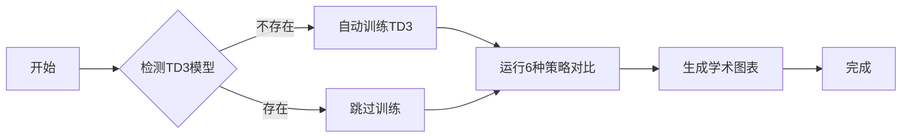

# 🚀 卸载策略对比实验

> 一键运行TD3与基准算法的完整对比实验

## 📁 文件结构（精简后）

```
offloading_strategy_comparison/
├── 📄 README.md (本文档)                     # 快速指南
├── 📄 完整使用指南.md                         # 详细文档
├── 📄 一键运行TD3对比.bat                    # ⭐ Windows一键入口（推荐）
├── 📄 run_complete.sh                        # Linux一键入口
├── 📄 run_full_comparison_with_td3.py       # 主实验脚本
├── 📄 run_offloading_comparison.py          # 核心对比引擎
├── 📄 offloading_strategies.py              # 6种策略实现
├── 📄 visualize_vehicle_comparison.py       # 可视化脚本
├── 📁 results/                               # 实验结果
└── 📁 academic_figures/                      # 论文图表
```

## ⚡ 快速开始（3分钟）

### 方式1：双击运行（Windows，推荐）

```
双击 "一键运行TD3对比.bat"
选择模式：
  1 - 快速测试（5-10分钟） ✅ 推荐新手
  2 - 标准实验（30-60分钟）
  3 - 完整实验（1-2小时）
  4 - 仅生成图表
```

### 方式2：命令行运行
cd offloading_strategy_comparison
```bash
# 快速测试（仅验证框架）
python run_full_comparison_with_td3.py --quick

# 标准实验（推荐用于论文，1.5-2小时）✅
python run_full_comparison_with_td3.py --train-episodes 400 --eval-episodes 50

# 高质量实验（顶级会议，2.5-3小时）⭐
python run_full_comparison_with_td3.py --train-episodes 600 --eval-episodes 100
cd offloading_strategy_comparison
# 跳过TD3训练（使用已有模型）
python run_full_comparison_with_td3.py --skip-training --eval-episodes 50
```

**⚠️ 重要提示**：根据实际经验，TD3至少需要**400轮**才能基本收敛！

## 🎯 6种对比策略

| # | 策略名称 | 类型 | 说明 |
|---|---------|------|------|
| 1 | **LocalOnly** | 基准 | 纯本地计算（下限基准） |
| 2 | **RSUOnly** | 基准 | 仅RSU卸载（传统MEC） |
| 3 | **LoadBalance** | 启发式 | 负载均衡（最佳启发式） |
| 4 | **Random** | 对照 | 随机选择（对照组） |
| 5 | **TD3** | DRL | 完整TD3策略（主要贡献） ⭐ |
| 6 | **TD3-NoMig** | DRL | 无迁移TD3（消融实验） |

## 📊 实验流程



### 自动完成的工作：

1. ✅ **TD3模型准备**
   - 自动检测多个可能的模型路径
   - 未找到则自动训练
   - 复制到所有需要的位置

2. ✅ **策略对比实验**
   - 车辆数量: 8, 12, 16, 20, 24
   - 每个配置运行指定轮次
   - 使用TD3归一化方式计算成本

3. ✅ **学术图表生成**
   - 4子图综合对比（PDF + PNG, 300 DPI）
   - 加权成本突出图（含性能提升百分比）
   - Markdown性能表格

## 📈 评估指标

### 主要指标

- **加权成本** = `2.0 × 时延(s) + 1.2 × 能耗(kJ)`
  - ⚠️ 能耗从焦耳(J)转换为千焦(kJ)
  - TD3归一化方式，所有策略统一

### 次要指标

- 平均任务时延 (秒)
- 总能耗 (焦耳)
- 任务完成率 (%)

## 📂 输出文件

运行完成后，结果保存在：

```
📁 results/offloading_comparison/
  └── vehicle_sweep_YYYYMMDD_HHMMSS.json    # 原始数据

📁 academic_figures/vehicle_comparison/
  ├── vehicle_comparison_main.pdf           # 主对比图（论文用）
  ├── vehicle_comparison_main.png           # PNG版本
  ├── weighted_cost_highlight.pdf           # 成本突出图
  ├── weighted_cost_highlight.png           # PNG版本
  └── performance_table.md                  # 性能表格
```

## 🔧 高级选项

### 自定义实验参数

```bash
python run_full_comparison_with_td3.py \
  --train-episodes 500 \      # TD3训练轮次
  --eval-episodes 100 \       # 评估轮次
  --skip-training             # 跳过TD3训练
```

### 仅生成图表（使用已有数据）

```bash
python visualize_vehicle_comparison.py
```

### 运行核心对比脚本

```bash
python run_offloading_comparison.py --mode vehicle --episodes 50
```

## ❓ 常见问题

<details>
<summary>Q: TD3模型加载失败？</summary>

**解决方案：**
```bash
# 方案1：自动训练
python run_full_comparison_with_td3.py --quick

# 方案2：手动训练
cd ..
python train_single_agent.py --algorithm TD3 --num-vehicles 12 --episodes 200
```
</details>

<details>
<summary>Q: 结果中没有TD3数据？</summary>

**检查：**
1. TD3模型是否存在于 `results/single_agent/td3/12/best_model.pth`
2. 运行日志中是否有"成功加载TD3策略"
3. 使用 `--train-episodes` 参数先训练模型
</details>

<details>
<summary>Q: 如何修改车辆数量？</summary>

**修改方法：**
编辑 `run_offloading_comparison.py` 中的 `vehicle_counts` 参数
或使用快速测试模式自动使用 `[8, 12, 16]`
</details>

## 🎓 论文使用

### 引用说明

生成的图表符合以下会议/期刊要求：
- ✅ IEEE INFOCOM（PDF，300 DPI）
- ✅ IEEE TMC（PDF，300 DPI）
- ✅ ACM MobiCom（PDF，300 DPI）

### 图表说明

1. **Figure X: 车辆数量影响分析**
   - 文件: `vehicle_comparison_main.pdf`
   - 包含：加权成本、时延、能耗、完成率

2. **Figure Y: TD3性能提升**
   - 文件: `weighted_cost_highlight.pdf`
   - 显示：TD3相对于基准的改进百分比

3. **Table X: 性能对比表格**
   - 文件: `performance_table.md`
   - 可直接复制到LaTeX

## 📞 技术支持

详细使用说明请查看：[完整使用指南.md](./完整使用指南.md)

---

**版本**: v1.0 (清理版)  
**最后更新**: 2025-10-14  
**状态**: ✅ 生产就绪
